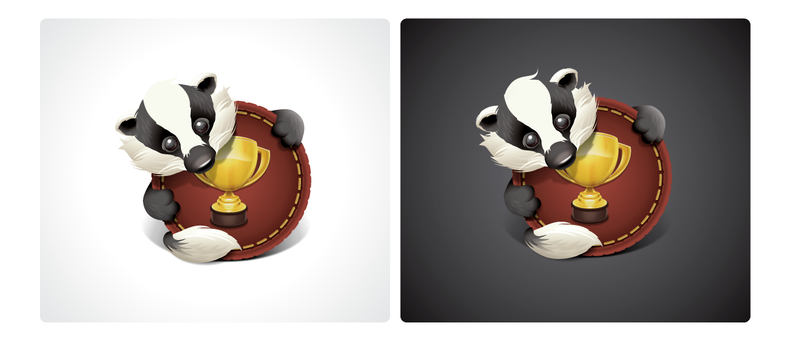

**TL;DR**: <em>A year ago, I said I wanted to build a badging service
for the Mozilla community, so we could all celebrate how awesome we
all are. Well, I putzed around and didn't get far, so I'm starting
over with something more immediately useful.</em>

<em>(This is an awesome illustration by [Sean
Martell](http://seanmartell.com/), used entirely without permission.
I'll take it down if anyone gets mad.)</em>

Almost a year ago, [I wrote about building a badging service for
all of Mozilla][badger-paper]. 

In a nutshell, I left the [2010 Mozilla Summit](http://www.flickr.com/photos/gen/4784616521/)
wanting to build a tool that empowered people to craft social objects
representing achievement and gratitude, and give them to each other.

Since then, I've [played around with a prototype in Django with
Pinax][badger1].  But, I abandoned that thing due to getting super
busy with the Firefox 4 release. It also didn't help that I was a
Django newb and that I got caught up in screwing around with shiny
things like [Pinax][] and [Lettuce][] and neglected the actual feature
set.

So now, finally, [I'm picking the thread back up again][badger2]. This
time, with a little less ambition and a few more practical aims.

### Make something more useful right away

While I *have* spent some dangerous time screwing around with shinies like
[Vagrant][], [Puppet][], and [Playdoh][], I think I've gotten that
mostly out of my system and have gotten down to work [as of last
night][work].

[work]: https://github.com/lmorchard/badger2/commits/master

Rather than build a Grand Central Station for badges, I've reset my
goals to a progression of practical results:

* Build a reusable Django app that supports some basic use cases of
  creating and awarding badges to users.
* Add [Activity Stream][]s narrating [badge claims][]
* Add support for [PubSubHubbub][push] with Badger activity streams
* Add a REST API, maybe with OAuth
* Accept badges for local users, via [PuSH][] from
  external sites
* See what the [Open Badges Project][] is up to, and how Badger can
  fit in with their goals.

[badge claims]: http://wiki.activitystrea.ms/w/page/27189812/Badge
[Open Badges Project]: https://wiki.mozilla.org/Badges

The idea here is to make Badger a practical, reusable, drop-in app for
existing sites—preferably (but not necessarily) the
[Playdoh][]-flavored sites we're building at Mozilla. Then,
incrementally and optionally empower a Badger-enabled site to become a
badge hub by accepting reports of badge claims from other
Badger-enabled sites.

### Take baby steps to federation

So, for example, let's say we dropped Badger into a few sites like
these:

* <http://developer.mozilla.org>;
* <http://support.mozilla.com>;
* <http://addons.mozilla.org>.

At first, Badger would just augment those sites with badging
facilities for their respective user bases. That could fill some needs
right away.

Then, say we built a site that offered personal profiles to members of
the Mozilla community.  With the [Activity Stream][] and [PuSH][]
augmentations, users could connect their profiles with each of the
other Mozilla sites they use.  That way, whenever they claim a badge
out there, it gets delivered to their community profile.

### Why bother federating at all?

If the only cross-site goal to build an all-in-one display case for
badges on a community profile, I could just build JSON feeds and wrap
them in a JS-based widget. In fact, [a JSON-formatted Activity
Stream][as-json] will work nicely for that. Drop that into the profile
page, and we're done.

There are lots of reasons to federate. But, at least one thing not supported by
this solution are [meta-badges][]. That is, badges awarded for badges.

Let's say you close 100 bugs on Bugzilla, answer 100 questions on
SUMO, edit 100 pages of documentation on MDN, and author 100 add-ons.
And, let's say you get badges on the respective sites for all of those
activities.

Well, now, I'd like to give you a badge on your community profile for
being a **Mozilla Superhero**. I could just do that by hand, having
observed all your greatness. But, I'd rather the system just do that
automatically.

If your community profile treated all your badges from your chosen affiliated
sites as first-class citizens, then I could build the meta-badge
trigger right there.

Of course, I could also write a program that monitors badge feeds from
various sites. Then, use the community profile site's Badger API to
issue a badge when the conditions are met. But, as maintainer of the
monitoring program, I'd have to keep track of what feeds where count
for which people, which could be a mess.

There's still some thinking to do here.

### What about identity and co-opting badges?

I'm still thinking through how someone connects a profile to other
sites. As in, how can Badger ensure that the owner of the community
profile is also the owner of a badge claim feed on MDN?  Maybe some
kind of OAuth dance that results in a [PuSH][] subscription between
sites?

Consider the least-capable federation case: a Badger-compatible feed
hosted as a static file on Amazon S3. And, by Badger-compatible, I
mean an [Activity Stream][] that contains [badge claims][]. You
shouldn't need my specific implementation of Badger-in-Django to
produce one of those.

Although [PuSH][] is still the ideal case (I think), occasional
polling of an [Activity Stream][] feed should still be supported. If a
user connects that up to their community profile, we just have to take
their word for it. We'd rely on community members to
flag stinkers trying to claim badge feeds that aren't theirs.

Beyond that, there's probably some crypto-voodoo we can invoke here,
for cases where badge claim validity really matters—as opposed to the
fun and games I have in mind for Mozilla.

### What about the Open Badges Project?

From various conversations over the past year, it sounds to me like
the [Open Badges Project][] is getting the parts in place to do even
more interesting federation of badges that gives ownership of the
badge hub to the user.

In that scenario, you have a backpack in your browser and can carry
your badge claims with you between sites with no prior coordination
between the sites themselves. 

This sounds like something in which Badger should be able to
participate, eventually. If not as a hub, Badger should at least offer
the tools to create and award badges that work with the user-owned hub
scheme.

### So, what next?

Now that I've written all this out, I need to hack on it. If you're
interested in this stuff, let me know. That way, it'll look like
someone might actually find this stuff handy when I get something
working!

[as-json]: http://activitystrea.ms/specs/json/1.0/
[meta-badges]: http://decafbad.com/2010/07/badger-article/#section-105
[activity stream]: http://activitystrea.ms
[push]: http://code.google.com/p/pubsubhubbub/
[vagrant]: http://vagrantup.com
[puppet]: http://pupetlabs.com
[playdoh]: https://github.com/mozilla/playdoh
[pinax]: http://pinaxproject.com
[lettuce]: http://lettuce.it
[badger-paper]: http://decafbad.com/2010/07/badger-article/
[badger1]: https://github.com/lmorchard/badger
[badger2]: https://github.com/lmorchard/badger2

<!-- vim: set wrap wm=5 syntax=mkd textwidth=70: -->

            <h3>Archived Comments</h3>
            
        <ul class="comments">
            
        <li class="comment" id="comment-256743407">
            

                

                    
                    <a class="avatar name" rel="nofollow" 
                       href="">David Boswell</a>
                

                <a href="#comment-256743407" class="permalink"><time datetime="2011-07-19T01:18:24">2011-07-19T01:18:24</time></a>
            

            
Very cool to see an update on Badger.  I'm definitely interested in this and would love to see something like this show up in the Mozillians phonebook that will be ready soonish :)

David

            
        </li>
    
        <li class="comment" id="comment-257292756">
            

                

                    
                    <a class="avatar name" rel="nofollow" 
                       href="http://briks.si">Brian King</a>
                

                <a href="#comment-257292756" class="permalink"><time datetime="2011-07-19T15:12:01">2011-07-19T15:12:01</time></a>
            

            
Over at the Mozilla Reps program, we are discussing the possible use of badges - https://wiki.mozilla.org/ReMo

            
        </li>
    
        <li class="comment" id="comment-257331862">
            

                

                    
                    <a class="avatar name" rel="nofollow" 
                       href="http://kanai.net/weblog/">Gen Kanai</a>
                

                <a href="#comment-257331862" class="permalink"><time datetime="2011-07-19T15:48:22">2011-07-19T15:48:22</time></a>
            

            
Agreed with DBos. Would love to see Badger as an official service, especially with the new Campus Reps program that Jason Haas is rebooting as well as with the Mozilla Representatives program. Also you might get a badge for contributing to the Join Mozilla program? So many great uses for us.

            
        </li>
    
        <li class="comment" id="comment-278082903">
            

                

                    
                    <a class="avatar name" rel="nofollow" 
                       href="">interstar</a>
                

                <a href="#comment-278082903" class="permalink"><time datetime="2011-08-05T03:15:39">2011-08-05T03:15:39</time></a>
            

            
Hi Les,

Very very interesting. 

I was just thinking that there needed to be something like the Open Badges project today. (I'd even got as far as knocking up a data-model in web2py.) And then I saw this.

I quickly cloned and tried out your app with an ordinary Django project but it's blowing up without jingo and I guess other Playdoh related modules. Are you committed to Playdoh for Badger2 ?

            
        <ul class="comments">
            
        <li class="comment" id="comment-278514925">
            

                

                    
                    <a class="avatar name" rel="nofollow" 
                       href="http://decafbad.com/">Les Orchard</a>
                

                <a href="#comment-278514925" class="permalink"><time datetime="2011-08-05T18:05:31">2011-08-05T18:05:31</time></a>
            

            
I'm committed to Playdoh insofar as my initial users will probably be my co-workers at Mozilla, who are all building Playdoh-based sites.

But, there's no reason why it shouldn't eventually work with vanilla Django. It's using core template loaders and shortcuts, so switching over to standard stuff shouldn't be an issue for the views and models.

I'm hoping at some point to put together some more Django-conventional template tags and templates toward that end, unless someone gets to it before me in a pull request (patches welcome!). Really, I think the template tags are the more important thing, since any templates out of the box will likely get overridden on a real site.

            
        </li>
    
        </ul>
    
        </li>
    
        <li class="comment" id="comment-301119028">
            

                

                    
                    <a class="avatar name" rel="nofollow" 
                       href="http://www.integrating-technology.org/">Dr. Nellie Deutsch</a>
                

                <a href="#comment-301119028" class="permalink"><time datetime="2011-09-02T14:07:45">2011-09-02T14:07:45</time></a>
            

            
I love the idea, Leslie.  I've been heading a self-funded organization that provides free online professional development workshops for educators around the world since 2006. We need badges for our graduates.  Let me know how I can be of help. 

            
        </li>
    
        </ul>
    
        

    