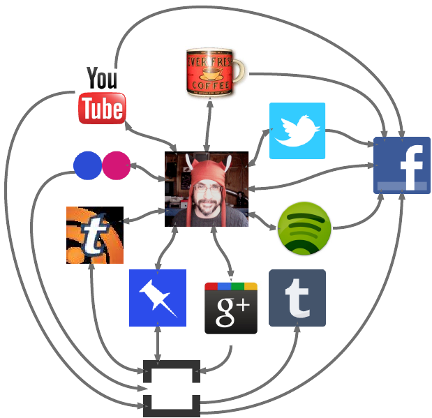

**TL;DR**: <em>Since Google Reader lost it's sharing, I've decided to
revisit my "social media strategy". I'm plugging lots of things into
other things. I feel like maybe I should write about this stuff.</em>

 <small>Started diagramming all my social media flows on LucidChart.</small>

## This is what I do for fun

Since I've mentioned in a few places that I'm a weirdo, I thought I
might spend some time explaining exactly what I mean by that. You see,
one of my hobbies is turning myself into a human content filter for
friends on the web.

And, honestly, having my sharing habits shaken up by the
[Readerpocalypse][] makes it fun again.

The image over to the right is an attempt I made to diagram some of my
social media flow. It's incomplete, though: I'm a cheapsake and ran
out of free objects in my diagram. So, I had to leave out at least a
half-dozen more services and a dozen additional connections.
([LucidChart][] is very nice, by the way.)

[lucidchart]: http://www.lucidchart.com/

## In other words, ifttt.com is awesome

In particular, I've finally spent some time with [ifttt.com][]. It's
like [Automator][] for the social web. It lets you [define event
triggers from one site that cause actions on another site][recipes]. 

So, I've gone crazy and created a bunch of tasks that make things like
the following possible:

* [Pinboard][] bookmarks based on favorites from
  [Twitter][twitterfavs], [identi.ca][identicafavs], [YouTube][],
  [Last.fm][], and my [Kindle][] highlights. I'm turning my
  [Pinboard][] account into both my personal social media archive and
  a Google Reader sharing replacement, and I don't even have to beg
  for new features at [Pinboard][].

* [Tumblr][] photo posts based on [Reddit up-votes][reddit], [Flickr
  favorites][], and [Pinboard][] bookmarks tagged "[to:tumblr][]".
  Since creating it, I've left my [Tumblr][] almost entirely
  neglected—but now with [ifttt.com][], I can route almost every nifty
  image I find over to that thing. It's the right side of my outboard
  brain to the [Pinboard][] left.

* Published items from from my private installation of [Tiny Tiny RSS][] 
  end up shared on [Pinboard][]. This pretty much scratches my itch
  for feed reader sharing, since [Google nixed those features from
  Reader][readerpocalypse].

* Starred items from [tt-rss][tiny tiny rss] get sent to
  [Instapaper][], so I can read them on my [Kindle][] later. If [email
  delivery of documents start working][ipemail], then I'll have a
  personal long-attention span newspaper delivered regularly to that
  gadget.

* Posts from [Google+][] get copied over to [Facebook][], because I
  don't want to pick sides.

* In fact, almost everything I do everywhere eventually ends up posted
  to [Facebook][], because I almost never post anything in person over
  there. I do have friends and family over there and respond to
  comments, though.

## What's the point?

The important principle here is that I'm lazy. If there's a single
button to click somewhere that expresses my happiness about a thing,
I'd like to click it and have that happiness shared and archived
elsewhere without me doing much (or anything) more. The scheme I have
now feels pretty good for that, and [ifttt.com][] does a huge amount
to help.

The other important thing is that **I am at the center of these
connections**. I don't live entirely on any single service, and
anything I care about is archived where I can easily grab it for
backups or mashups. Should any particular service node in this web
fail, I can probably do without, find an alternative, or build one
myself. 

My goal is to eventually replace as many of these nodes as possible
with self-hosted or at least Open Source derived services. (Though, of
course, I'm also lazy and my friends are where they are. So, that goal
will take awhile.)

## One more thing...

I've got [an idea for my next book simmering][book]. And, since I've
so far managed to write books about the major things I've done for
fun, I feel I'd be remiss if I skipped this stuff. I mean, I sort of
covered the same ground all in [my first][] and [second][] books, but
things have progressed since then.

What this means is that all the above feels like a warm up for the
coding and prosing I'll need to do. I just need to get my shit
together and carve out the time to make it happen.

[my first]: http://www.amazon.com/gp/product/0764597582?ie=UTF8&tag=0xdecafbad01-20&linkCode=as2&camp=1789&c%0D%0Areative=9325&creativeASIN=0764597582
[second]: http://www.amazon.com/gp/product/0470037857?ie=UTF8&tag=0xdecafbad01-20&linkCode=as2&camp=1789&%0D%0Acreative=9325&creativeASIN=0470037857
[book]: https://github.com/lmorchard/tinkering-with-activity-streams
[google+]: https://plus.google.com/114487965928288927815/posts
[ipemail]: https://twitter.com/lmorchard/status/132482782709555200
[flickr favorites]: http://www.flickr.com/photos/deusx/favorites/
[twitter]: http://twitter.com/lmorchard
[recipes]: http://ifttt.com/people/lmorchard
[facebook]: http://www.facebook.com/lmorchard
[instapaper]: http://www.instapaper.com/
[tiny tiny rss]: http://tt-rss.org/
[last.fm]: http://www.last.fm/user/deusx/library/loved
[youtube]: http://www.youtube.com/user/lmorchard
[identicafavs]: http://identi.ca/lmorchard/favorites
[twitterfavs]: https://twitter.com/lmorchard/favorites
[kindle]: https://kindle.amazon.com/profile/Leslie-Michael-Orchard/1056858
[reddit]: http://pipes.yahoo.com/pipes/pipe.run?_id=6f374b46f1b9a132972b262f2d85b7db&_render=rss
[to:tumblr]: http://pinboard.in/u:deusx/t:to:tumblr
[tumblr]: http://lmorchard.tumblr.com/
[pinboard]: http://pinboard.in/u:deusx
[yahoo! pipes]: http://pipes.yahoo.com/pipes/
[automator]: http://en.wikipedia.org/wiki/Automator_%28software%29
[ifttt.com]: http://ifttt.com
[readerpocalypse]: http://decafbad.com/blog/2011/11/01/readerpocalypse

<!-- vim: set wrap wm=5 syntax=mkd textwidth=70: -->
