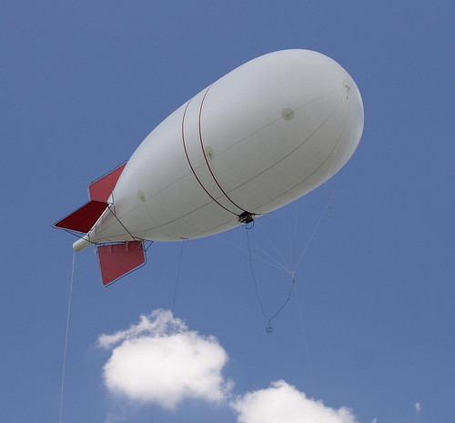

  

    Contents
  

  
  <ul class="toc_list">
    <li>
      <a href="#Aerostats">1 Aerostats</a>
    </li>
    <li>
      <a href="#Base_Stations">2 Base Stations</a>
    </li>
    <li>
      <a href="#The_Cloud">3 The Cloud</a>
    </li>
    <li>
      <a href="#Nerds-only_for_now">4 Nerds-only, for now</a>
    </li>
  </ul>

In my thinking about things [IndieWeb][1] and user-supported cloud infrastructure, I&#8217;ve had a couple of notions bouncing around in my head that might help clarify some &#8220;products&#8221; I&#8217;d like to build if and when I have time. I guess this would be good to blog about, so maybe someone else can steal my ideas (if they&#8217;re any good). Because, after all, much of this is sourced from material I&#8217;ve stolen from guys like [Dave Winer][2]. <!--more-->

## Aerostats

The first notion is &#8220;**areostats on the web**&#8221; &#8211; and by that I mean little servers that you own & run out in the cloud, like communication satellites. They&#8217;re positioned on the high ground, in view of lots of clients behind firewalls that can&#8217;t see each other.

An **aerostat** provides rendezvous, repeaters, store-and-forward inboxes, and general all-around persistent resources accessible by mobile and sometimes-online devices.

**Aerostats** can talk to each other and pass messages around. They include things like [PubSubHubbub][3] & [rssCloud][4]; [Jabber][5] / [XMPP][6]; [web-based push notifications][7].

**Aerostats** don&#8217;t necessarily include web servers intended for general content publishing: Many of these coordination and communication services involve a web server, but in my mind an **aerostat** isn&#8217;t where you stick your blog. It might be the thing that fires off update pings when you post to your blog, though. The blog itself could be hosted on Amazon S3 &#8211; because they do paid scalable content hosting very well. (And, just visualize how easy it would be for a mob to pull down an aerostat.)

I don&#8217;t really have any **aerostats** built, yet. I want to, though. I&#8217;ve got ideas for many pieces, but have yet to assemble them in a meaningful way.

## Base Stations

The second notion is &#8220;**base stations on the web**&#8221; &#8211; and by that I mean little servers that you own & run at home, like the base station for old-school cordless phones.

A **base station** could be your NAS or Time Machine, and it&#8217;s where your constellation of laptops and mobile devices can sync up when you&#8217;re on the couch. If you&#8217;re lucky, you have a stable IP on the public net from your ISP and can open a port in your router&#8217;s firewall &#8211; that way, your devices can get to the base station while you&#8217;re out and about.

**Base stations** include things such as backup services; a [Firefox Sync server][8]; a [storage API][9] for mobile apps. In my mind, a **base station** is largely private, maybe shared with a single household or immediate family. A **base station** isn&#8217;t where you host your blog, but it could be the thing that fetches updates from *others&#8217;* blogs and hosts a news reader.

I have a **base station** at home, right now. It&#8217;s a [Synology DS210j NAS][10], and it comes with much of the above out of the box. I&#8217;ve added a [Firefox Sync][8] server, though that needs some work on my end. I&#8217;m also able to open a port on my router. That&#8217;s allowed me to enjoy my own music collection from a 1TB hard drive in my basement, [using my smartphone on wifi][11] while at 10,000 feet over Utah. Who needs to upload tracks to Google or Amazon?

(Well, you might, if you don&#8217;t want to bother with maintaining a music collection at home &#8211; but I like it.)

## The Cloud

Now, there&#8217;s nothing keeping **aerostats** or **base stations** from being things provided entirely in the cloud. In fact, most of these things are available out there right now. But, it&#8217;s fairly hard to host these things yourself if you wanted to, and common APIs are lacking.

Some of the cloud services are for-pay and some are for free, but the stability of many are questionable. So, self-hostability and common APIs would at least make it easier (or at least possible) for you to jump off a burning platform if or when the company goes under or [a giant like Facebook or Google buys them and the dev team gets retasked][12].

Really, the point here is that you should be able to pay a vendor to run these services, or you should be able to buy your own hardware and run them yourself. Or, I guess you can subject yourself to ads and behavioral analysis to get a free ride &#8211; [but, you get what you pay for][13].

## Nerds-only, for now

Another thing to note is that, at least in my mind, the terms **aerostat** and **base station** invoke thoughts of amateur radio. That&#8217;s on purpose: Like usual, I think the next phase of this stuff [is and will be lovable only by the nerds][14] &#8211; just like the blogosphere in the last decade. So, I might as well embrace that at first and visualize ham operators on the web.

Maybe this stuff can eventually be productized in a more generally usable way &#8211; yet preserves qualities of freedom, privacy, usability, and reliability.

 [1]: http://indiewebcamp.com/
 [2]: http://scripting.com/
 [3]: https://code.google.com/p/pubsubhubbub/
 [4]: http://rsscloud.org/
 [5]: http://www.jabber.org/
 [6]: http://xmpp.org/
 [7]: http://arstechnica.com/business/2012/02/mozilla-developing-web-push-notification-system-for-firefox/
 [8]: http://docs.services.mozilla.com/howtos/run-sync.html
 [9]: http://www.w3.org/community/unhosted/wiki/RemoteStorage
 [10]: http://www.amazon.com/gp/product/B005YW7OLM/ref=as_li_ss_tl?ie=UTF8&tag=0xdecafbad01-20&linkCode=as2&camp=1789&creative=390957&creativeASIN=B005YW7OLM "The model number changes every year; mine is 2 years old."
 [11]: https://play.google.com/store/apps/details?id=com.synology.DSaudio&feature=search_result#?t=W251bGwsMSwxLDEsImNvbS5zeW5vbG9neS5EU2F1ZGlvIl0.
 [12]: http://techland.time.com/2012/07/20/why-google-or-facebook-buying-your-favorite-startup-means-its-probably-toast/
 [13]: http://en.wikipedia.org/wiki/There_ain%27t_no_such_thing_as_a_free_lunch
 [14]: http://scripting.com/stories/2012/07/21/usersWillTakeControl.html