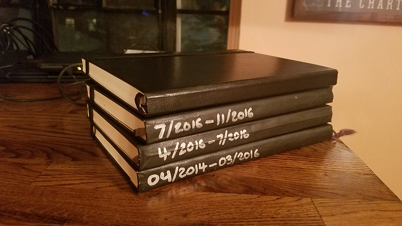
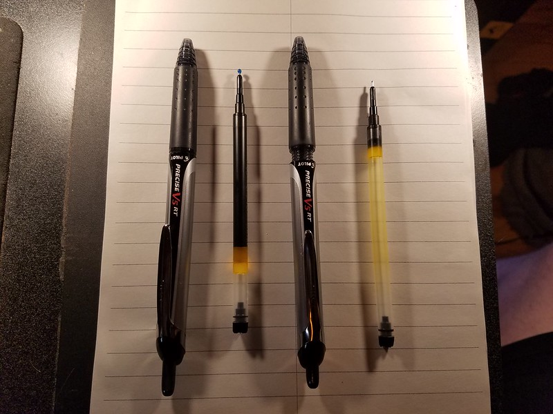
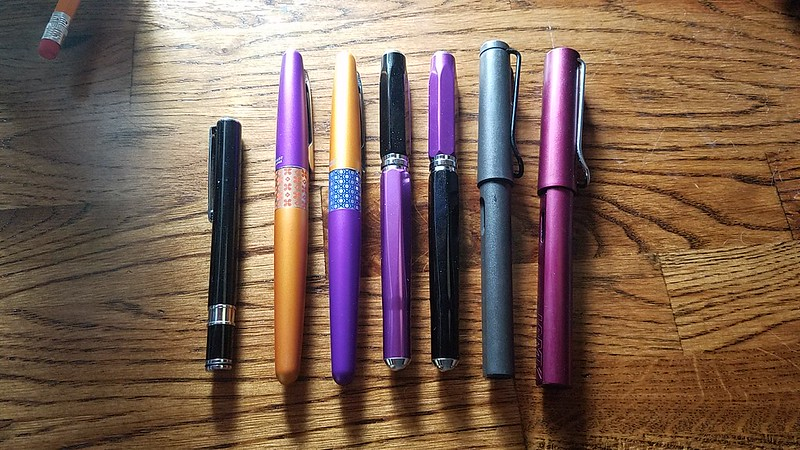
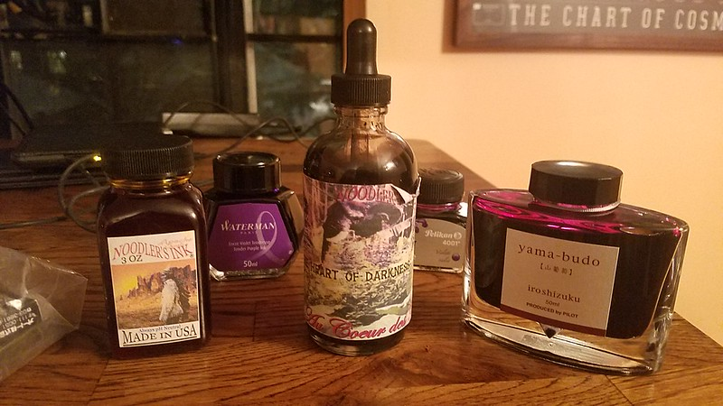
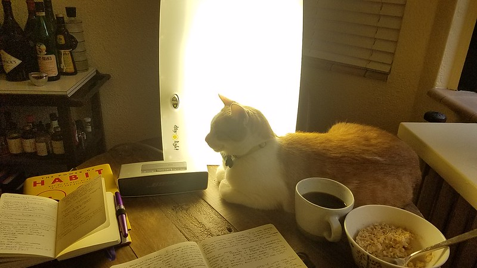
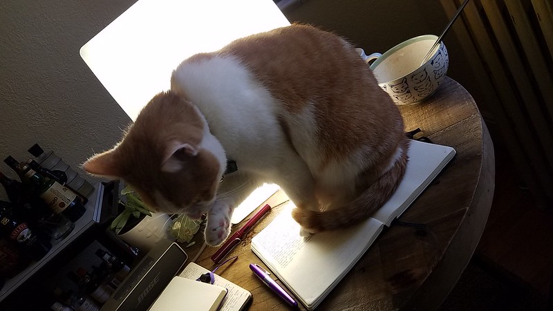

**TL;DR**: I've been writing a lot and accumulating fancy pens & ink colors.

<!--more-->

I've been trying to make some changes in my life. I started [running](https://www.strava.com/athletes/6013128) and tried eating better. I've tried [making things besides software](https://blog.lmorchard.com/tag/diy/). I've also been trying to write more consistently.

Last January, I started writing three pages almost every morning, five days a week. I take weekends off because my routine is so random & lazy then. But, as of now, I've written roughly 200,000 words by hand.

I started with a Moleskine I'd unwrapped in 2014—these books typically last years for me. I've always idly kept a journal since I was a teenager. I even tried forming a daily pages habit in college after reading [The Artist's Way](http://amzn.to/2jTm12t) and [Life's Companion](http://amzn.to/2jttNUp), but that iteration of the habit sputtered. Since then, I've only written when something extraordinary happened or, oddly, when I was stuck on a plane.

I've still got **20** and **30** (!) year old journals that I browse through occasionally. One of my biggest regrets is that there are such enormous gaps between entries. Important things happened to me and my memory is fuzzy on how they hit me and who I was then.

But, since the daily pages habit took hold this time, my consumption of pages has made a sharp uptick. I've filled close to four volumes of around 250 pages each. It's also taken a toll on my supply of pens. Where before a Pilot Precise V5 RT might have lasted the year, I started going through them every month. I was actually surprised & confused to have one run dry on me—I'd always lose them well before that happened!

I shared this picture on Twitter and someone joked that the next step was obviously to get into fountain pens. Well, I figured why not? But, I may have gone overboard by accumulating this assortment over the summer:

I'm also well-stocked with ink at this point—at least as far as journal pages are concerned. Though now that the addiction has seized me, I'm probably going to keep accumulating colors and playing.

Now I've got a virtuous nerdy cycle: Every morning, I look forward to grabbing my journal and one of my fancy pens and making sure the pen is topped off with ink. It's a very fiddly and satisfying process—and if you know me at all, you know I'm easily satisfied with fiddly processes.

And, it turns out, I love writing with a fountain pen. I find myself almost craving it, hours after I finish my morning routine. The ink literally flows onto the page, by way of capillary action drawing it down the tiny gap in the nib. Unlike with a ballpoint or even a Pilot rolling ball, I don't have to apply any pressure. I can just barely touch the page and paint the ink onto the page. I've also come to appreciate nicer paper, having upgraded my Moleskine habit to a [Leuchtturm1917](http://amzn.to/2kSYMW0) habit. I've come a long way since a drug-store spiral notebook and a No. 2 pencil would do.

But anyway, back to the routine: I make coffee & oatmeal. I start some music. I fire up my [light therapy panel](http://amzn.to/2kTiEbS) because [winter in Michigan is ridiculous](http://www.mlive.com/weather/index.ssf/2017/01/incredible_lack_of_sun_continu.html). I attract a cat or two. Then, I start writing.

Usually, I can make it through 3 pages in 45-60 minutes. That ends up being about 750 words. I started this habit at my office desk, but I would get distracted by my laptop. At our old house, I moved to the kitchen island downstairs and kept my phone just out of arm's reach once I got the music started. Since we moved to Detroit this past fall, we've got a breakfast nook with a little table near a window overlooking the backyard. It's embarrassingly precious, but I manage.

When I'm lucky, I get myself into a good mindful state for a solid block of time. Sometimes, the writing is rewarding and dislodges interesting stuff from my head. More often, the writing is just random blather that spills out to fill pages. And every once in awhile, the writing is about the fact that I'm writing random blather for the sake of writing—at which point the journal implodes into itself and I have to buy a new one.

The thing is, though, that I sit down and that I finish it. Three pages every time. It's an interesting way to start the day, accomplishing a moderately strenuous mental task not unlike physical exercise. When it works, I untangle my brain while also exercising focus and willpower to complete the task. Some days, that focused feeling spills over into the rest of the day's work. Sometimes it doesn't *quite* work. A few times, I've experimented with writing these pages while I ride an exercise bike to kill two birds with one stone—but the result was disastrous and messy. Really, it's just best to stick to a simpler ritual.

**So, where do I go from here?** I had an interesting time **reviewing** entries when I had vacation time at the end of 2016. It was a pretty good year, [until it wrecked me](https://blog.lmorchard.com/2016/11/11/heartbroken/). But, I'd like to do better in 2017. And, of course, this new year brings new challenges and pushes me to do [things that I've never really done before](https://twitter.com/lmorchard/status/821789340355428352). I've got a lot of tangle to straighten in my brain.

I also want to **publish** more consistently & effectively. I wrote 200,000 words this past year, but it's unlikely anyone will ever read them but me. It's not like I'm going to be a historically significant figure and see all these journals end up in an archive somewhere. Hell, I'm not even all that sure anyone's reading *this very blog post*—but since you don't have to sneak into my office to access it, chances are way higher.

I've got my **tinkering & making** to write about, like I always have. But, I've also been considering writing here about more general topics—and whether that might work better than snipey little junk food retweets and Facebook threads. You know, versus just keeping my mouth shut altogether. I've never really gotten all that **political** on a blog before, but maybe it would help me clarify my thinking by doing it out loud and inviting some push back.

I've also really wanted to get myself writing **stories**. I've got [a little bit of fiction on my blog](https://blog.lmorchard.com/tag/fiction/), but I've always wanted to do more. The engine never quite catches, though. Maybe I can find a way to translate or replicate this daily pages habit as a regular creative writing habit. Maybe start with some flash fiction again and work my way up to extended works.

All in all, I love writing. I'm not sure why I have such a hard time doing it more out in the open, but I'd like to solve that. Maybe 2017 will be the year I progress from this solid private habit to a public one.

<!-- vim: set wrap wm=5 syntax=markdown textwidth=78: -->
