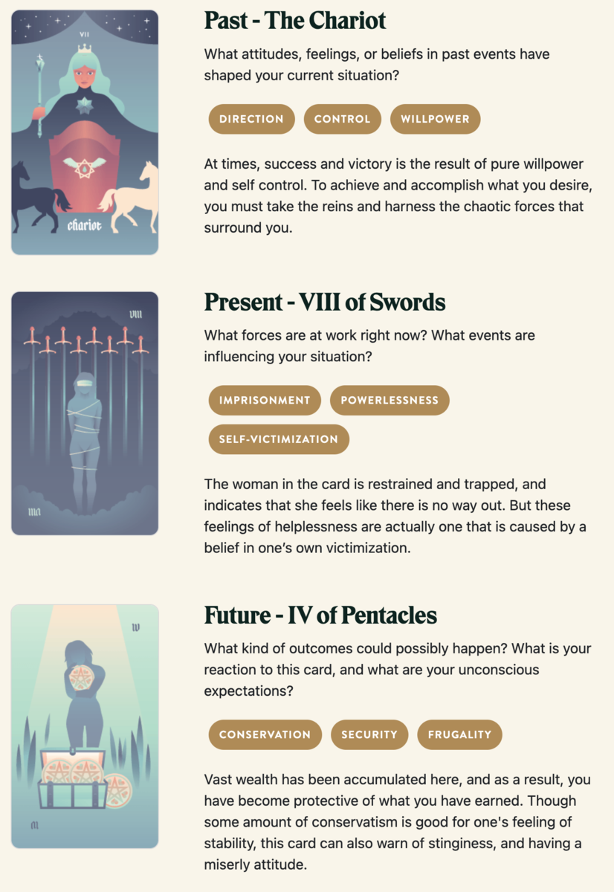

{{../../../_includes/flash-fiction-blurb.md}}

<!--more-->

<figure class="wide"></figure>

Asceline crept through the caverns. Her elfin boots deadened the sound of her footfalls and any errant pebble that she might disturb. And, though her ultrablack cloak never failed to divert all light from her form, she took special care to stick to the shadows.

She passed a handful of torch-bearing humans patrolling the tunnels, but none of them took the slightest notice. Before long, she'd reached the magma chamber of the dormant volcano. The magma had been drained long ago by unnatural means, but the air remained sulfrous and searing.

At the center of the chamber, atop her immense hoard of gold and jewels, slumbered the crimson-scaled dragon Chemryth. Curled up like a house cat, the beast was still the size of a mead hall. Her jaws could easily consume a draft horse in a single bite. Her nostrils, the diameter of cauldrons, vented steam with her gentle yet titanic exhalations. 

Asceline approached the edge of the hoard, a mere dozen paces from Chemryth's eye. She recognized the golden bars and coins, embossed by the dragon's scales. The men in these caverns had used them for all manner of mayhem - slavery, bribes, wars. All the funding led here.

"Um, excuse me," said Asceline.

Chemryth's eyelid stirred, but did not open.

Asceline cleared her throat. Louder this time: "Hello? Miss dragon?"

Chemryth sighed, her breath like a bonfire laced with nutmeg and diesel. Her great golden eye opened, wandered a bit, then fixed on Asceline.

"Oh, hello there," said Chemryth with a thrumming inside Asceline's mind. "I can barely see you in the light, but your soul shines bright."

"Ah! Yes, thank you, I think," replied Asceline out loud. "I do try to keep it polished."

Chemryth gave a gentle chuff. "You don't need to make sound for me to understand, if you're worried about the others finding you."

"Oh, yes," thought Asceline in reply, "thank you again. I am worried about that."

"I would imagine so. Now, why have you come? Despite your terror, you don't seem inclined to attack."

"Oh, no, never. That would be altogether foolish. No, I just hoped I could ask you some questions?"

"You may ask. It's even possible that I might answer."

"Oh. Okay. So, first question: Why do you pay the men who live here?"

"Because they hunt for me and bring me things."

"Couldn't you go hunt for yourself and get your own things?"

"Yes, but that would require me to leave my hoard unguarded."

"Why do you even have this hoard?"

"So I can pay men to hunt for me and bring me things."

"Wouldn't it be better not to be bound to this hoard?"

"Perhaps. But I also think it's pretty and the metal makes for a soft bed."

"Soft? Oh, I suppose gold might be soft for someone like you."

"Indeed. You have more questions, no?"

"Yes. Is there anything I could do to convince you to stop paying these men?"

"These men in particular?"

"Yes."

"Perhaps you could convince different men to attend to me? I don't care about these in particular. I suspect that's why they're so quarrelsome toward others who come to visit me."

"You'd pay anyone who hunted for you?"

"And brought me things, yes."

"So, just hypothetically: If those men were all killed, would that anger you?"

"No. They haven't especially endeared themselves to me. I would be annoyed by missing meals and gifts, though."

"Ah. So, if the hunting and the gifting continues - but these particular men all died - you wouldn't leave here and ravage the countryside?"

"No. That sounds like a great deal of effort and not very interesting."

"One last question."

"Please ask."

"What does strike you as endearing?"

"Conversation and entertainment, my dear."

"Has this conversation been entertaining?"

"Mildly so, yes. And since you're fishing for this: Yes, I do find you endearing. Now go ahead and slaughter all those unpleasant men who've been troubling you and bring me more pleasant attendants."

"Thank you very much. I'll get right on that."

## Prompt

[Take a look at my Labyrinthos Tarot Reading!](https://app.labyrinthos.co/reading/ppf/SSTRWS/7,57,67)

