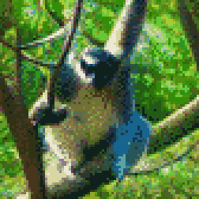

{{../../../_includes/flash-fiction-blurb.md}}

<!--more-->

Mala dashed quietly through the high tree canopy, skipping from branch to branch with all four gripping hands and her prehensile tail. It was well after sunset, but she'd been this way many times. For every leap, she knew exactly how to push off and land without making the leaves rustle.

The stranger troop should nearly all be sleeping by now. She could tell by the stars in the sky: This was when they let their fires burn low and curled up for the night. A few would still be awake to watch, but she'd learned their habits over many nights' quiet visits.

They kept their nest platforms in the middle branches. They were high enough that few hungry mouths could reach them from the forest floor, but low enough that the canopy leaves caught the rain when it stormed.

Most of the eyes were aimed down, then, as Mala came upon their village. She carefully circled the place, noted the guards who lounged and chattered to each other. She found the little storage hut where they kept what she came for. Only one of the troop sat near it, dozing.

This troop had gathered a new kind of fruit. It was found far from here, but she knew how to grow new fruit from the seeds inside. As far as she had ever seen, no one in this troop could do that. They just gathered and ate. It was a waste. If she could take some of their fruit, she could flee back home and introduce it to her own troop.

She carefully descended through the branches toward the hut. The only light came from a smoldering clay fire bowl outside. The guard was curled up right inside the entrance. The roof was made from broad, overlapping leaves draped over bent branches. She wasn't sure whether it would take her weight if she landed on it.

She decided she didn't care. She dropped. She fell onto the leaves of the roof - and tore a hole right through. With a thud, she landed on the platform inside in a jumble of limbs. Her head landed right next to the guard's own. She held her breath.

The guard's eyes opened and met hers. She tried a smile. He smiled back, drowsily. Then, he pulled back in a startle and began a hooting alarm cry. 

Mala scrabbled back and cast her gaze around the space. Just behind her, a net of woven vines held a generous pile of the fruit. She snatched it, slung it onto her back. She heard others scampering toward the hut. The walls were made of woven twigs and branches, not much more substantial than the roof.

Screaming, she turned and dashed into the back wall of the hut and burst out into open space beyond. Her limbs flailed as she cast around for anything to grasp. She fell and fell - and finally, one hand caught a branch, breaking her fall with a wrench of her shoulder. Joints throbbing, she swung up and sought greater height. 

No need for stealth, Mala reached the high canopy and put on as much speed as she could muster. Behind her, she heard hoots and screams in pursuit. The huffing of her own breath began to drown them out. Soon, she could hear them no longer and home was in sight.

## Prompt

[Take a look at my Labyrinthos Tarot Reading!](https://app.labyrinthos.co/reading/ppf/SSTRWS/56,12,72)

