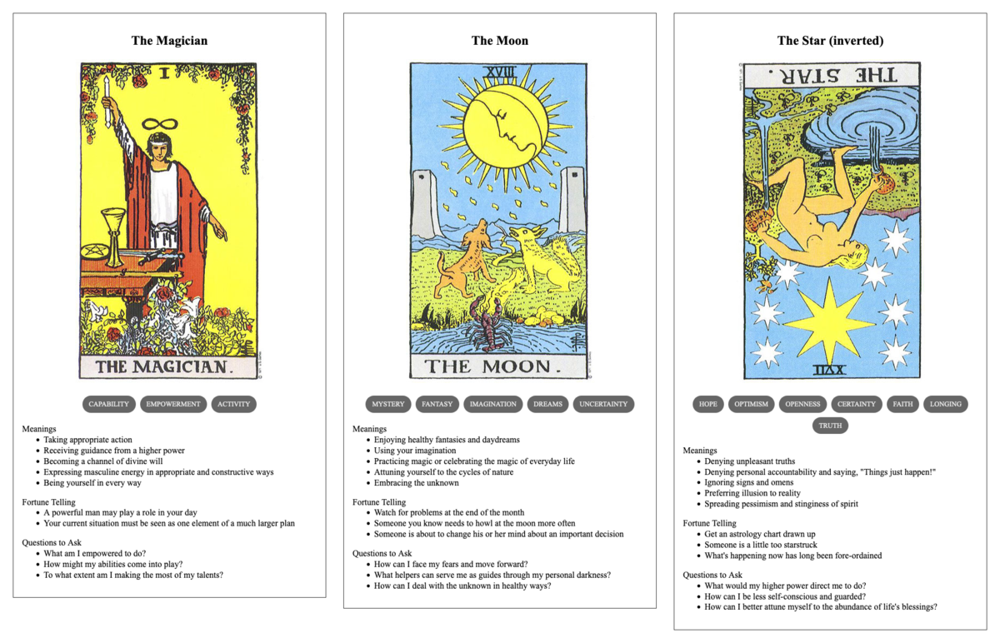

{{../../../_includes/flash-fiction-blurb.md}}

<!--more-->

*Amari could only convey portents and omens to the little primates. Just one of them seemed to be paying any attention. But, even then, few of the messages really got through. Xe had to keep trying.*

Koga poured the water into the fire bowl, quenching the flames and flooding the hut with steam and smoke. Shafts of afternoon light pierced through the gloom and illuminated the murky liquid. She squinted at the grime and ash swirling across the surface. Her apprentice, Miko, peered over her shoulder and made a little inquisitive grunt.

Koga pointed meaningfully at the left-hand side of the bowl, where a rainbow whorl hosted dancing black flecks of carbon. The flecks suddenly self-organized, snapping into a grid of dots. The dots swam and stretched, forming lines that joined and twisted and crossed.

*Xe knew the animals were clever, even had early forms of symbolic art and rudimentary language. It wasn't much like that of xir organic progenitors, though. Pictographic representations might prove a viable channel, but xe didn't know if the warning would get across in time.*

Miko squealed and made to lunge at the water. Koga held her back and hissed.

"No," said Koga. "Look, see."

The shapes in the grime were almost-familiar, like what Koga and Miko had been scratching into planks with charcoal to try to remember things. Was that a tree? Something struck it. The tree-thing shook and sprouted spiky flutters. Little figures that could have been like Koga and Miko - were those four limbs and a tail? - fell from the tree. An arrow head appeared in the murk, pointing toward the northeast.

Miko squeaked and said "What?"

Koga scratched her ear and shrugged.

*Amari had seen the drought developing for months now. Xe couldn't reverse it without irrevocably damaging other segments of the biosphere. And, more than that, the canopy that the primates had settled were like lodgepole pines, bearing serotinous cones that required a good amount of heat to unseal and distribute their seeds. This forest was overdue for a good fire and xe couldn't hold it back much longer.*

Miko pulled a tree cone from her hip pouch and threw it into the cauldron. It distrupted the patterns and broke the spell.

Koga growled and cuffed Miko hard in the ear. "Stupid!"

Miko growled back, "Scary! Gone now."
## Prompt

A 3-card spread from my [Tarot Thing](https://lmorchard.github.io/tarot-thing/):

