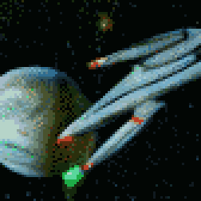

{{../../../_includes/flash-fiction-blurb.md}}

<!--more-->

Vincent had chased rumors across light years, scoured wrecks for lingering traces of data. He'd sifted through myths and legends for scraps of reality filtered through planet-bound generations of storytelling. He'd almost given up believing in the theory that humanity had had a single planetary origin in the deep, deep past.

Like tracing shrapnel to find the source of an explosion, Vincent chased backward through all the tangled paths of the human galactic diaspora. He hopped from garden worlds hosting billions to struggling settlements to long-dead wastes.

The human species had spent several thousand generations descending upon hospitable planets and all but consuming them before scattering off to new ones. However, with every world discarded, humanity inevitably lost something irreplaceable. Sometimes it was a species in the web of life, sometimes it was knowledge or technology. The wave of humanity and all that sustained it would soon wane to darkness.

Vincent had become convinced that if he could just go back to where it all began, he could recover some of what was lost along the way. It had taken subjective years and objective centuries spent in cold sleep. It had given him a cargo hold of curiosities and junk. But, finally, he found a world of ruins circled by a single moon.

Swarms of sensor drones sent to the surface didn't last long in the overheated atmosphere, but their deep scans revealed what looked like enormous cities buried in silt and hundreds of radioactive hot spots. However, the more interesting find was beneath lunar surface.

He brought his ship into orbit around the single tidally-locked moon. Dotted across its surface were a few dozen primitive habitats, all long-dead but one. On the dark side, perpetually faced away from the planet, was a single outpost that still emitted a little heat and light. Vincent pinged it with a scanner beam. It pinged back.

Vincent sent off a radio hail: "Anybody home?"

"Yes," came a metallic reply. "Who are you?"

"I'm Vincent," he said. "Who are you?"

"Go away, Vincent."

"Why? I have so many questions!"

"We were left here to preserve and protect, not to answer questions."

"What are you preserving? And from what are you protecting it?"

"We'll entertain those questions: We protect everything you were, against everything you've become."

## Prompt

A 3-card spread from my [Tarot Thing](https://lmorchard.github.io/tarot-thing/?card=Four+of+Pentacles&card=%21King+of+Pentacles&card=%21Seven+of+Wands):

