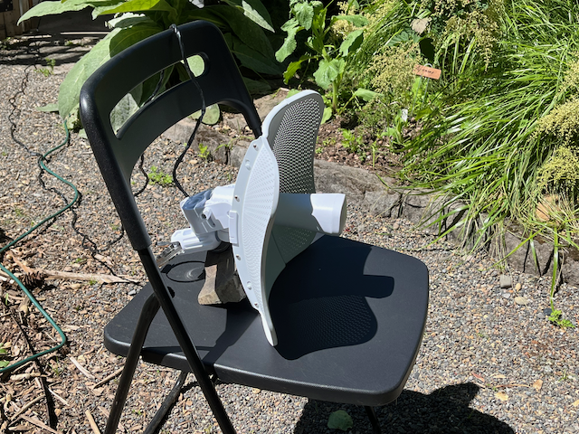

**TL;DR**: There are no ushers on Mastodon. There's no one paid to show you to your seat, no one whose job it is to ease you into comfort and remove friction.

<!--more-->

You are not a pair of valuable eyeballs worth fractions of a cent per impression on the ad market. There is no in-built incentive on this network to retain you or solicit increased engagement from you. You will get very little out of this network without putting something into it. And even then, there's no promise of returns.

That's not to say no one will help you: Mastodon is a loose assemblage of ongoing parties. There are many pleasant hosts and friendly party-goers who may welcome you. They may even open a spot on the couch for you. They're not here to serve you, though. These are people at a party with an open invitation, and you'll need to find your own good time.

There is no manager on Mastodon. Maybe you don't think of yourself as the kind of person who demands to speak to one. But, if you find yourself kvetching into the ether about the network, to whom are you speaking? Venting's a thing, sure. But, there's no obsequious ear noting your concern. There's no one whose job it is to accommodate you.

There may be people who'll hear your concern and decide to spend their time on it - for better or worse. Maybe it's fun. Maybe they want to feel clever. Maybe it's a skill-building opportunity. Maybe it's aligned with some idealistic aspiration. Maybe they believe in gift culture. Maybe their hobby is trolling. Maybe they like you personally. Maybe they don't like you. Maybe it's not you at all. Folks have all kinds of motivations.

Missing on this network, though, is a team of employees paid to implement a system that regards you as important because there's a chance that access to your attention can be auctioned off for revenue. (Dang, that's a convoluted way to run things.)

I think we've gotten used to this sort of importance-by-default. It feels like a small flattery, regardless of purpose or underpinnings. It may feel like an indignity when it's absent. All it is, though, is that you have encountered a system of people who owe you nothing and have not yet discovered anything they want from you.

You may find this network confusing. It's not perfect. It doesn't work for everyone. There will always be a need for improvement. But, it is good enough for a lot of people. And it has been around longer than you may have been aware of it. Again, many of the folks on the network do not feel particularly motivated to resolve your confusion. You may need to do some homework to meet folks where they are.

Why did you sign onto this network? What do you hope to get out of it? Examine your intent. Did you expect this to replace something for you? What, exactly? Be explicit, if only for yourself.

This network is not a 1-for-1 replica of things from which it was inspired. Nonetheless, some folks have found it offers what they wanted from other things. You'll need to explore and seek or build for yourself.

This is not "[a cybernetic ecology where we are free of our labors ... and all watched over by machines of loving grace](http://www.brautigan.net/machines.html)". The machines here are rather clumsy, built by amateurs and professionals on days and nights and weekends. It's a best effort attempt by a bunch of folks who want to talk to each other.

You will need to employ some effort to join this network. You might even need to spend some money. You may also decide that it's not what you want. But, all-in-all, you will only experience frustration if you demand that it becomes something else just for you.
