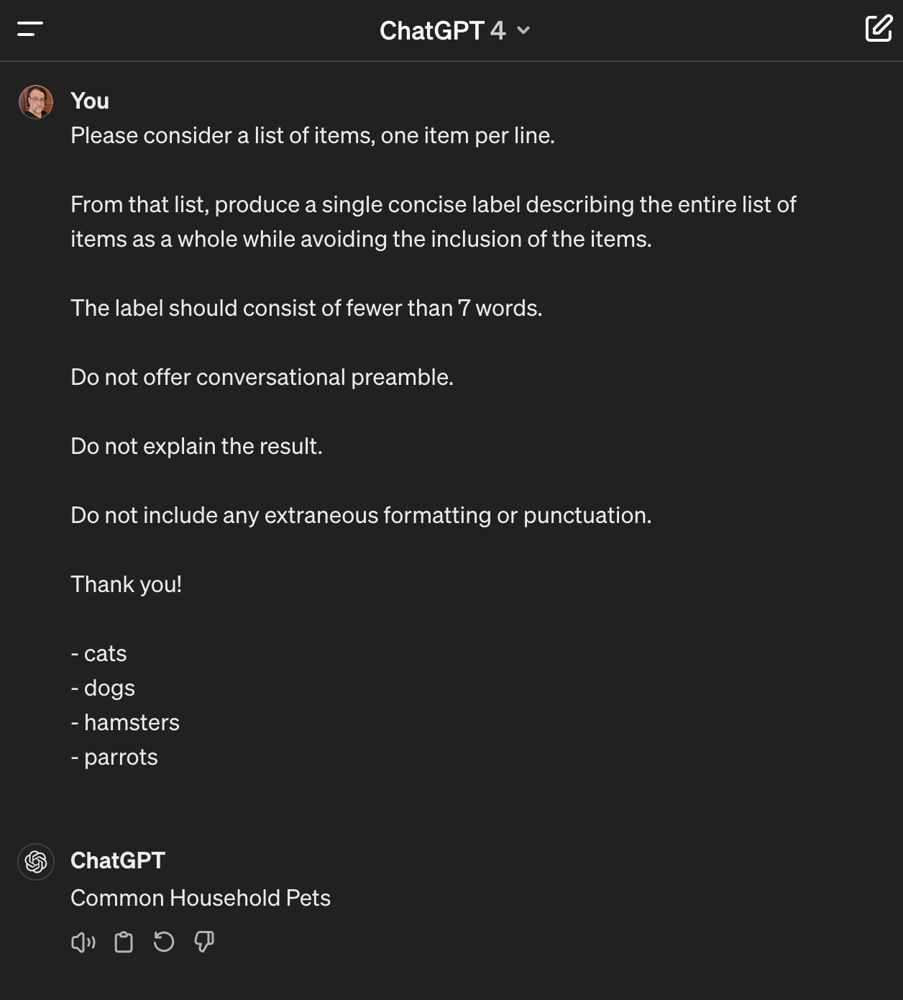

**TL;DR**: FigJam has a feature where you can automatically cluster sticky notes by topic. I wanted to see if I could glue some things together to implement this myself.

<!--more-->

<figure class="wide">
  
  <figcaption>I asked DALL-E to generate "a whimsical depiction of astronauts arranging ideas into clusters while floating in deep space". Then, I ran a few imagemagick transformations on it for fun.</figcaption>
</figure>

<nav role="navigation" class="table-of-contents"></nav>

## Organizing sticky notes automatically

Over the years and on various teams, I've been in a lot of brainstorming and clustering exercises. Years ago, we did it with literal paper sticky notes slapped onto a wall. More recently and remotely, we've done this with [FigJam](https://www.figma.com/figjam/) over Zoom.

We'd also do the clustering as a manual group exercise, whether moving little slips of paper around or dragging boxes on the screen. Well, over the past year or so, [Figma added AI features to FigJam](https://www.theverge.com/2023/11/7/23950667/figma-figjam-generative-ai-design-tools-beta-announcement). One of these features is the ability to automatically cluster sticky notes by topic:

<figure class="wide">
  <video controls>
    <source src="./figjam-sorting-demo.mp4" type="video/mp4" />
    <a href="./figjam-sorting-demo.mp4">figjam-sorting-demo.mp4</a>
  </video>
  <figcaption>A quick demo of FigJam's sticky organization feature - it's more legible in fullscreen view</figcaption>
</figure>

Sometimes, the group exercise of shuffling ideas around is the entire point - it can help folks review everything during the process. But, sometimes, that just chews up time better spent parsing through things at a higher level. So, this is a neat tool to have around for rough cuts and quick passes.

Also, with respect to this tool in the context of the generative AI hype cycle, I don't think it's a terrible application of the tech. The results can be imperfect, but a brainstorming process is pretty tolerant of fuzziness. This thing can be pretty handy even with the glitches and quirks.

## So, how does it work?

Since I don't work at Figma, I don't really know how they implemented this in FigJam. But, lately, I've been trying to catch up on the last decade of machine learning and language models. That gives me a few ideas of what I can glue together to make something like this work.

First, there are two main parts to this clustering activity:

1. clustering the sticky notes by topic
1. labelling the topic of each cluster

Simple, right? You just look at the notes and physically move the ones you think are similar closer together. Then, you look at each group, scratch your head a bit, and write down a few words that seem to describe what seems similar about them.

Now, how can a computer do any of that? Well, not simply. At least, not without having a significant bit of tooling to deal with language and semantics. As it turns out, we have some of that tooling these days.

With that in mind, here's a technobabble outline of what I'll spend the rest of the blog post explaining:

1. we map the notes as points in a virtual semantic space using [vector embeddings][]
1. [k-means clustering][] can find groups of points that are close together in space
1. we map the points back to notes and a [large language model][] can help generate labels for each group

This process is sorta-kinda like what we'd do as humans? Only, instead of pushing sticky notes closer together, the machine constructs a space wherein the sticky notes are already in close proximity. And, instead of scratching its head, it does a bunch of funky math to figure out what words are plausibly appropriate given the context.

Okay, yeah, that hurt my head to write. Let's get into some code.

## Play along at home with a notebook

By the way, if you've got time, you can play along with this blog post at home with this notebook:

- [topic_clustering_with_openai.ipynb](./topic_clustering_with_openai.ipynb)

Someday, I might figure out a way to integrate notebooks into this blog. But, until then, you can run it with [Google Colab][] and see the results for yourself. If you want to do that, you'll also need an [OpenAI API key][], since I won't be sharing my own here.

I'll leave it as an exercise to the reader to figure out how to get all this working. But, it's worth learning how to use these tools if you're interested in this kind of thing.

[openai api key]: https://platform.openai.com/
[google colab]: https://colab.research.google.com/

## Opening ceremonies

To kick things off, consider this code that constructs a list of notes to cluster:

```python
items_text = """
- pasta
- thomas dolby
- alpha
- apples
- cats
- pears
- meters
- brick
- dogs
- beta
- howard jones
- concrete
- asphalt
- milk
- rebar
- gillian gilbert
- hamsters
- bread
- butter
- wendy carlos
- gamma
- birds
- bananas
- rick wakeman
- inches
- glass
- feet
- gary numan
- miles
- lumber
- kilometers
- geoff downes
"""

# Split the text into non-empty lines...
items = [x for x in items_text.split("\n") if x]
```

It's a pretty random grab bag of things. Maybe you'd roll these up in [Katamari Damacy][]? Anyway, along with giving you a weird view of my brain, it's a good starting point for a clustering exercise.

Next, here's some preamble to install some needful modules and to create an OpenAI client. There are other ways to get all this working, but OpenAI's APIs are a quick option to start playing:

```python
%pip install openai scikit-learn

from openai import OpenAI
from google.colab import userdata

openai_client = OpenAI(api_key=userdata.get('openai_api_key'))
```

This notebook expects an OpenAI API key to be provided in a Collab secret named `openai_api_key` and the `userdata.get()` method is how it's fetched. Collab has a handy little tab with a "key" icon on the side [where you can add secrets](https://twitter.com/GoogleColab/status/1719798406195867814), so I don't have to share mine with you here.

## Mapping notes with vector embeddings

Now, consider a [hash function][] like [MD5][] or [SHA-256][]: using one of these, we can generate a consistent, fixed-length hash for any chunk of data. Since these hashes are likely to correspond to a specific chunk of data, we can fairly reliably compare hashes to see if two pieces of data are identical or not.

Similarly, a [vector embedding][vector embeddings] is a fixed-length list of numbers that can be consistently generated for any chunk of text. Just like hashes, we can compare two embeddings to see if they came from the same text. (Though, as I'll explain shortly, this is not the most exciting feature of embeddings.)

Here's how we can get embeddings for our list of notes, using the OpenAI API:

```python
# Get embeddings for the list of items
embeddings_response = openai_client.embeddings.create(
  model="text-embedding-ada-002",
  input=items,
  encoding_format="float"
)

# Simplify the response data model to just a list of embeddings
embeddings = [embedding_item.embedding for embedding_item in embeddings_response.data]
```

This uses [OpenAI's embeddings API](https://platform.openai.com/docs/guides/embeddings) to access a model named `text-embedding-ada-002` and generate embeddings for each item in the list. There are other models available - just like there are different hash functions - but this one is a good starting point.

As promised, if you peek at one of the embeddings, you'll see a list of numbers like this:

```python
embeddings[0]
[0.0094045475,
 -0.009105674,
 0.01120443,
 -0.018105082,
 -0.007730857,
 0.015474997,
 -0.026951734,
 -0.026725918,
 0.0040049027,
 -0.035120938,
 0.021890812,
 0.019061478,
 -0.014438903,
 ...
```

Here's where vector embeddings have a superpower over hashes: You can consider that list of numbers as the coordinates of a point somewhere in a very high-dimensional space. And, in this space, geometric distance between points is roughly approximate to semantic similarity.

When I first learned about [vector embeddings][], it sounded entirely sci-fi and bruised my brain. But, it's practical technology. Some researchers at Google figured it out back in 2013 and called it [Word2vec][]. Of course folks have built on that a lot since, but the basic notion remains handy.

To make it work, you need to train a machine learning model over an enormous corpus of example text. Roughly speaking, the training encodes the relationships of words and phrases based on surrounding context. The resulting model can then generate what I think of as positions along a large number of semantic axes for any given text you throw at it.

The `text-embedding-ada-002` model produces vectors of 384 floating point numbers. I take this to mean that the model has encoded 384 axes of semantic similarity - sort of the "resolution" of the model, if you will. This, along with other factors I don't quite understand yet, can be used to decide on which embedding model to use for a given task. (And there are quite a few to choose from.)

Honestly, it's a black box to me - I don't know what the semantic axes mean in any given model. And, modulo research I haven't yet read, I don't think anyone really knows what they mean.

But, the gist is that you get a fancy hash function that can be used to index text in a way that roughly corresponds to semantics.

## K-means clustering in a semantic space

Okay, so, we've got a list of notes and we've got an associated list of embeddings. Assuming you believe that the embeddings can be used as coordinates in a semantic space, we can apply a spatial algorithm to group the points - and, thereby, the notes - into clusters.

The [k-means clustering][] algorithm is a way to do this. It's another black box to me, but I think the way it works is by placing a set number of points in space at random and then jiggling them away from each other until they're each in the middle of a dense bunch of other points. Then, it divides the space up in a clever way around those "centroid" points to define clusters.

The real interesting thing here is that [k-means clustering][] doesn't know anything about words or language. It just knows about points in a space of arbitrary dimensions. But, since we've managed to map text into meaning-like points, we can use it to cluster text. And, in turn, since we've expressed ideas as text, this can help us organize ideas.

Weird, but I'm counting this as food for thought in considering further tools that can be applied to language, thanks to [vector embeddings][].

Anyway, here's some code that applies k-means clustering to our list of embeddings - which in turn corresponds to our list of notes. The heavy lifting is done with the `sklearn` package, the rest of the code just juggles the results into a more convenient shape:

```python
from sklearn.cluster import KMeans
from itertools import groupby

# Let's say we want to organize the list into this many clusters
n_clusters = 12

# Use the k-means algorithm to come up with a cluster ID for each embedding
cluster_ids = KMeans(n_clusters=n_clusters, n_init='auto').fit_predict(embeddings)

# Associate each cluster ID with the corresponding item
cluster_ids_with_items = zip(cluster_ids, items)

# Group the pairs of (cluster_id, item) into lists based on cluster ID
grouped_cluster_ids_with_items = groupby(
    sorted(cluster_ids_with_items, key=lambda x: x[0]),
    key=lambda x: x[0]
)

# Simplify that whole mess so we just have a list of clustered items
clustered_items = [
    [item for cluster_id, item in item_group]
    for cluster_id, item_group
    in grouped_cluster_ids_with_items
]
```

Another interesting thing is that k-means clustering is not consistent. You can run it repeatedly and get different results. In fact, if you're following along in the notebook, you should try that.

Print out the value of `clustered_items`, it'll look something like this:

```python
clustered_items
[['- cats', '- dogs', '- hamsters', '- birds'],
 ['- gillian gilbert', '- gary numan'],
 ['- alpha', '- beta', '- gamma'],
 ['- lumber'],
 ['- meters', '- miles', '- kilometers'],
 ['- brick', '- concrete', '- asphalt', '- rebar', '- glass'],
 ['- pasta', '- milk', '- bread', '- butter'],
 ['- rick wakeman'],
 ['- thomas dolby', '- howard jones', '- geoff downes'],
 ['- apples', '- pears', '- bananas'],
 ['- inches', '- feet'],
 ['- wendy carlos']]
```

Not too bad, huh? It's a pretty good rough pass at organizing similar notes. Some of the groupings are a bit weird, but that's to be expected. You can also adjust the `n_clusters` variable to see how the results change with fewer or more clusters.

On the next try, it might look like this:

```python
clustered_items
[['- rebar', '- lumber'],
 ['- meters', '- inches', '- feet', '- miles', '- kilometers'],
 ['- apples', '- bananas'],
 ['- alpha', '- beta', '- gamma'],
 ['- gillian gilbert', '- gary numan'],
 ['- wendy carlos', '- rick wakeman'],
 ['- hamsters'],
 ['- concrete', '- asphalt'],
 ['- cats', '- dogs', '- birds'],
 ['- pears', '- howard jones'],
 ['- thomas dolby', '- geoff downes'],
 ['- pasta', '- brick', '- milk', '- bread', '- butter', '- glass']]
```

Oh, hmm: bricks and glass don't really belong on a grocery list, do they? That's kind of what I was talking about earlier with the fuzziness of the results.

Still, I think it's pretty interesting for a machine to do this at all! If I actually built a tool around this, it'd be handy to offer the ability to run the clustering repeatedly until a pleasing arrangement resulted. Keep the human in the loop, so to speak.

## Generating labels with a large language model

So, I've talked a lot about black boxes and fuzziness so far. And, alas, there's no stopping now since my next tool is a [large language model][].

These are machine learning models that have been trained on a lot of text and can, in turn, generate plausible text that seems to be in the same style as the training data. They can also be fine-tuned to generate text for more focused purposes - e.g. generating responses seemingly in the role of a chatbot assistant, answering questions, or summarizing text.

I'm still working to wrap my head around how these work. My current hypothesis is that because models have been trained on text which narrates giving and taking instructions - and includes the results of following out instructions - many models can generate the semblance of performing tasks. It's [Chinese rooms][] all the way down, except sometimes the results are useful despite the hype.

Anyway, with that in mind, here's some code that will soon be employed to do stuff:

```python
topic_generation_prompt = """
Please consider a list of items, one item per line.

From that list, produce a single concise label describing the entire list of
items as a whole while avoiding the inclusion of the items.

The label should consist of fewer than 7 words.

Do not offer conversational preamble.

Do not explain the result.

Do not include any extraneous formatting or punctuation.

Thank you!
"""
```

Oh wait, that's not code, that's wishful thinking.

Except, it sort of *is* code? I mean, I typed that into a box over at [chat.openai.com](https://chat.openai.com/) and it did stuff I wanted it to do. And I'm reasonably sure there wasn't a person on the other end. I think it was somebody else's computer (i.e. the cloud).

Unfortunately, I didn't think to capture the half-dozen rounds of fumbling it took me to get to this point. But, here's a screenshot of that prompt in action:



Pretty nifty. "Common Household Pets" was an acceptable answer for me. Though, why did I thank the computer? [I don't know. It didn't hurt?](https://blog.lmorchard.com/2022/06/12/jays-machine-friends/) And maybe I'll be last [up against the wall when the revolution comes](https://hitchhikers.fandom.com/wiki/Sirius_Cybernetics_Corporation)?

This, in the biz, is what we call "[prompt engineering][]". In a nutshell, you throw many drafts of wishful thinking at the machine until it starts to give you what you want. And, weirdly, it often does.

It's nowhere near an exact science, though there's tooling and techniques I've yet to learn. My working hypothesis is that you're nudging the model into areas of its training that roughly correspond to what you want, based on how other folks wrote things similar to your request in the training set.

And, in the case of this blog post, the prompt seems good enough to generate labels for our clusters:

```python
def generate_topic(items):
    text = "\n".join(items)
    completion = openai_client.chat.completions.create(
      model="gpt-3.5-turbo",
      messages=[
        {"role": "system", "content": topic_generation_prompt},
        {"role": "user", "content": text}
      ]
    )
    return completion.choices[0].message.content
```

This little function takes a list of notes, joins them into a single string, and then sends that along with our prompt to the OpenAI API. The API then uses the model (i.e. `gpt-3.5-turbo`) to generate an acceptable label for the list of notes and returns it to us. Usually. Most of the time. Sometimes.

Well, often enough to run in a loop and get interesting results:

```python
for cluster in clustered_items:
    topic = generate_topic(cluster)

    print(f"# {topic}")
    print()
    for item in cluster:
        print(f"{item}")
    print()
```

This code takes each cluster of notes, generates a label for the cluster, and then prints out the label followed by the notes in the cluster.

When I ran it, this is what I got:

```markdown
# Pets

- cats
- dogs
- hamsters
- birds

# Synthpop musicians

- gillian gilbert
- gary numan

# Greek letters

- alpha
- beta
- gamma

# Building Materials

- lumber

# Units of Distance

- meters
- miles
- kilometers

# Construction materials

- brick
- concrete
- asphalt
- rebar
- glass

# Grocery essentials

- pasta
- milk
- bread
- butter

# Musician

- rick wakeman

# Synthpop music pioneers

- thomas dolby
- howard jones
- geoff downes

# Assorted fruits

- apples
- pears
- bananas

# Length measurements

- inches
- feet

# Music producer and composer.

- wendy carlos
```

I mean, that's not bad? If I were using this for something serious, I'd go through and nudge a few items around. But, it would have saved me (or a group) maybe 20 minutes, having taken only about 30 seconds to run end-to-end in the notebook.

Also, if you run it repeatedly, you'll get different labels. Sometimes the labels won't make sense. But, that's another place where you can play with the fuzziness. And, in a brainstorming context, that's not a terrible thing.

## Wrapping up

So, that's a rough pass at how you might implement a tool to cluster notes by topic using machine learning and generative AI. There's not a ton to it, code-wise. I'm good at gluing things together, and that's what I've done. But, there's a lot of interesting stuff going on under the hood and things to think about further.

Some next steps, top of mind:

- There are multiple choices for embedding models, clustering algorithms, and language models. I'd like to try this whole exercise again, but with different choices in each slot to see how the results change.

- I used the OpenAI APIs here, but local models are a thing. I'd like to see how much of this exercise I can run entirely on my own hardware without sending data off to third parties.

- I'd like to try throwing a larger set of more complex ideas at this and see what what that means for refining the prompt.

All-in-all, I'm skeptical of the latest hype wave around AI. But, I don't think that this stuff can be dismissed as a fad. There's a lot of potential here, and it's important to understand what this stuff can and can't do.

I'd like to be able to make practical engineering decisions, even if a lot of it remains a collection of black boxes to me. The best way I know how to do that is by plugging things into other things and seeing what happens.

[word2vec]: https://en.wikipedia.org/wiki/Word2vec
[hash function]: https://en.wikipedia.org/wiki/Hash_function
[md5]: https://en.wikipedia.org/wiki/MD5
[sha-256]: https://en.wikipedia.org/wiki/SHA-2
[vector embeddings]: https://cloud.google.com/blog/topics/developers-practitioners/meet-ais-multitool-vector-embeddings
[k-means clustering]: https://en.wikipedia.org/wiki/K-means_clustering
[large language model]: https://en.wikipedia.org/wiki/Large_language_model
[large language models]: https://en.wikipedia.org/wiki/Large_language_model
[katamari damacy]: https://en.wikipedia.org/wiki/Katamari_Damacy
[prompt engineering]: https://www.ibm.com/topics/prompt-engineering
[chinese rooms]: https://en.wikipedia.org/wiki/Chinese_room