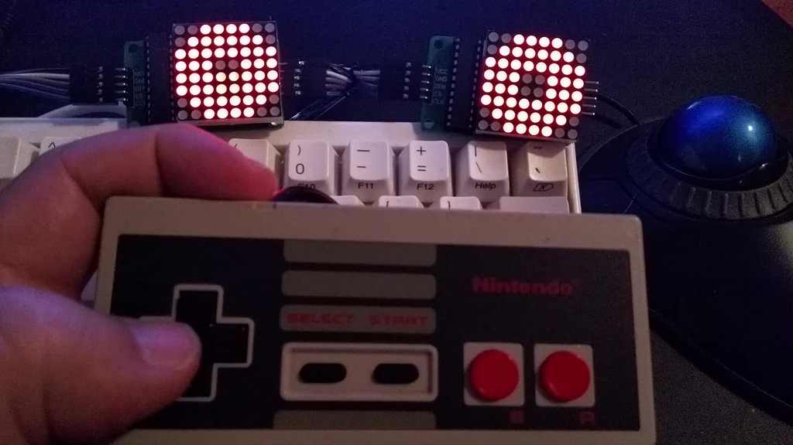
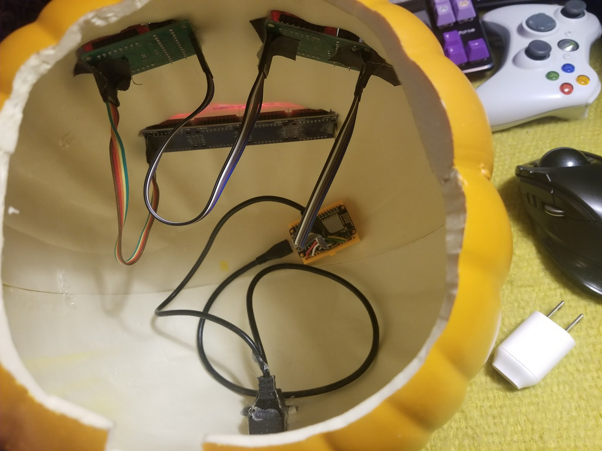

**TL;DR**: I made a wifi pumpkin using an ESP8266 with LED matrix eyes and mouth.
I added a web-based remote control for my phone using websockets. It was fun!

<!--more-->

<nav role="navigation" class="table-of-contents"></nav>

A few years ago, [I decided][pumpkintweet] to use some LED matrices to make animated
eyes for a jack-o'-lantern. Not terribly original, but it sounded fun.

<blockquote class="twitter-tweet" data-lang="en">
Considering getting some LED matrices to make animated eyes &amp; mouth for a jack-o-lantern. Seems like it could be a fun project or a disaster
&mdash; Les Orchard (@lmorchard) <a href="https://twitter.com/lmorchard/status/651958618800177152?ref_src=twsrc%5Etfw">October 8, 2015</a></blockquote>

[pumpkintweet]: https://twitter.com/lmorchard/status/651958618800177152

## v1.0 (2015)

My first thought was to use a Raspberry Pi.  It was easy to get an LED matrix
working in Python. And, I had a notion to build some kind of remote control
over wifi. But, it felt like overkill to stuff a whole Linux computer
into a gourd. ([A dead badger might work][badger], but this was not that kind
of project.)

[badger]: http://strangehorizons.com/non-fiction/articles/installing-linux-on-a-dead-badger-users-notes/

That's when I remembered the Arduino Uno I had stashed in a drawer.  I found
[this guy's project][otherpump], which confirmed I wasn't the first to try
this. But it was nice to start from [someone else's code][workingcode]. 

[workingcode]: https://github.com/michaltj/LedEyes/blob/master/LedEyes.ino
[otherpump]:  https://mjanyst.weebly.com/arduino-pumpkin-eyes.html

I had a brief go at scripting some animations, which resulted
in an [over-engineered little sketch][overengineered] that helped me 
exercise my rusty C skills.

[overengineered]: https://github.com/lmorchard/arduino-sketches/blob/master/googly_eyes/googly_eyes.ino

From there, I discovered an [NESPad library][] that made [hooking up a
controller][hookingup] simple. It's just [a serial interface
powered by a shift register][neshow] - pre-teen me would have been impressed that I
finally learned how so many buttons worked with so few pins.

[neshow]: https://www.allaboutcircuits.com/projects/nes-controller-interface-with-an-arduino-uno/
[hookingup]: https://github.com/lmorchard/arduino-sketches/blob/master/nespad_eyes/nespad_eyes.ino
[nespad library]: https://github.com/joshmarinacci/nespad-arduino 

When Halloween arrived, I hustled to get it done before dusk: I carved some
quick square holes for eyes, nose, and mouth - let's say it's an 8-bit thing. 

I bundled up the electronics with plastic wrap and crammed the mess into
the pumpkin. I strapped the LED matrices in with picture
wire. The results weren't too bad in the dark. 
Trick-or-treaters seemed entertained by my cyborg pumpkin buddy as I handed out
candy!

Not long after Halloween, the gourd went downhill fast. Pumpkins are
not a good choice of long-term project enclosure. I put it off as long as I could, but
finally I had to put on some gloves to rescue my parts from the slimy
mess. Those parts went in a box and went untouched for the next year. 
 

## v2.0 (2016)

As Halloween approached again, I wanted to give the project another go. I
found a foam pumpkin at Target that seemed realistic. A little time at
[the local maker space][i3] with my Swiss Army knife, and I had a freshly carved
synthetic jack-'o-lantern. 

[i3]: https://www.i3detroit.org/

Rather than glue things together, I just used some gaffer tape inside to hold
the eyes in place. I'd planned to add some more LED matrices to give it a mouth,
but never quite got around to it. The little guy seems a bit creepy with just a
pair of eyes, though.

With a house move in the works, my ambition ran out fast that year. I
didn't make any code changes, but I did have to do some reverse engineering.

Because, of course, I hadn't left myself good notes and some of the wires had
come undone over the past year.  My poor NES controller was looking sad with
wires just kind of crammed into it.  But, it still worked.

I refreshed the thing just enough to make it live to see another day. We
didn't hand out candy that year, though, so the thing just decorated my office
for awhile.  

## v3.0 (2017)

<!--

-->

Another Halloween and I felt an urge to get more ambitious: I’d picked up that
Arduino at a Maker Faire back in 2011, pretty far from state of the art these 
days. 

I’d been reading about the [ESP8266][] -
a cheap and tiny WiFi module that had been repurposed for
more tinkery things.  In fact, I read that you could even flash unmodified
Arduino sketches onto the thing.

[esp8266]: https://www.espressif.com/en/products/hardware/esp8266ex/overview

<!--

-->

So, I ordered [an ESP8266 dev board][nodemcu] and four more [8x8 LED
matrices][matrix] for a mouth.
It took me an hour to [port my old Arduino sketch over][ported],
including the time to set up the dev stack. The eyes came alive on
the new hardware in very short order. Another hour and I had the
mouth animating.

[nodemcu]: http://a.co/8zPcmQ5 
[matrix]: http://a.co/3Mc3qZZ
[ported]: https://github.com/lmorchard/arduino-sketches/blob/master/nodemcu/nespad_eyes/nespad_eyes.ino

<!--

-->

<!--

-->

A bit more carving, and I was ready to install the mouth. I switched
from gaffer tape to hot glue to make things more permanent. Alas, somehow I
damaged a column of LEDs in the process. But, oh well: I just gave it fangs.

<!--

-->

To tidy the whole thing up, I bought extension cables for USB power and the NES
gamepad. I hacked those up and hot glued them into the back of the pumpkin. 

When I was done, I had no cables trailing out from the inside of the thing. And, I could
stop shoving bare wires into the end of an NES pad. And, if I wanted to go
completely wireless, I could drop a USB power bank into the top and just
connect it from inside.
 

## v4.0 (2017)

But, speaking of completely wireless: Back at the start, I'd
considered using a Raspberry Pi.  Given a USB wifi adapter, I could have
written a little web app to use as a remote control for the pumpkin. I still
wanted to make that happen.

I knew this ESP8266 thing was handy, but I didn't realize just how handy until I did some more research. I found an interesting set of libraries to glue together:

* [ESP8266 Arduino core][espcore] - this let me port my sketch over mostly unmodified
* [SPIFFS][] - offers an onboard filesystem in flash memory
* [ESP8266WebServer][] - an embedded webserver that [serves up static files from SPIFFS][servestatic] and lets me handle some URL routes with C code
* [arduinoWebsockets][] - websockets server and client libraries
* [WiFiManager][] - code to fire up an temporary Access Point with a captive web portal to bootstrap wifi configuration - great for a device with no screen or keyboard

[espcore]: https://github.com/esp8266/Arduino
[SPIFFS]:http://esp8266.github.io/Arduino/versions/2.0.0/doc/filesystem.html 
[servestatic]: https://github.com/esp8266/Arduino/tree/master/libraries/ESP8266WebServer/examples/FSBrowser 
[arduinoWebsockets]: https://github.com/Links2004/arduinoWebSockets
[ESP8266WebServer]: https://github.com/esp8266/Arduino/tree/master/libraries/ESP8266WebServer
[WiFiManager]: https://github.com/tzapu/WiFiManager

Long story short, I used all the above to produce this masterpiece:

What you're looking at is the wifi remote control for my pumpkin. The big yellow square is a virtual touchpad - dragging my finger across it moves the eyeballs. Tapping "Blink" makes the eyes blink, while "Talk" makes the mouth open & close.

It's a little web page loaded up from the onboard file system. It connects back to a websocket server that [accepts a bunch of little commands][wscmds] - which, oddly enough, map directly to NES pad buttons so I could be lazy and just reuse all the same code paths.

[wscmds]: https://github.com/lmorchard/arduino-sketches/blob/master/nodemcu/nespad_eyes/nespad_eyes.ino#L324 

Building this went way easier than I expected. Sure, it's embarassing code that anyone sensible would shred in a code review. But, it was fun hacking and works pretty much like I hoped it would. In particular, I was surprised at how responsive it ended up being. Without any optimization, it follows my taps and drags without noticible lag.

So, for another year, I sat next to an animated glowing pumpkin while I handed
out candy. But this time, I played amateur ventriloquist and had the thing
talking to kids while I prodded at my cell phone. Pretty awkward and nerdy, but
I think some folks appreciated it. They humored me, at least.

## v5.0? What's next?

A few months later, this project is lying fallow. It’s on display in my office, where I can watch the semi-random idle gibbering whenever I like. And though I haven't gotten back to any ESP8266 tinkering since October, I'm still kind of musing over what I could hack together next.

It feels weird to say it, but this project might be done: this pumpkin seems pretty close to my original idea. 

I’ve mused about maybe building some sort of voice assistant into it: talk to the pumpkin, control things around the house, hear about the weather, order it to fire candy into kids’ bags with tiny trebuchets - who knows?

I could upgrade from LED matrices to [full-blown OLED screens][oled]. Though, if I did that, I've got a notion to build myself a replica of 790 from Lexx. I'd probably regret it, but he seems more my kind of personal assistant than current offerings like Alexa or Siri:

<iframe width="560" height="315" src="https://www.youtube.com/embed/s8d1mfLa5Vk" frameborder="0" allow="autoplay; encrypted-media" allowfullscreen></iframe>

[oled]: https://learn.adafruit.com/animated-electronic-eyes-using-teensy-3-1/overview

I've also been thinking bigger: Like, what if I turned my *house* into an animated character? Combine some [ESP8266's with AC relays][sonoff] and orchestrate strings of holiday lights into something animated? I could be *that* guy on the block!

Anyway, let me know what you think!

[sonoff]: https://www.itead.cc/sonoff-wifi-wireless-switch.html

<!-- vim: set wrap linebreak nolist wrapmargin=0 textwidth=0 syntax=markdown formatoptions-=t: -->
