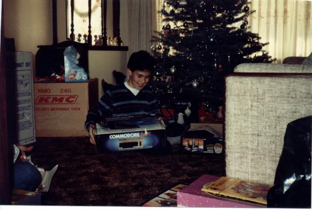
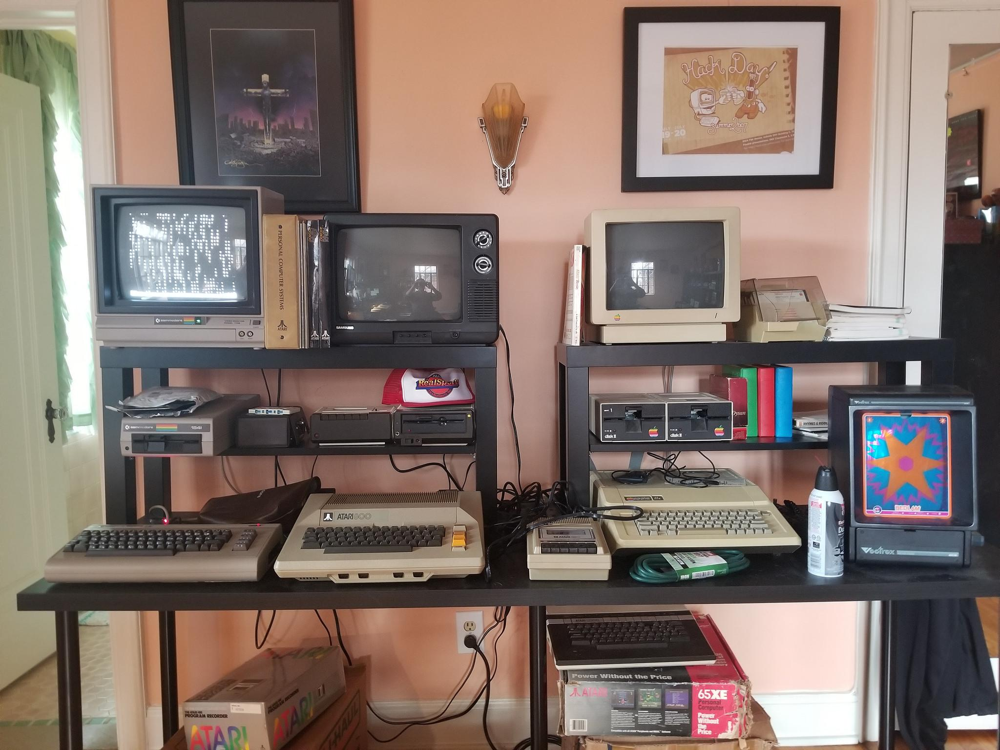
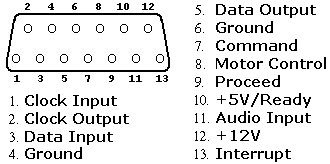
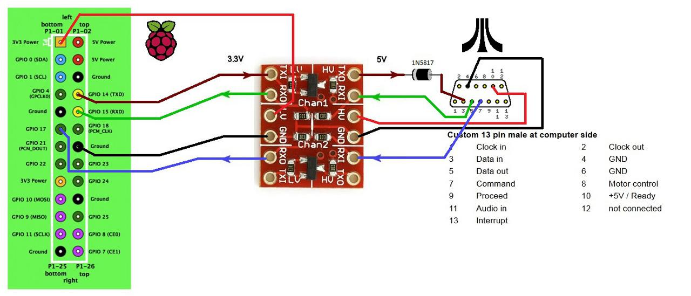
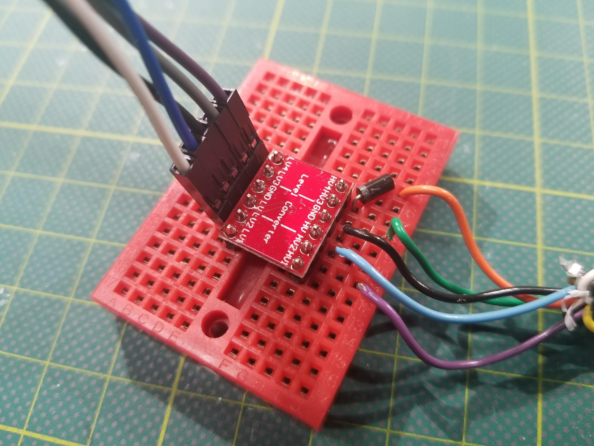
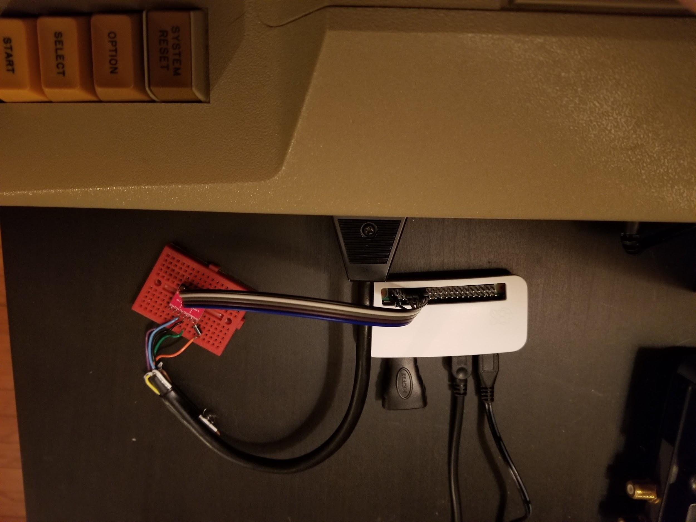
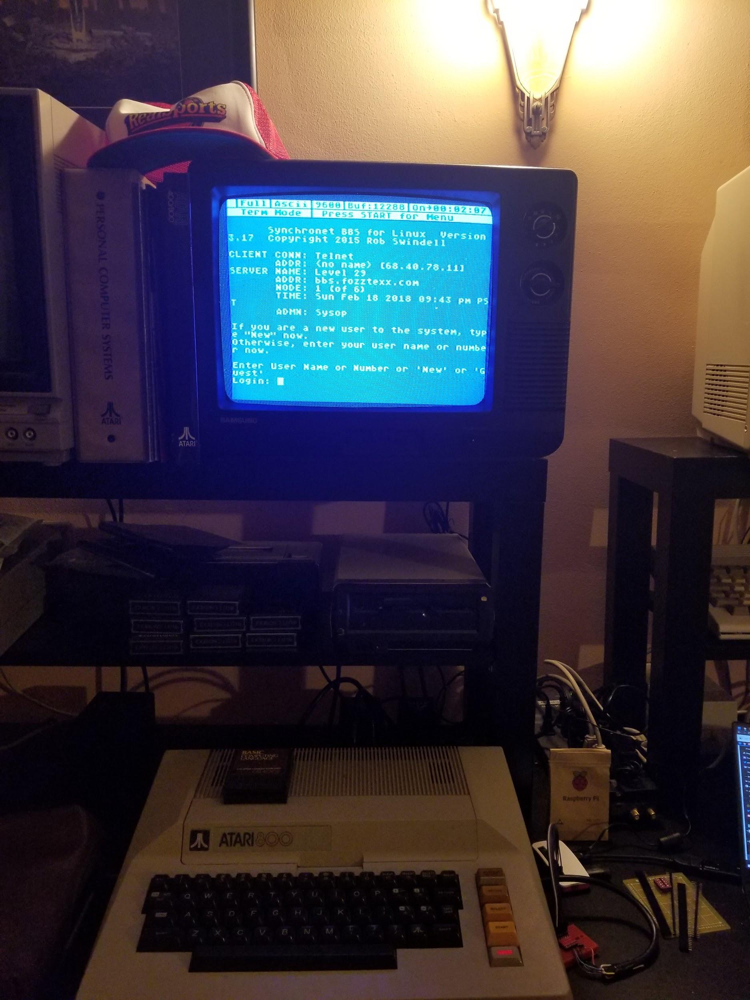
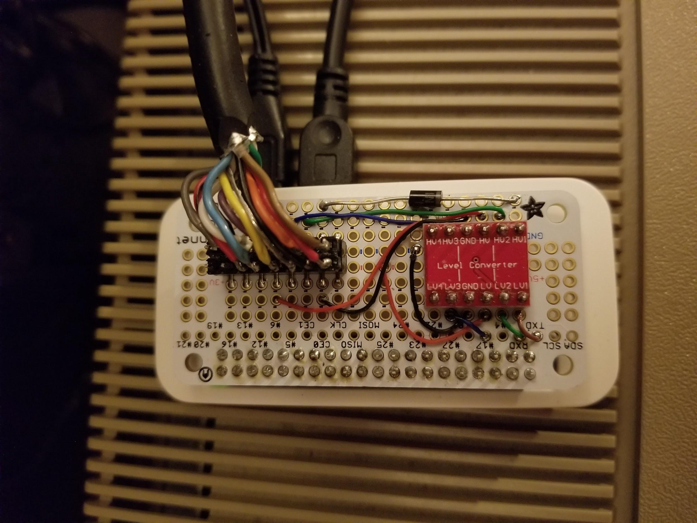

**TL;DR**: The first computer I programmed was an Atari 800. I'm using a Raspberry Pi Zero W
to load disk images from the internet onto my Atari 800.

<!--more-->

<nav role="navigation" class="table-of-contents"></nav>
[I’ve written before about my first contact with computers](https://blog.lmorchard.com/2003/06/13/newly-digital/). But, man, I wrote that back in 2003. Long enough to make the post a retro artifact in itself. The passage of time is weird.

Anyway, to recap: I was a problematic kid - hyperactive and easily bored. I recall literally climbing the walls by way of the classroom curtains. At some point, the principal decided I needed a challenge. He plonked me down in front of a computer and a stack of books.

I burned through those books and fell in love with computers. Typed in programs & games. Found out how old I’d be in The Year 2000 thanks to math. Learned how programming worked. Computers expanded to fill my head, gave outlet to my spastic energy. The only problem was that I had just 1 hour every day with the machine at school. We didn’t have a computer at home.

That didn’t keep me from picking up every computer book I could get my hands on at the book fair when it came to school, though. I’d read through the programs and try to figure out how they worked while I waited until I could get some time at a keyboard to type them in.

I even remember playing with a [Lite Brite](https://en.wikipedia.org/wiki/Lite-Brite) and trying to work out how to translate those pictures to Atari graphics. That frustrated me, of course, because [those old-school Lite Brites had a hexagonal layout of pegs rather than a square grid](https://jenn.glitch.me/a-post-of-utmost-hexellence/) that could directly translate to pixels.

That Christmas - or maybe the next - I got a Commodore 64 under the tree. My story with computers accelerated, because I had the thing all to myself in my bedroom. But, I left Atari behind. I learned about the [SID](https://en.wikipedia.org/wiki/MOS_Technology_SID) chip, but I never explored the [POKEY](https://en.wikipedia.org/wiki/POKEY).

Decades later, I hit up eBay for an Atari 800. I found one at a decent price - complete with an [Atari 1050](http://www.atarimuseum.com/computers/8bits/xl/xlperipherals/atari1050.html) floppy, [1010 cassette drive](http://www.atarimuseum.com/computers/8BITS/XL/xlperipherals/1010.html), and a pile of disks and tapes and cartridges. I played with it a little, but mostly it sat as an office decoration for a few years.

This year, I decided to do something with all my old machines. I’ve got a small collection in my home office: Commodore 64, Amiga 1200, Apple IIe, and Atari 800 - all personal touchstones. But, as it happens, floppies and cassettes and rubber belts decay. I discovered that some of this stuff stopped working over the years.

The core machines still work, though. And, thanks to the internet and folks generous with their time & efforts, enormous archives of software for these systems can be accessed in seconds. The only problem is getting this software into these archaic systems.

I thought bridging the gap would be hard. But, a bit of cheap modern kit can twiddle the signals on an old-school input/output port such that an antique thinks it’s talking to something of its own vintage. Microcontrollers and single-board computers are fast enough to pretend to be almost anything to these old machines.

That brings me to the [SIO port](https://en.wikipedia.org/wiki/Atari_SIO) on the Atari 800. Where most 80s computers had a handful of parallel & serial ports of proprietary & standard flavors - the Atari 8-bit computers had just this one port for talking to disks, cassettes, printers, modems, or whatever.  If that sounds familiar, the [SIO port](https://en.wikipedia.org/wiki/Atari_SIO) could be considered a predecessor to our modern USB port. Oddly enough, [Joseph C. Decuir](https://en.wikipedia.org/wiki/Joseph_C._Decuir) worked on both technologies, so I think the similarity is more than coincidental.

In my idle googling on how to get new data piped into my old Atari, I found this 2013 post on AtariAge entitled "[SIO2PI -> Raspberry Pi as a floppy](http://atariage.com/forums/topic/209010-sio2pi-raspberry-pi-as-a-floppy/)" by [TheMontezuma](http://atariage.com/forums/user/29824-themontezuma/). 

There, I found a really simple circuit: It used a logic level voltage converter, a diode, a Raspberry Pi, and some wires. I didn’t *really* know all that much about voltage levels and serial ports before this, but this seems handy for all kinds of things and well within my ability to build.

Of course, there’s something ludicrous about using a Raspberry Pi for this. That little thing can emulate an entire Atari 800 on its own. You could hollow out the original guts of the old computer, drop in the Pi, and with some clever wiring you’d probably never know the difference from the outside. [Some people actually do that with classic computers like the Amiga](https://makezine.com/2013/03/18/raspberry-pi-gives-amiga-a-new-life/). But, I really wanted to get this original machine up and running. And, overpowered as it might be for the task, a Raspberry Pi Zero W is also hilariously cheap.

So, I went shopping and picked up some parts:

* [CanaKit Raspberry Pi Zero W (Wireless) Starter Kit with Official Case](http://a.co/j79Bk4z)

* [Logic Level Converter Bi-directional Shifter Module for Arduino](http://a.co/0Uo3bnl)

* [Rectifier Diode Assorted Kit](http://a.co/4arTjGe)

* [Breadboard jumpers in ribbon cable form](http://a.co/70wjtGE)

* [Mini breadboards](http://a.co/70wjtGE)

I had a spare SIO cable that I cut in half for the project. I could have tried getting [a new SIO connector 3D printed](https://www.thingiverse.com/thing:1831769) - and I still might - but I knew this cable already worked. And, I was impatient. My first prototype came together on a little breadboard.

My first attempt at using the thing was a failure. But, I did more reading into [how to configure the Raspberry Pi’s serial UART](https://www.raspberrypi.org/documentation/configuration/uart.md). Two needful things came up:

* Disabling the out-of-box Bluetooth module

* Disabling the service running a console on the serial port

After that, [sio2bsd](https://github.com/TheMontezuma/SIO2BSD) started working and my little rig piped images of Atari floppy disks downloaded from [ftp.pigwa.net](http://ftp.pigwa.net/) into my old computer as if they were the real thing.

I’ve only spent a couple of hours with this stuff so far, so I don’t have any particularly memorable things to show yet. I’d totally welcome some suggestions for some things to check out. I knew there were games, but I was never aware of a demoscene or music packs on the Atari 8-bit computers. I’m also starting to learn a bit about the differences between members of the old Atari 8-bit family - insofar as not everything runs on the Atari 800.

Then, I discovered that I could run [tcpser](https://github.com/FozzTexx/tcpser) on the Raspberry PI - and suddenly my pretend disk drive was a pretend modem. I could "dial out" to the internet and explore a neo-retro world of BBSes I’d never had a chance to experience back in the day on an Atari.

The little breadboard rig worked pretty well. But, the next morning, I found most of the wires pulled free thanks to a curious kitten. So, I decided to clean things up and make them more permanent with a [Perma Proto Bonnet Mini Kit](https://www.adafruit.com/product/3203), a [16-pin IDC breakout helper](https://www.adafruit.com/product/2104), and [some 30AWG wire](http://a.co/4IZlqkb) from Adafruit.

Even though there are only 5 pins needed between the Pi and the SIO port, soldering up all the pins to headers means I never have to remember what gets plugged into where. There are also 3 unused pins on the header - because SIO is 13 pins but the IDC breakout was convenient enough to use as-is and just ignore the extra connections.

I managed to solder all the SIO cable wires onto header pins as a makeshift male connector to the SIO2Pi Bonnet. It ended up being a mess and I redid it a few times. But, it works. I’m also considering adding a female header to the other end of the SIO cable I chopped in half, if only to make it easier to join the two halves back into a working cable if I ever need it.

The finished product sits pretty nicely on top of the Atari 800.

The wires might be too thick, but I’m considering some [IEC ribbon cable connectors](http://a.co/4ptrVtJ) to crimp one onto the end of these wires and replace my rough soldering job. That might be cleaner and fit more naturally into how this sits on my desk, without bending all the wires awkwardly.

This setup works rather well. The only drawback is that I have to ssh into the Raspberry Pi and run sio2bsd manually to make it available for loading. And, if I want to switch to using it as a modem from a term program, I have to kill sio2bsd and start up tcpser.

The Raspberry Pi isn’t hooked up to a monitor - and I don’t really want to devote one to it. It would be nice to have a web interface I could hit from my phone. Maybe use that to select disk images and switch into terminal mode, do all the process management of sio2bsd and tcpser in the background with node.js. So, there’s a project for the future.

Beyond just digging into old software, I’m not sure where I’m going with this stuff next. I’ll probably keep calling some BBSes. I’ve also got a kind of masochistic notion to fetch some old computer magazines and try some of the type-in programs for old time’s sake. Maybe I’ll poke around with exploring the hardware and writing my own games. I could also explore 3D printing a case that combines all this stuff into a tidy little module with an SIO socket (or two for daisy chaining) rather than using a butchered old cable.

Or, you know, maybe I’ll move on from this serial interest and let it hang out in my office for a few more years. Either way, it’s been a quick & fun project to revive this old machine and get a look a some new-to-me software that I never had a chance to see back in the day.

