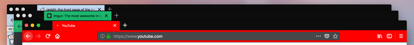

**TL;DR**: Last year, I started work on a new Test Pilot experiment playing with themes in Firefox. 

<!--more-->

So far, we’ve been calling it [ThemesRFun](https://github.com/mozilla/ThemesRFun) - though we’re [in the process](https://github.com/mozilla/ThemesRFun/issues/23) of coming up with an official name.

<nav role="navigation" class="table-of-contents"></nav>

## New theme APIs are fun

At the core of this experiment are [new theme APIs for add-ons](https://developer.mozilla.org/en-US/Add-ons/WebExtensions/API/theme) shipping with Firefox. 

These APIs take inspiration [from static themes in Google Chrome](https://developer.chrome.com/apps/themes), building from there to enable the creation of dynamic themes. 

For example, [Quantum Lights](https://addons.mozilla.org/en-US/firefox/addon/quantum-lights-dynamic/) changes based on the time of day.

[](https://addons.mozilla.org/en-US/firefox/addon/quantum-lights-dynamic/)

[VivaldiFox](https://addons.mozilla.org/en-US/firefox/addon/vivaldifox/) reflects the sites you’re visiting.

[](https://addons.mozilla.org/en-US/firefox/addon/vivaldifox/)

You could even build themes that use data from external HTTP services - e.g. to change based on the weather.

To explore these new APIs, ThemesRFun consists of a website and a companion add-on for Firefox. The website offers a theme editor with a paper doll preview - you can click on parts of a simulated browser interface and dress it up however you like. The add-on grants special powers to the website, applying changes from the theme in the editor onto the browser itself.

## Editing themes on the web

[The site](https://github.com/mozilla/ThemesRFun/tree/5cdcb7e15d64934f0e71521512c74337dc58fa05/src/web) is built [using Webpack](https://github.com/mozilla/ThemesRFun/blob/5cdcb7e15d64934f0e71521512c74337dc58fa05/webpack.web.js), React, and Redux. React offers a solid foundation for composing the editor. Personally, I really like working with [stateless functional components](https://github.com/mozilla/ThemesRFun/blob/5cdcb7e15d64934f0e71521512c74337dc58fa05/src/web/lib/components/SavedThemeSelector/index.js) - they’re kind of what tipped me over into becoming a React convert a few years ago. I’m also a terrible visual designer with weak CSS-fu - but [using Webpack to bundle assets from per-component directories](https://simonsmith.io/using-webpack-to-build-react-components-and-their-assets/) makes it easier for teammates to step in where I fall short.


Further under the hood, Redux offers a clean way to [manage theme data and UI state](https://github.com/mozilla/ThemesRFun/blob/5cdcb7e15d64934f0e71521512c74337dc58fa05/src/lib/store.js). Adding [undo & redo buttons](https://github.com/mozilla/ThemesRFun/tree/5cdcb7e15d64934f0e71521512c74337dc58fa05/src/web/lib/components/UndoRedoButtons) is easy, thanks to [redux-undo](https://github.com/omnidan/redux-undo/). And, by way of some [simple Redux middleware](https://github.com/mozilla/ThemesRFun/blob/5cdcb7e15d64934f0e71521512c74337dc58fa05/src/web/index.js#L52), I was able to easily add a hook to push every theme changes into the browser via the add-on.

The website is just a static page - there’s no real server-side application. When you save a theme, [it ends up in your browser’s localStorage](https://github.com/mozilla/ThemesRFun/blob/5cdcb7e15d64934f0e71521512c74337dc58fa05/src/web/lib/storage.js). Though we plan to move to a Mozilla-owned production server on launch, I’ve been [deploying](https://github.com/mozilla/ThemesRFun/blob/5cdcb7e15d64934f0e71521512c74337dc58fa05/package.json#L29) builds to [GitHub Pages](https://mozilla.github.io/ThemesRFun/) during development.

Another interesting feature of the website is that we encode themes as a parameter in the URL. Rather than come up with a bespoke scheme, I use [this json-url module](https://github.com/masotime/json-url) to compress JSON and encode it as Base64, which makes for a long URL but not unreasonably so. This approach enables folks to simply copy & paste a URL to share a theme they’ve made. You [can](https://mozilla.github.io/ThemesRFun/?theme=XQAAAAK6AAAAAAAAAABBKYhm849SCiaxqiaEGccwS-xNVABND6bPaWX82IACoyBXlMz-ogPQMZx8jZw0gi6ZqepxjZiNq3qtC6ReDugh0DJEIcc-6Ekd4BML5haoPqlXvTBKbEuN12ZBm-SJaWyB2b9GzX0tU6b_u9yjWO4ukTDkntTK440uf__ug8AA) [even](https://mozilla.github.io/ThemesRFun/?theme=XQAAAAK5AAAAAAAAAABBKYhm849SCiaxqiaEGccwS-xNVABNBRtj-x-Szc1kMeuEtwJYdDlHdJFchkY8sMP4iOzSOnr2vDVLFHcDTGfvoD2F-saWB-4Q-0HlUiMST82W8NTW8EedwTOfbOY_8T30w0e4gC9vlGFCU9f6FVIWiWSteBgU_b2G6fBR_7tUIAA) [link](https://mozilla.github.io/ThemesRFun/?theme=XQAAAAK8AAAAAAAAAABBKYhm849SCiaxqiaEGccwS-xNVABNKtQKc4Qr-u-HdLUSjaBjcrH658wB_k4I1-yfpFsfTFeutvkNHhJd47c-oR5Cmx-mMJXZ4Lq7R98D2PE8etCHIG-B5_8oTyfPCjY6DxXN-uebtBycPe1q5OYxejC4KXCppxfkfniiH__gvZgA) [to](https://mozilla.github.io/ThemesRFun/?theme=XQAAAAK7AAAAAAAAAABBKYhm849SCiaxqiaEGccwS-xNVABNC6bT6OtXpulKBw4DX1CffRksp6558s0k0DnUhq_LUMnHsWC8m0Ch34ivMZQ9sgV8nw4smjNTF6KwTBLBWoGene--BIiLoZeK7cfULCJbaoBYqyuNgz2tcB6oGDKcpyWUdMoffLb2h__-XfwA) [themes](https://mozilla.github.io/ThemesRFun/?theme=XQAAAAK2AAAAAAAAAABBKYhm849SCiaxqiaEGccwS-xNVAAfaPFobPrtxqh09bZ0dFlllNZAoZN2KxC18prV-JbJ_OWRSXO_BkFys9aW3y-ZXvULv_v6dWy1x1lwnCABmI9hLlcXkVKtiPaJ2TBI4QUpuGXbvJ__-RkwAA) from a blog post, if you wanted to!


When the page loads and sees the ?theme URL, [it unpacks the data](https://github.com/mozilla/ThemesRFun/blob/5cdcb7e15d64934f0e71521512c74337dc58fa05/src/web/index.js#L201) and [loads it into editor’s Redux store](https://github.com/mozilla/ThemesRFun/blob/5cdcb7e15d64934f0e71521512c74337dc58fa05/src/web/index.js#L204). I’ve also been able to work this into the location bar with the HTML5 History API and [Redux middleware](https://github.com/mozilla/ThemesRFun/blob/5cdcb7e15d64934f0e71521512c74337dc58fa05/src/web/index.js#L61). The browser location represents the current theme, while back & forward buttons double as undo & redo.

## Add-ons can be expansion cartridges

[](http://www.syntiac.com/chameleon.html)

[The companion add-on](https://github.com/mozilla/ThemesRFun/tree/5cdcb7e15d64934f0e71521512c74337dc58fa05/src/extension) is also built [using Webpack](https://github.com/mozilla/ThemesRFun/blob/5cdcb7e15d64934f0e71521512c74337dc58fa05/webpack.extension.js) and acts as an [expansion cartridge](https://www.c64-wiki.com/wiki/Simons%27_BASIC) for the theme editor on the website. (Can you tell [I’ve had retro computers on the mind](https://blog.lmorchard.com/2018/03/01/sio2pi/), lately?)

Add-ons in Firefox can install [content scripts](https://developer.mozilla.org/en-US/Add-ons/WebExtensions/Content_scripts) that access content and data on web pages. Content scripts can communicate with the parent add-on [by way of a message port](https://developer.mozilla.org/en-US/Add-ons/WebExtensions/Content_scripts#Communicating_with_background_scripts). They can also communicate with a web page [by way of synthetic events](https://developer.mozilla.org/en-US/Add-ons/WebExtensions/Content_scripts#Communicating_with_the_web_page). Put the two together, and you’ve got [a messaging channel](https://github.com/mozilla/ThemesRFun/blob/5cdcb7e15d64934f0e71521512c74337dc58fa05/src/extension/contentScript.js) between a web page and an add-on in Firefox.

Here's the heart of [that messaging bridge](https://github.com/mozilla/ThemesRFun/blob/5cdcb7e15d64934f0e71521512c74337dc58fa05/src/extension/contentScript.js):

```javascript
import { CHANNEL_NAME } from "../lib/constants";

// Relay backend port messages to content
let port;

function connect() {
  port = browser.runtime.connect({ name: CHANNEL_NAME });
  port.onDisconnect.addListener(() => {
    port = null;
    reconnect();
  });
  port.onMessage.addListener(message => {
    window.postMessage({ ...message, channel: `${CHANNEL_NAME}-web` }, "*");
  });
}

// Relay content messages to backend port if the channel name matches
// (Not a security feature so much as a noise filter)
window.addEventListener("message", event => {
  if (
    port &&
    event.source === window &&
    event.data &&
    event.data.channel === `${CHANNEL_NAME}-extension`
  ) {
    port.postMessage({ ...event.data, location: window.location.href });
  }
});

connect();
```

With this approach, the web page doesn’t actually gain access to any Firefox APIs. [The add-on can decide what to do with with messages it receives](https://github.com/mozilla/ThemesRFun/blob/5cdcb7e15d64934f0e71521512c74337dc58fa05/src/extension/background.js#L23). If the page sends invalid data or asks to do something not supported - nothing happens. Here's a snippet of that logic from the extension:

```javascript
const messageListener = port => message => {
  let theme;
  switch (message.type) {
    case "fetchTheme":
      log("fetchTheme");
      fetchTheme().then(({ theme: currentTheme }) =>
        port.postMessage({ type: "fetchedTheme", theme: currentTheme })
      );
      break;
    case "setTheme":
      theme = normalizeTheme(message.theme);
      log("setTheme", theme);
      storeTheme({ theme });
      applyTheme({ theme });
      break;
    case "ping":
      port.postMessage({ type: "pong" });
      break;
    default:
      log("unexpected message", message);
  }
};
```

And here's a peek at [that Redux middleware I mentioned earlier](https://github.com/mozilla/ThemesRFun/blob/5cdcb7e15d64934f0e71521512c74337dc58fa05/src/web/index.js#L52) which updates the add-on from the web:

```javascript
const postMessage = (type, data = {}) =>
  window.postMessage(
    { ...data, type, channel: `${CHANNEL_NAME}-extension` },
    "*"
  );

const updateExtensionThemeMiddleware = ({ getState }) => next => action => {
  const returnValue = next(action);
  const meta = action.meta || {};
  if (!meta.skipAddon && themeChangeActions.includes(action.type)) {
    postMessage("setTheme", { theme: selectors.theme(getState()) });
  }
  return returnValue;
};
```

The add-on can also restrict the set of pages from which it will accept messages: We [hardcode the URL for the theme editor](https://github.com/mozilla/ThemesRFun/blob/5cdcb7e15d64934f0e71521512c74337dc58fa05/webpack.extension.js#L55) into the add-on’s content script configuration at build time, which means no other web page should be able to ask the add-on to alter the theme in Firefox.

## Add-on detection is hard


There is a wrinkle to the relationship between website and add-on, though: A normal web page cannot detect whether or not a particular add-on has been installed. All the page can do is send a message. If the add-on responds, then we know the add-on is available.

Proving a negative, however, is impossible: the web page can’t know for sure that the addon is *not *available. Responses to asynchronous messages take time - not necessarily a long time, but more than zero time. 

If the page sends a message and doesn’t get a response, that doesn’t mean the add-on is missing. It could just mean that the add-on is taking awhile to respond. So, we have to render the theme editor such that it starts off by assuming the add-on is not installed. If the add-on shows up, minutes or milliseconds later, the page can update itself to reflect the new state of things.

Left as-is, you’d see several flashes of color and elements on the page move as things settle. That seems unpleasant and possibly confusing, so we came up with a loading spinner: When the page loads, it displays the spinner and a timer starts. If that timer expires, we consider things ready and reveal the editor. But, if there’s any change to the Redux store while that timer is running, we restart the clock.

This is the gist of what that code does:

```javascript
const unsubscribeLoader = store.subscribe(() => {
  if (selectors.loaderDelayExpired(store.getState())) {
    // State settled down long enough for timer to expire - stop listening.
    unsubscribeLoader();
  } else {
    // Reset the timer again.
    startLoaderDelay();
  }
});

// Utility to (re)start up a timer to dismiss the loading indicator
let loaderTimer = null;
function startLoaderDelay() {
  if (loaderTimer) {
    clearTimeout(loaderTimer);
  }
  loaderTimer = setTimeout(
    () => store.dispatch(actions.ui.setLoaderDelayExpired(true)),
    LOADER_DELAY_PERIOD
  );
}
```

Early changes to the store are driven by things like decoding a shared theme and responses from the add-on. Again, these are asynchronous and unpredictable. The timer duration is an arbitrary guess I made that seems to feel right. It’s a dirty hack, but it seems like a good enough effort for now.

## Using npm scripts and multiple Webpack configs

One of the things that has worked nicely on this project is building everything in parallel with a single npm command. You can [clone the repo and kick things off for development](https://github.com/mozilla/ThemesRFun/tree/5cdcb7e15d64934f0e71521512c74337dc58fa05#get-started) with a simple `npm install && npm start` dance.

The add-on and the site both use Webpack. There’s [a shared config](https://github.com/mozilla/ThemesRFun/blob/5cdcb7e15d64934f0e71521512c74337dc58fa05/webpack.common.js) as a base and then specific configurations with tweaks for [the site](https://github.com/mozilla/ThemesRFun/blob/5cdcb7e15d64934f0e71521512c74337dc58fa05/webpack.web.js) and [the add-on](https://github.com/mozilla/ThemesRFun/blob/5cdcb7e15d64934f0e71521512c74337dc58fa05/webpack.extension.js). So, we want to run two separate instances of Webpack to build everything, watch files, and host the dev server.

This is where [npm-run-all](https://www.npmjs.com/package/npm-run-all) comes in: It’s a CLI tool that lets you run multiple npm scripts. I used to use gulp to orchestrate this sort of thing, but [npm-run-all](https://www.npmjs.com/package/npm-run-all) lets me arrange it all [in `package.json`](https://docs.npmjs.com/misc/scripts). It would be fine if this just enabled running scripts in series. But, npm-run-all also lets you run scripts* in parallel*. The cherry on top is that [this parallelization works on Linux, OS X, *and Windows*](https://www.npmjs.com/package/npm-run-all#%EF%B8%8F-motivation).

```json
"scripts": {
  "start": "npm-run-all --parallel server watch:extension watch:lint",
  "server": "cross-env NODE_ENV=development webpack-dev-server --config webpack.web.js",
  "watch": "npm-run-all --parallel watch:*",
  "watch:web": "cross-env NODE_ENV=development webpack --watch --progress --colors --config webpack.web.js",
  "watch:extension": "cross-env NODE_ENV=development webpack --watch --progress --colors --config webpack.extension.js",
  "watch:lint": "onchange -p -v \"src/**/*.js\" -- npm run lint",
  "lint": "eslint --color .",
},
```

In past years, Windows support might have been an abstract novelty for me. But, in recent months, I’ve switched from Apple hardware to a PC laptop. I’ve found the new [Windows Subsystem for Linux](https://docs.microsoft.com/en-us/windows/wsl/install-win10) to be essential to that switch. But, sometimes it’s nice to just fire up a Node.js dev environment directly in PowerShell - [npm-run-all](https://www.npmjs.com/package/npm-run-all) lets me (and you) do that!

So, [the start script in our package.json](https://github.com/mozilla/ThemesRFun/blob/5cdcb7e15d64934f0e71521512c74337dc58fa05/package.json#L12) is able to fire up both Webpack processes for the site and add-on. It can also [start a file watcher to run linting](https://github.com/mozilla/ThemesRFun/blob/5cdcb7e15d64934f0e71521512c74337dc58fa05/package.json#L17) and tests (when we have them) alongside. That simplifies using everything in a single shell window across platforms. [I used to lean on Vagrant or Docker to offer something "simple" to folks interested in contributing to a project](https://decafbad.com/2011/06/os-webdev-vm/slides.html#1). But, though virtual machines and containers can hide apparent complexity in development, it’s hard to beat just running things in node on the native OS.

## Help us make themes more fun!

We’re launching this experiment soon. And, though it only makes limited use of the new theme APIs for now, we’re hoping that the web-based editor and ease of sharing makes it fun & worth playing with. We’ve got some ideas on what to add over the course of the experiment and hope to get more from the community. 

Whether you can offer code, give feedback, participate in discussions, or just let us watch how you use something - everyone has something valuable to offer. In fact, one of [the overarching goals of Test Pilot](https://wiki.mozilla.org/Test_Pilot/mission) is to expand channels of contribution for folks interested in helping us build Firefox.

As with all Test Pilot experiments, we’ll be watching how folks use this stuff as input for what happens next. We also encourage participation in our [Discourse forums](https://discourse.mozilla.org/c/test-pilot). And finally, the project itself is [open source on Github](https://github.com/mozilla/ThemesRFun) and open to pull requests. 

In the meantime, start collecting color swatches for your own theme. Personally, I might try my hand at [a Dracula theme](https://draculatheme.com/) or maybe raid my Vim config directory for some inspiration.

[modeline]: # ( vim: set wrap linebreak nolist wrapmargin=5 syntax=markdown textwidth=78 formatoptions-=t: )
