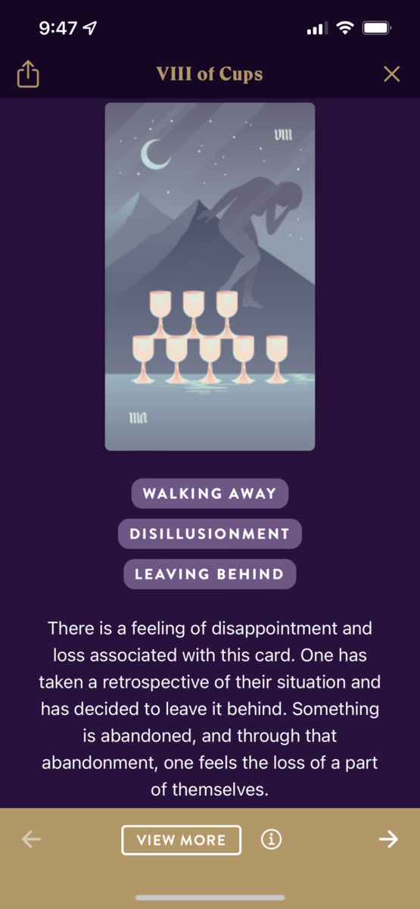

Fawn sat at the dining room table, wedged between her brothers Glen and Lonnie. Her parents, Barbara and Stuart, sat opposite. On the wall hung a banner of shiny metallic letters that read "Welcome Home Space Girl!"

With a plastic fork, she prodded gently at a slice of chocolate cake merging into mush with the scoop of vanilla ice cream melting next to it. Her favorites. She felt 14 again.

Around her, boisterous voices of family overlapped into cacophony. There was an occasional parental glance or a brotherly nudge, to which she could only respond with a nod or a smile or a shrug. 

She could never quite find an opening to string together a sequence of words bearing any significance. Never were any of them particularly inclined to ask or hear about where she'd been for the past two years. They all seemed more interested in telling her what she'd missed in their lives, in friends' lives, in neighbors' lives.

It was as if they thought she'd been in a coma, a non-entity through her time away. As if she hadn't just returned from the edge of the solar system, having spent months struggling—and ultimately succeeding—to exchange meaning with exotic intelligences visiting just beyond the orbit of Pluto.

The one time she'd tried to relay a fragment of how it felt to be strapped into a single-seat capsule streaking through space with faster-than-light pseudo-motion—her mother stopped her, saying, "But you're home, now."

As if they'd made her do it. As if she wouldn't leap at the chance to be out there, right now.

The evening wore on and what passed for conversation wore down. In a lull, her father clapped his hands and said, "We should play Scrabble!" Lonnie groaned but Glen flashed a broad grin.

Fawn sighed. "I should head out."

"But you just got here," said her mother.

"Yeah," said Lonnie, with a grin, "it's not like you have work in the morning." He elbowed her in the rib.

That rib was still bruised from turbulence that had knocked her capsule around during re-entry. She flinched away and drew a breath through clenched teeth. Lonnie's face showed mock offense.

"Yeah, no," she said, "actually I've got to catch a flight, bright and early. Gotta get back to base." A lie—but also a wish. Fawn pushed back in her chair and stood. She walked over to the mudroom, donned her coat, started pulling on her boots.

Abruptness stunned everyone for a beat, but soon they all rose and crowded into the mudroom with her. The cacophony returned: Her brothers decided it was time to go, so it was time to go. Her parents tried to convince them to stay for a game. Take some leftover cake. Call when they got home.

Finally, after hugs and well wishes and her mother on the verge of tears—Fawn was alone in her rented car with the engine running and the doors locked. Her mother stood in the front doorway, watching.

Fawn pulled out her phone, pulled up the calendar app. Six months of leave ahead of her, one weekend down. She sighed. She couldn't stay here. She looked up, tried a smile. She waved to her mother, put the car in reverse, and backed out of the drive.

## Prompt

