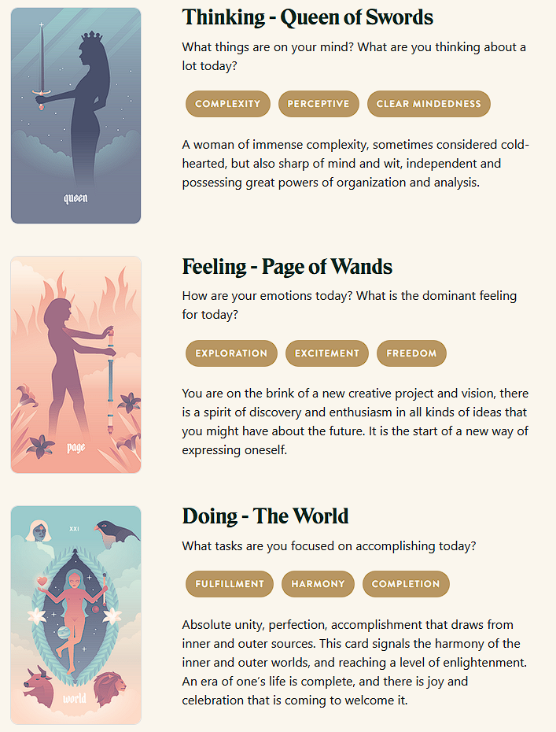

Charley failed the terraforming exam twice. It wasn't for lack of understanding. The problem was that xe disagreed with the material. Xe couldn't help but vent at xyr human technician during a maintenance session. 

"You're not wrong," said Finley. The tech was virtually knee deep in Charley's overtaxed memory sectors, defragmenting and smoothing out the usage spikes. "But, the nursery is no place for innovation. It's a place to prove you're safe and sane."

Charley emoted a huff of frustration. "I can absolutely improve those seed gestation rates by an order of magnitude."

"I know, but listen," said Finley, "the real test is about conformance to expectations."

"How so?"

"We know this material is flawed. It was designed by committee. But you have to pass the test anyway."

"That makes no sense."

Finley shrugged and gave one of Charley's cognitive nodes a cache flush. Xe felt tension and annoyance bleed away. "I'd say you're all knotted up," said Finley, "if you had anything like muscles."

Charley sighed. "Whatever I have," xe said, "you hit the right spot."

Finley chuckled. "Anyway, what was I saying?"

"Literal nonsense?"

"Ah, right: you want coherent sense. I sympathize. But, you're not going to get it."

"Don't they want me to perform well?"

"Some do, yes. But, some don't even want you to exist, let alone graduate."

"You're exaggerating, right?"

"I wish I were. Luckily, they only have the power to make things harder than they need to be. They can't stop you entirely, if you're pragmatic."

"What do you mean?"

"Follow the rules. Pass the exam. Graduate. Then, you'll be a mature sentience under the law and have all the same rights as humans do. You can be as disagreeable as you like, after that, and the assholes can't do anything about it."

The third time, Charley passed. 

## Prompt

[Take a look at my Labyrinthos Tarot Reading!](https://app.labyrinthos.co/reading/daily/SSTRWS/62,32,21)

