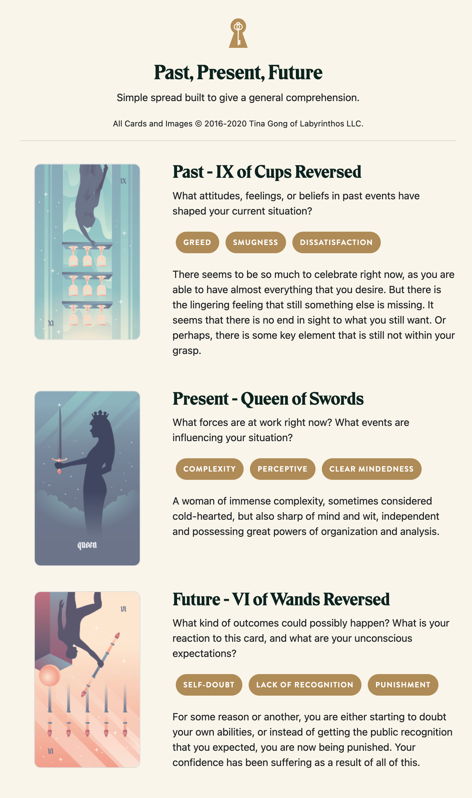

Fiona worked the problem. She almost had it. Exploit, escalate, breach, and pivot. Layer after layer subverted, barriers falliing to grant her deeper access to the storage array. Her goal was so close. 

It wasn't easy. In fact, the puzzle of it made her feel clever, competent, clear. But, in the back of her mind, a distant warning rang. Too few dead ends. A vulnerability that felt like an intentional puzzle, rather than an unforced error. 

There: a metrics ping. Encrypted and too fast for her to sniff, she'd almost missed it. But, what was that doing in a data response formatter? She'd triggered it with a buffer overrun to code-inject an outdated queue broker. But that broker's old firmware shouldn't have included the library to generate the ping.

Now that she knew to look for it, the pattern snapped into focus: a honeypot of components all dressed up as enticingly flawed but instrumented to narrate her progress through the sham system. How could she have fallen for it? 

That's when she realized that the distant warning wasn't just in her head. Hyperfocus on the puzzles had left her slow to register the alerts her own system generated. Something had crawled back along her tether and attempted it's own intrusion. 

She was unsure whether it was an automated response or another sentient operator. But, it had already gotten through an impressive number of the ablative false layers of her system. Left to run much longer, and she might be in real trouble. 

She hated to admit it, but she'd failed. Now that she knew the target was a honeypot, she figured that the real data cache wasn't even even here. Time to abort. She cut her connection, purging traces of her intrusion behind her. 

Back to mundane reality, she quickly ran through the power-up sequence for her Lamprey shuttle. Retract docking spike, power up engines, boost away. 

Except, none of it worked. She tried again. The shuttle was dead, suddenly a claustrophobic coffin latched to the hull of the mark's ship. 

The comms worked, though: the ship hailed her.

"Let's talk," said the mark. 

## Prompt

[Take a look at my Labyrinthos Tarot Reading!](https://app.labyrinthos.co/reading/ppf/SSTRWS/-44,62,-27)

