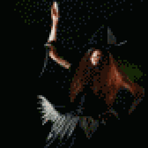

{{../_includes/flash-fiction-blurb.md}}

<!--more-->

Rhys remembered the roar of the crowd at the end of the awards ceremony. Waves of thunderous noise crashed over him from hundreds of glow sticks being whacked together in the auditorium. He stood atop the dais, holding the golden scepter above his head. He smiled so hard his teeth hurt.

But, that was last year. His reverie was shattered by the hiss of an enchanted arrow. He flicked a hand out in front of him to project a quick ward. The arrow slipped just past his ear to shatter in a cloud of frost against an oak behind him. 

"Althea!" he cried to his comms amulet.

"I've got him," came Althea's response. From high in the trees ahead, Rhys saw a searing orange bolt lash down. Where it met the forest floor, a twenty-foot hemisphere of roiling flame blossomed. It incinerated branch and leaf - and one unfortunate Ranger. 

Rhys saw the enemy glyphs on his left bracer tick down by one. Only four contestants remained, including himself and Althea.

* * *

"As a solo combatant, Rhys was nigh unstoppable last season!"

"And the two seasons before that, Hassan!"

"You've got that right, Layla! But this season, we've got the unexpected addition of his protege Althea to the battle royale."

"Unexpected indeed, Hassan! We've seen Rhys and Althea in heavy training together over the past year. But no one could have anticipated her inspired performance in the lower leagues!"

"That's right, Layla! She's the youngest combatant to gain admittance to the professional leagues! Althea rivals Rhys himself!"

"I guess she really made the most of that training, Hassan! It's almost unfair that they've teamed up today!"

"Almost, Layla, but you know there can only be one winner in the end. I wonder if we might see a passing of the torch here today?"

"Oh, good question, Hassan! That would be an incredible end to Rhys' career! What a legacy!"
 
* * *

Rhys charged out of the stand of trees to emerge into a sunlit meadow before a rocky bluff. There at the cliff edge stood Milena, the elder sorceress, master of wind and air. Althea drifted down from the treetops to alight gently on Rhys' right side. The three of them were the last.

"I'm curious about your plan, Rhys," rasped Milena with a twisted grin. 

"Don't forget about me," said Althea. 

"Oh, trust I haven't. But, I fear you've forgotten yourself, dear."

Althea cocked her head and glanced at Rhys. Then, with a guttural cry, she launched herself at Milena. 

"Althea, stop!" shouted Rhys. 

Milena made a swooping, beckoning gesture with her bony hands. The two women swirled around each other and Althea sailed off the edge of the bluff. 

Althea flicked her wrists, taking control of her flight. She made a fist and jerked it toward her hip, marshaling forces that encircled Milena in orange rings of light. Milena found herself plucked unceremoniously away from the bluff in turn. 

Rhys sighed. He flung his hands out toward the airborne women and danced finger patterns in the air. He snapped both his thumbs. 

Magic ceased to exist within a fifty-foot sphere that encompassed both Milena and Althea. They screamed and fell to the rocks and water below. 

* * *

"Oh, that's too bad, Hassan!"

"Too bad, indeed, Layla! I guess Rhys saw his chance and let gravity do the work!"

"What a waste of talent, Hassan! That Althea could have really been the future of the game!"

"Coulda, shoulda, woulda, Layla! Maybe the next bright star will take note and be a little less impulsive!"

"Great advice, Hassan!"

"What a great game, Layla!"

"You got that right, Hassan!"

* * *

Rhys ascended the dais for the fourth time, held the scepter loosely by his side. His face was grim before the roaring crowd. He bowed his head and left the stage.

## Prompt

[Take a look at my Labyrinthos Tarot Reading!](https://app.labyrinthos.co/reading/ppf/SSTRWS/21,30,54)

