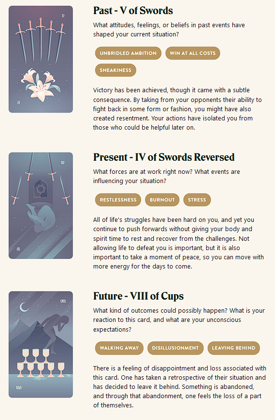

This prompt is a little too real right now. Not sure how much unbridled ambition I had, but the parts about burnout and disillusionment are too true a story. Hard to get my head into a place where I might write some fiction about it.

Very tired now, going to bed soon. Played Vampire Survivors all day rather than write to this prompt, or do much of anything else. I guess it's Easter, but that just makes me anxious and sad about a lot of things.

Maybe I could turn this prompt into a story someday soon. They say to write what you know. And I know this. But touching this set of ideas right now is like draining my power to ground.

I want to write about different things, right now. Exciting things. Adventurous things. Weird things.

Though, to be honest, I'm maybe trying too hard to write those things and be clever. Maybe I need to spend some time writing some simple, mundane scenes. Not try to make everything a space opera or a fantasy epic in progress. Hard to come up with something cool every day, whether or not the thing I come up with actually ends up being cool.

So, this isn't fiction. I feel like I'm cheating. But I guess it could count as a creative writing exercise. I'm writing. I'm thinking about creativity. I'm thinking about stories. It's more journalistic than the other days so far, but maybe that's okay. I don't tend to share my journal entries with anyone.

But anyway, as for making this count for my goal: I'm the one who's making me do this. I can decide this counts. It's thinking about writing stories. This is doing the work. Or doing some kind of work, anyway.

Not sure whether I'll post this one to my blog or not - though I guess it does make for a decent meta post about this writing exercise habit I've been trying to establish.

## Prompt

[Take a look at my Labyrinthos Tarot Reading!](https://app.labyrinthos.co/reading/ppf/SSTRWS/54,-53,43)

