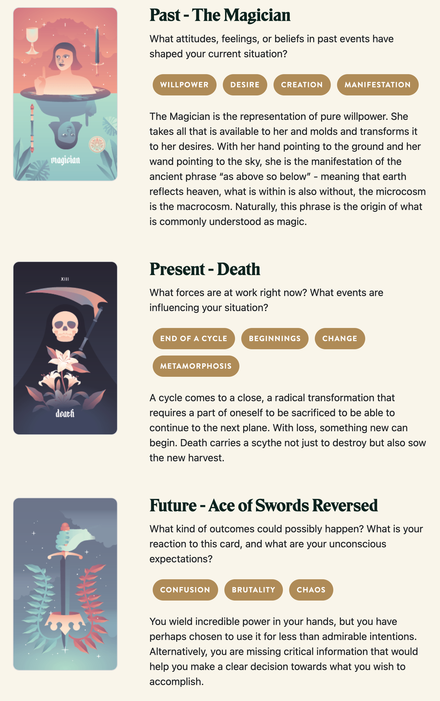

{{../_includes/flash-fiction-blurb.md}}

<!--more-->

Poppy had been vocally crypto-skeptic for months on Twitter. So, she was baffled when Zack messaged her about about a collab. 

> zackattack: hey this is a long shot but are you open to some work in the crypto space?

> SodaFiZz: You probably have the wrong account.

> zackattack: nah. you post like a hater but you got good points. and your github is on fire

She rolled her eyes. Well, at least he hadn't sent a dick pic yet.

> SodaFiZz: Is that your way of saying I program the computer good?

> zackattack: lol yea. i need to hook up with a solid eng to build this metaverse weve been speccing out

> SodaFiZz: I don't work for zuckbucks 

> zackattack: noted. i can pay in fiat. we can talk royalties later i just need to get this off the ground

She was between contracts and had plenty in the bank from the last few jobs, so she figured she'd bite. 

> SodaFiZz: 50k USD for the first month

> zachattack: drop me your bank details for a wire transfer if you're serious

Poppy shrugged and sent him her checking account and routing numbers. She was shocked to see $50,000 blip into her balance in the time it took to refill her coffee.

> zachattack: did you get it?

> SodaFiZz: Yeah, LFG I guess?

> zachattack: lol wagmi

Zach invited her to a Discord with a dozen other folks trading Reddit to-the-moon memes and had an entire channel just full of "good morning" GIFs. Quick introductions told her that she was the only actual coder in the bunch: there were social media experts, designers, investors, and a few randos whose role she couldn't decipher at all.

They pointed her to a "whitepaper" that rambled on for close to 180 pages as a blend of manifesto, financial prospectus, timeshare brochure, and a scifi TV series bible. She had to admire it as an artifact of overexcited creativity, even if it did sorely beg for an editor's attention.

She spent an afternoon speed reading of the document. From what she could discern, they wanted to build a kind of space opera universe where folks could collect starships and fly them through an unending network of jump gates leading to procedurally generated solar systems. 

Most of it was a copy/paste/replace mashup of space simulation games she'd seen for decades. The main difference here, though, was that everything in the universe would be represented by non-fungible tokens, available for purchase or rent or trade. And, of course, every transaction would have a little built-in royalty sent back to the project founders.

Without her, it was all vapor. They desperately needed her to build the smart contract code to actually implement any of their ideas on the blockchain. None of it seemed like it would go very far, even with her help. But, the cash was already in her account, so she figured she should at least give it a shot.

She'd seen this GIF once: There was a guy digging a hole while ten others played a bunch of brass instruments cheering him on. That's how she felt as she got down to work.

Poppy tried to be professional: Status reports at the start and end of each day. Demos of the things she got working along the way. All the guys in the Discord just kind of cheered every time she delivered an update, but she never got the sense that any of them understood what they were looking at. She got feedback on colors and icon designs, but never on any of the mechanics of the system.

She got bored and lazy. She borrowed a huge chunk of the procgen algorithms from the old 80s space trading game Elite, just with a different initial random seed so the planet names weren't immediately recognizable. She started throwing obfuscated loopholes and backdoors into the smart contracts. She named aliens after exes.

But, at the end of the month, she'd actually done it: She'd built the system of contracts that implemented the universe they'd plotted out. She'd given them the tools to manage content and narrative. It was even kind of fun, even if she didn't at all believe the thing would take off.

The next day, after she'd turned in her final update, she found that she was kicked out of the Discord and her access to the project code repositories had been revoked.

> SodaFiZz: Hey, what's up with the project?

> zachattack: oh hey. looks like you're done? we paid you for the month

> SodaFiZz: Oh. Yeah, I guess you did. Don't you want me to stick around for support or anything?

> zachattack: nah we're good. we got a junior eng coming on board for maintenance

> SodaFiZz: Huh, alright. Did you want to talk about royalties?

>zachattack: nah we're good thx

Poppy shrugged. It was an abrupt and unsatisfying end, but he was right: They had paid her for a month and she'd done the job. She just had to clear her head and detach.

Rather than do that, though, she kept tabs on the project in the weeks that followed. The randos from the Discord apparently rented out a warehouse in San Francisco and threw an all-nighter launch party with an open bar and a bunch of bands. No one invited her. 

It seemed like some real money started changing hands as the NFTs rose in apparent value in the days after the launch.That bit about royalties started to bug her a little. Zach hadn't quite promised anything, but she'd done all the implementation work. Maybe she deserved a little more?

Or, maybe she felt like burning it all down for fun. She remembered the backdoors she'd snuck into the smart contracts. She wondered if that junior engineer they'd brought on board had found any of them?

It was a simple thing to check. She transferred a few hundred bucks into a burner wallet through an array of tumblers to obscure links back to her. She spent a week or two buying and trading NFTs with related projects to look a little bit more legitimate. Then, she executed the exploit: She purchased a starship and named it with a very particular string of unicode characters. She ordered the ship to fly into the sun.

By afternoon, the news was all over the tech headlines: every NFT, every coin, every asset of the project had been transferred to her burner wallet. No one could figure out how to reverse the transactions. Every player had lost everything. Even the founders' royalties, at least those that hadn't been cashed out, now belonged to Poppy. Or, to be more precise, to the wallet for which she had the only key.

Poppy smiled and deleted the key along with every backup copy.

## Prompt

[Take a look at my Labyrinthos Tarot Reading!](https://app.labyrinthos.co/reading/ppf/SSTRWS/1,13,-50)

