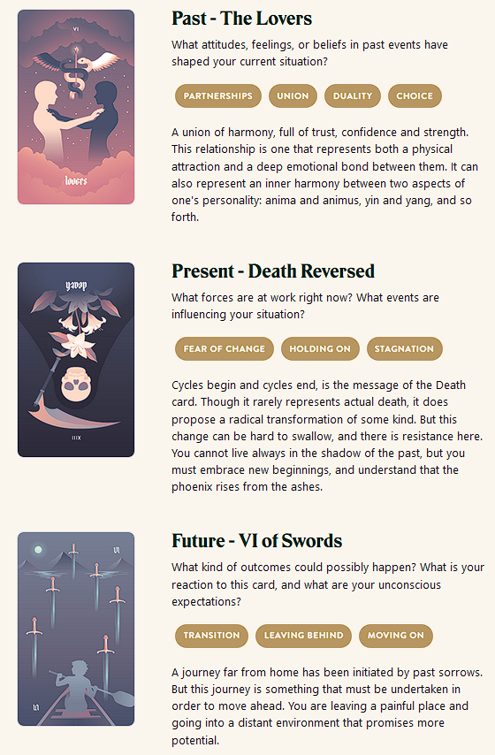

{{../_includes/flash-fiction-blurb.md}}

<!--more-->

"You were right, we don't know each other."

"No, that's not what I meant," he said. "I just said we could stand to get to know each other better."

"[We're staying together for the sake of our memories](https://curve.bandcamp.com/track/perish-3)," she said.

He sighed. "Yeah, we've had a lot of good times together. We're still good. Together."

"There's a ghost in my house," she said. "I realize it's you, but I see through you."

"What are you even talking about?"

"Look," she said. "You moved in with me here and it's like you faded away. You don't work on music anymore. You quit the band."

"The new job has has been busy. You know that. And besides, it's not like you've been writing much yourself, either."

"I know," she said. "And that's my point, really. It's like we think our souls will perish if we're apart, but it feels like that's happening the longer we're together."

He scoffed. "I guess you have been writing. That's so dramatic."

"This shouldn't be a misery contest," she said. "I'm not trying to let you down."

"I'm not trying to let you down either!"

"I know. And yet, we're doing it anyway."

"So let's stop doing it!"

"I don't think we can."

"I don't even know what I'm doing!"

"Neither do I. But, you know we're doing it, right?"

"Yeah, I know." He put his head in his hands. "What happened? We didn't fight, we didn't cheat."

"It just kind of ran out."

"We can make it work again."

"How? What'll be different?"

"I don't know."

"Me either."

They were both silent for a few minutes. Each staring at a different wall. 

He cleared his throat. "Do you remember the last time it was actually good?"

"Not really. A long time ago."

He nodded and stood. "I should pack a bag."

## Prompt

[Take a look at my Labyrinthos Tarot Reading!](https://app.labyrinthos.co/reading/ppf/SSTRWS/6,-13,55)

