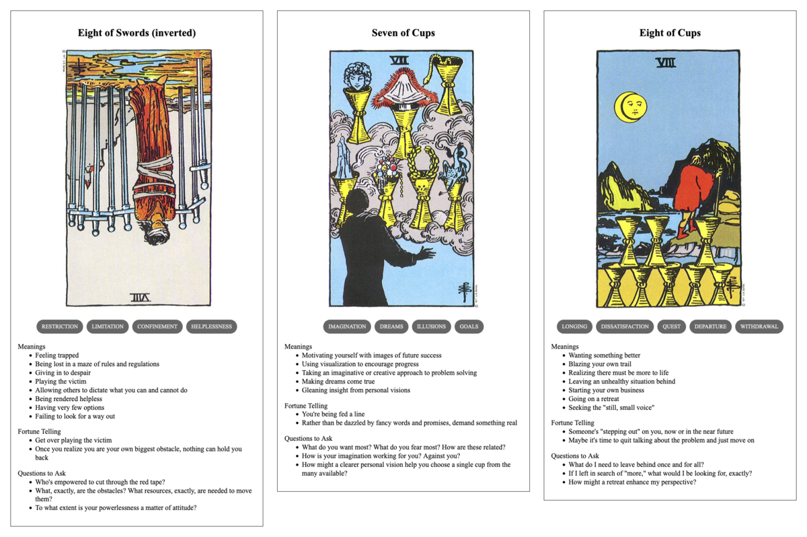

{{../_includes/flash-fiction-blurb.md}}

<!--more-->

Staring at his monitor, Jacob fought to stay awake, to appear engaged. His face appeared alongside seven other teammates in a column along the right of his screen. The bulk of the screen was occupied by a spreadsheet listing work items for the week. Document conversions, metadata updates, quality checks - none of it particularly hard or exciting. 

Jacob's boss, Frank, was presenting. His voice was an endless drone, explaining every row of the sheet in great detail.  He occasionally called out names on the call, expecting folks to unmute and acknowledge having been assigned a task by repeating the description of the work involved. 

Jacob pinched his leg, out of frame. He'd had three mugs of coffee already, but it didn't seem to be working at all. Except, that is, having left him with a powerful urge to pee with at least 45 minutes left in the meeting. 

Despite his best efforts, his mind wandered. He'd been at this job for over 5 years. It was steady, stable work. There was opportunity for advancement, but he just couldn't manufacture the enthusiasm required to pursue it. 

After the end of the workday, he spent most nights watching live streams of long haul truckers just cruising along open roads. He could watch those streams for hours on end and never feel the slightest bit drowsy. Something about the land and the road slipping past just thrilled him. 

He never told anyone about it. The few times he'd considered bringing it up to one of his coworkers—really, his only daily source of human contact—he found himself at a loss for words to explain it. 

"Hello, Jacob," said Frank. "Are you with us?"

"Ah," said Jacob. "I'm here."

"You're muted, Jacob."

Jacob toggled the mute button on his headset. "Yes, I'm here."

"Glad to hear it. Now, would you mind confirming the acceptance criteria for task 8675? Please and thank you."

Flustered, Jacob pulled up the task quickly, assigned it to himself, and read the description to the folks on the call.

Later, after dinner alone on the couch, Jacob opened up a browser tab on his laptop and started searching for commercial driving classes. 
## Prompt

[Tarot Thing](https://lmorchard.github.io/tarot-thing/)

