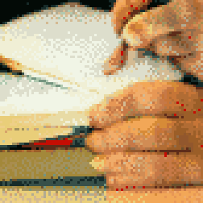

{{../_includes/flash-fiction-blurb.md}}

<!--more-->

Cyril had been writing in a journal for decades. Just a few pages every day, but he'd accumulated volume after volume in his attic: over 30,000 pages of mundane observations interspersed with an occasional bit of profundity.

One day, after he retired, he decided to start reviewing all he'd written to distill it into a single book. Not quite a memoir, more a guidebook that he'd give to his younger self if he'd had a time machine.

He pored over every old journal, marveling and cringing at the people he had been over the course of 50 years. He extracted the most interesting material from between the lines, noting the lessons that changed him and then changed him again. He tried to prize out the patterns that would have gotten him further along in life earlier. 

After a year long effort, he'd managed to strip it all down to a little over 400 pages of terse and meticulously arranged prose.

Cyril started shopping the book around to publishers. He had a few friends in the industry as contacts. He figured he'd at least get a few useful pointers in their rejections. To his great surprise, though, he had a half-dozen competing offers for his work before the end of the week. By the weekend, he'd negotiated his way up to a seven-figure deal. 

The next year passed in a rush: He tightened the book up with an army of editors. He spent a few weeks in a studio narrating the audio book himself. When it all finally hit the shelves, it was a ludicrous success. Royalties drove his earnings up by tenfold. He was pulled into interviews and appearances on TV, radio, podcasts, live streams—the works.

Just when he thought his success couldn't grow any further, his publisher invited him to give the keynote speech at a convention centered around his work. 

In the months leading up to the event, he approved all kinds of follow-on franchises: Courses derived from his work. Private coaching sessions with corporate executives. Even merchandise like t-shirts and candles with pithy slogan drawn from the book. 

Finally, he was on a plane. The venue was on the other side of the country. Being pulled away from his customary surroundings and being subjected to jet lag put him in the foulest of moods on the day of the keynote. He was a terror to venue staff and his assistants. 

After the post-keynote applause, he lingered for glad-handing and book-signing. Event staff kept a tumbler of whiskey filled at his right hand as the hours progressed. 

All grace drained out of him before day's end. He got into a shouting match with one attendee who'd decided they needed to debate him on the finer points of human relations. It almost came to blows before assistants dragged him away to his room.

Videos of the confrontation popped up all over, the next day. Sober and sullen, he didn't even recognize the man with his reddened face spewing spittle-laced profanities.

Things went downhill fast, after that. Book sales plummeted, appearances dried up, a second year of the conference was cancelled. In the course of a few more weeks, Cyril was back at home again, left alone.

## Prompt

[Tarot Thing](https://lmorchard.github.io/tarot-thing/)

