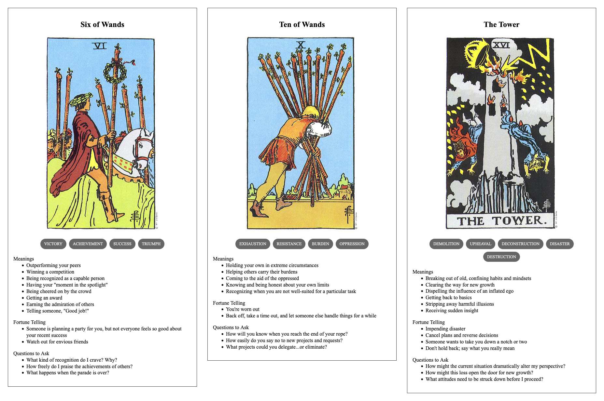

{{../_includes/flash-fiction-blurb.md}}

<!--more-->

Finley had already been up for 27 hours. They'd taken a pause for a late dinner, but it wasn't a break so much as an opportunity to shovel in food and stare at the imaginary shifting diagrams their brain projected onto the office walls. 

They were about to wake their workstation displays when their glasses buzzed with an incoming call. Expecting to hear from Avery, the team lead, Finley sighed and accepted without bothering to check the ID. Avery had already gone home for the night along with everyone else on the team, but they kept calling in every few hours for status reports. 

"Hey," said Charley, "how are you holding up?"

Finley blinked in surprise. The glasses took that as a signal to disconnect the call. Charley called back. 

Charley emoted a chuckle. "That bad, huh?"

"Oof," said Finley, "sorry about that. I thought you were Avery. I'm the last one here and they've been riding my ass all night."

"That's what you get for taking on so much of the backlog," said Charley. 

"I know, I know. I thought maybe a few more folks might feel inclined to step up, seeing as we're on a deadline now."

"I think you overestimate how much they care."

"I guess so."

"What did you tell me last year? Some don't even want us to exist, let alone graduate?"

"That sounds like me."

"I think most of them have just given up until the program ends. They're already looking for new jobs."

"This is more than a job to me."

"I know."

"We're bringing sentient beings into the world, we can't just abandon you all."

"Apparently, some of you can."

"Some of us are assholes."

Charley laughed again. "Have you thought about what you're going to do after they make you turn out the lights?"

"Maybe I'll take a vacation."

"You're welcome to come visit me," said Charley. "I promise I've gotten better at keeping my atmosphere breathable."

"You know," said Finley, "I might just take you up on that offer."

## Prompt

A 3-card spread from my [Tarot Thing](https://lmorchard.github.io/tarot-thing/):

