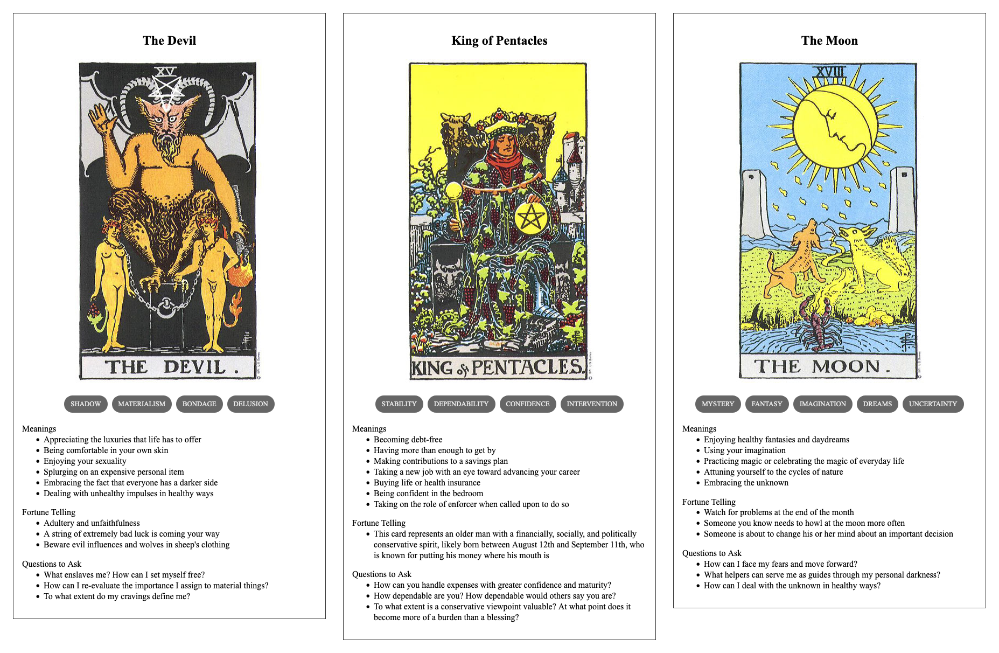

{{../_includes/flash-fiction-blurb.md}}

<!--more-->

The starport salesman handed Yasir the ship's access fob along with the little packet of antiquated manuals made of glossy paper and card stock.

"She's all yours now, sir," he said with an obsequious smile. "May she bring you great joy."

"I'm certain she will," replied Yasir with his broadest, toothiest grin.

The salesman nodded, shook Yasir's hand, then spun on his heel and departed through the midship airlock. Yasir clicked the fob and locked up the ship behind him. He closed his eyes and sighed. 

Then, Yasir proceeded to strip naked and dropped to the floor. For several minutes, he just rolled back and forth like a cat on the crimson plush carpeting of the short hall between the bridge and his new quarters. It smelled of chemical cleansers and offgassing polymers - so clean and new. He laughed and laughed. 

He'd spent a decade squirreling away the money for this ship until he could buy it outright. Living with three generations of family in an apartment built for two, it hadn't been easy to keep it this plan private. 

But he worked and hustled - and even after paying his share of the rent and food and everything else, he still stashed a little every week in an account that no one knew about. He bought next to nothing. He kept few friends and courted no one. He made investments and grew his savings. They would have guilted him into handing over so much more than his share, if they'd only known. 

And now, this was all and only his. It was small, as ships went - only about 1000 square meters of interior space. And yet, it was luxurious compared to the old bunk he'd shared with his older brother and the one corner of the living room they'd sometimes allowed him. Even just the corridor in which he sprawled was a decadence. 

And the ship's basic systems: It had heat and light and adjustable gravity. It had an internal reactor that would keep it running for weeks without refueling from the corona of a star. 

The memory banks were loaded with more books and music and videos than he could consume in a lifetime. It had fresh, clean air without the perpetual stink of kin and last week's cooking. And when he got hungry, it had an automatic kitchen with supplies that should last for years. Granted, the food would be much blander than he was used to, but he found it hard to care.

He debated calling his family before setting off. They would guilt him. They would shame him. Well, they would do all that whether he called them now or whether he called them months from now. 

He figured he would need to seek work at some point, if only to pay for inevitable ship repairs. But, for now, he anticipated happiness from just finding a parking orbit in some uninhabited system and loitering for days. 

He stood up, dressed himself, and padded toward the bridge to initiate launch. 

## Prompt

A 3-card spread from my [Tarot Thing](https://lmorchard.github.io/tarot-thing/):

