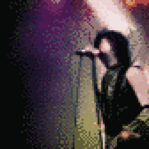
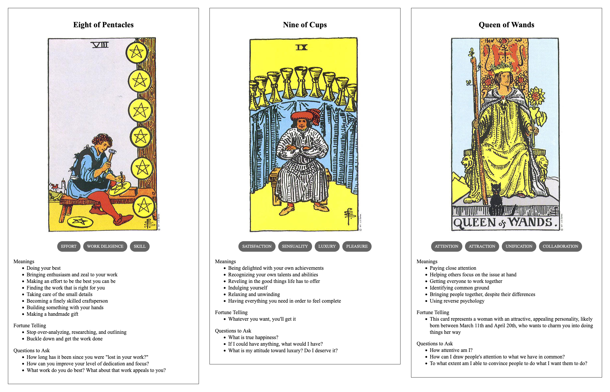

{{../_includes/flash-fiction-blurb.md}}

<!--more-->

Ivo found himself onstage, wearing a coprophagous grin in the dark. He flexed his fingers. Lasers and spotlight beams from all across the visible spectrum danced over him in response.

The crowd responded, too: 100,000 voices gone up in a titanic roar of approval and anticipation. He roared back. Even with the amplification of the venue's sound system, he struggled to match their zeal. He laughed and flung his hands out to send the lights across the audience. They screamed louder. 

He brought the lights back to himself with arms crossed over his chest. He began stomping his right foot, which triggered a pounding drum loop in time with his racing heart. His left fist flung to the sky to summon an urgent, droning bass line that resonated in every chest. His right hand swept out, open and upturned, toward the sea of moving bodies to cast out midrange arpeggios over a tense progression of key transitions.

The energy built upon itself in a reciprocal loop connecting crowd and performer until—Ivo collapsed to the stage, marionette strings severed. The music died with the lights.

And then, in an instant, Ivo leapt up. Sound and radiance returned. The eyes beyond the stage beamed back in ecstatic abandon. He grinned and they were all in on the joke. 

Ivo began to sing, his voice clear and plaintive, the words echoed back to him by every face he could see. He wove the music around him with gestures and pirouettes, his body orchestrating all the banks of machinery lurking just behind him onstage. 

He could already tell this would be his best show.

## Prompt

A 3-card spread from my [Tarot Thing](https://lmorchard.github.io/tarot-thing/):

