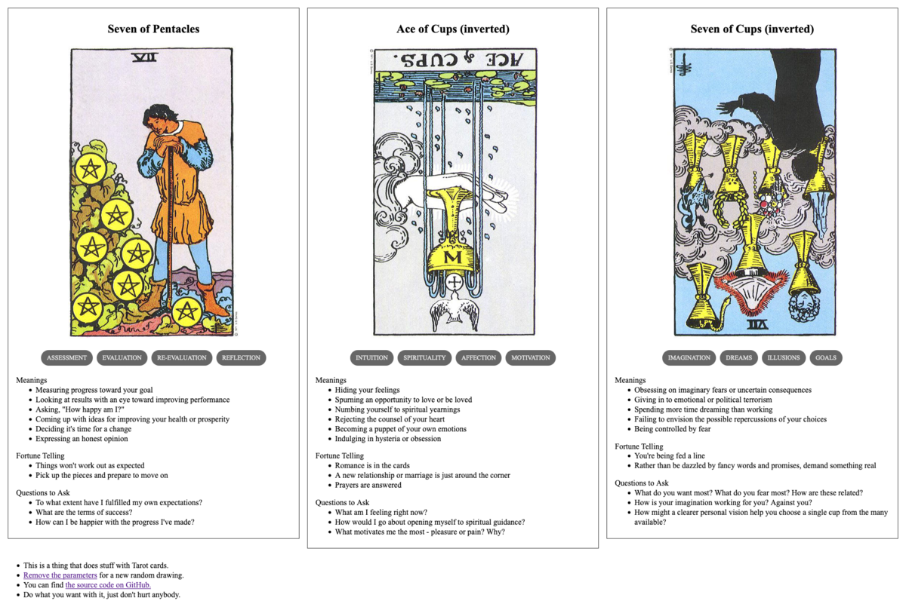

{{../_includes/flash-fiction-blurb.md}}

<!--more-->

Jae had walked through that park for years. It was on the way between work and home, and the pod of food carts across the way never got old for lunch.

As a creature of habit, Jae became accustomed to a lot of the same faces every day. Mostly just passing by in mutual oblivion, but there were always a few habitual nods or smiles.

When the pandemic hit, Jae hunkered down into a lonely work-at-home hermitage. It hadn't even occurred to them that they'd miss all those faces in the park. But, as the languishing stretched into weeks and months, they found themselves sometimes dreaming of strangers. 

When they had left the house over the interminable span of days, it was always away from the city center and away from people. The more deserted the route the better. They crossed the street whenever someone else appeared on the sidewalk, no nods or smiles.

Eventually, the pandemic waned enough for Jae to feel like risking a walk through the old park to the office to pick up a few things. They had no real idea what to expect. 

Still, a part of them somehow anticipated the old crowds. Like life had just continued in the old rhythms and habits without them. But, it turned out to be nearly as deserted as their meandering neighborhood walk. For almost the first time, the pandemic seemed like a thing that had happened to the world and not just them. 

Halfway across the park, a familiar stranger approached. Jae caught her eye, cocked their head. As the woman passed, her eyes narrowed in mild confusion, then she smiled. She turned back and Jae stopped, ten feet away. 

"I don't know you," she said, "do I?"

"No," they said, "I don't think we've met."

"But we have seen each other before, right?"

"I think... yes? I'm sorry, I think I've forgotten how to be around people."

She laughed. "Yeah, me too."

An awkward pause, then. She shifted on her feet. Jae suddenly felt like being back home.

"Well, okay then," said Jae. "Maybe I'll see you around."

"Yeah, maybe," she said, a little sad. Then she turned and continued on her way.

## Prompt

A 3-card spread from my [Tarot Thing](https://lmorchard.github.io/tarot-thing/?card=Seven+of+Pentacles&card=%21Ace+of+Cups&card=%21Seven+of+Cups):

