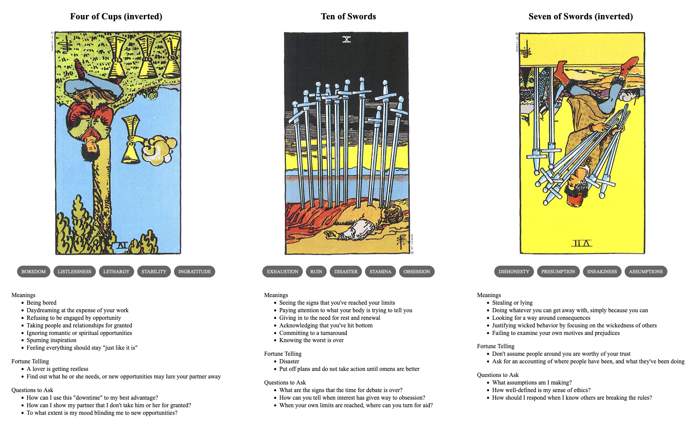

{{../_includes/flash-fiction-blurb.md}}

<!--more-->

Roxy stared out the window, watching a squirrel traverse a wire between poles. She had no real idea how long she'd been watching, but it was mesmerizing to watch the little critter scamper along at speed. 

She'd told herself it was just a pause to let her brain simmer. But, deep down, she knew that there was nothing going on in there. This was just pure dissociation. But even knowing that, she couldn't tear herself away until the squirrel descended another pole and scurried out of sight. 

Sighing, she turned back to her laptop. She'd only produced a handful of virtual fabric textures. She needed to have at least 50 by the end of the week to meet her contract's quota—and it was already Wednesday. 

She glared at the screen. She needed the money. She wanted a nap. She just couldn't make it happen. She wondered if she could get the squirrel to come sub in for awhile. She stifled a scream and just kind of bashed at the keys. 

To her surprise, whatever hot keys she'd hit had shaken up the patterns on the screen in a vaguely interesting way. Screw it: she saved it in a new file. 

She flailed at the laptop again. Oh, that didn't work so well. She hit undo once. Wait, okay, there's another good one. She giggled. She literally bounced her forehead off the keyboard. Good enough—saved. 

She spent the afternoon that way: randomly nudging things around, turning layers on and off, slapping filters and distortions on clip art. By dinner time, she had another fourty arguably unique pieces of garbage ready to send off to the game studio. 

She uploaded the files to the server and fired off an email to her producer. It only took a minute for the response to come back: "Looks good to me! Just a few more and we can close out the milestone."

She shrugged, sighed again, and closed her laptop. 
## Prompt

A 3-card spread from my [Tarot Thing][]:

[Tarot Thing]: https://lmorchard.github.io/tarot-thing/?card=%21Four+of+Cups&card=Ten+of+Swords&card=%21Seven+of+Swords

