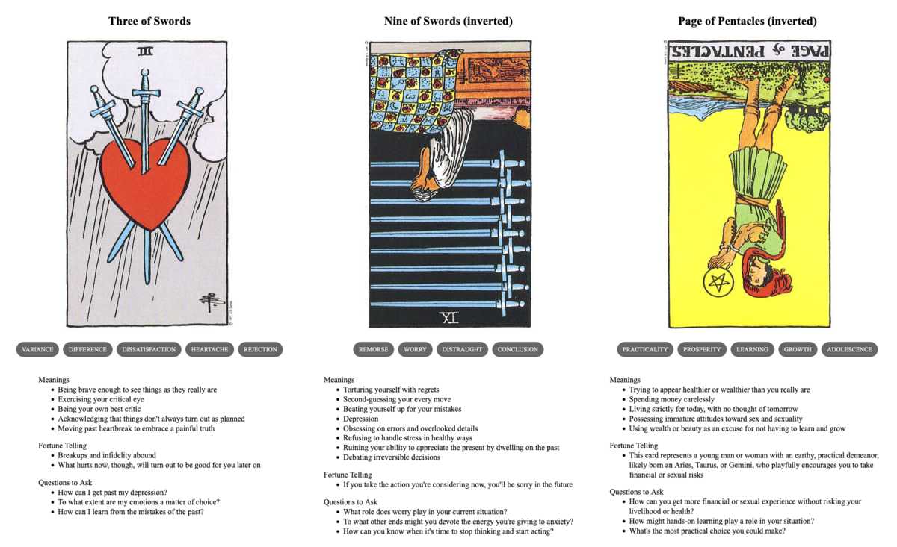

{{../_includes/flash-fiction-blurb.md}}

<!--more-->

"I didn't even know we were dating anymore," said Allyn. "I just thought you ghosted me."

Michael sighed. "I told you this was going to be a busy week at work."

Allyn sighed back, rather mockingly. "You were so busy you couldn't even spare a moment to return a text? It's been eight days since I last heard from you."

"You don't understand! It's been nothing but all-nighters and I've barely even slept."

"No," said Allyn. "You know what I understand? You don't have time for this right now. And neither do I."

"Allyn, wait—" Michael's phone beeped in his ear: the call disconnected. He looked at the screen for a few minutes, finger hovering over the redial button. 

He'd gotten Allyn's text—well, *texts* to be fair: six of them over a few days, a few days ago. The texts had come in during meetings and client calls. At the time, he'd been a annoyed and put off responding. Then, he just kind of got busy and forgot altogether. 

Granted, in local time, those meetings were as late as 8pm. But he'd told Allyn all about the time zone differences, he thought he'd understood. But, obviously not. Still, Michael could kind of see how Allyn might have felt a bit neglected. If the shoe were on the other foot, and all that.

*No,* thought Michael, *you know what? He's right. I don't have time for his crap.* 

He opened up a dating app and started swiping. 

## Prompt

A 3-card spread from my [Tarot Thing](https://lmorchard.github.io/tarot-thing/?card=Three+of+Swords&card=%21Nine+of+Swords&card=%21Page+of+Pentacles
):

