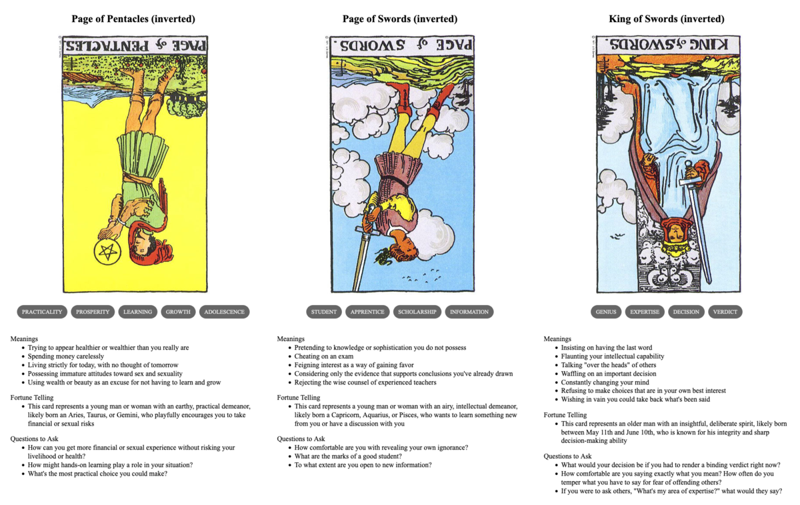

{{../_includes/flash-fiction-blurb.md}}

<!--more-->

In early Spring, just after the first thaw, Marek and Korrine loaded up a wagon and set out for the nearby city. Their cargo was mainly barrels of beer made from last year's harvest of wheat and rye. 

Marek had been dabbling with brewing for years. But, this year, Korrine turned her attention to herbs and yeast and managed to do something wonderful. They kept a good number of barrels in their own cellar, but that left plenty of surplus. 

Marek hated the city, but Korrine really wanted to see it. She convinced him it might be worth the trip to sell or trade the beer, at least. 

It was midday, after a few hours on the road, when they came upon the wrecked wagon. One of its axles had broken and the whole thing had toppled over and spilled cargo and passengers. A pair of men fussed with the wagon itself, but a larger group clustered around a small boy unmoving on the ground.

Marek didn't want to stop, but Korrine could see the injury progressing inside the boy's skull. They pulled off to the side, carefully. As Korrine hopped down to the road, Marek checked the knives strapped to his back under his jacket.

A finely dressed man hovered closest to the boy, examining his head. The boy had fallen onto a stone. Korrine could see the tangle of angry blood forcing energy to effervesce away to chaos inside his head.

"You have to release the pressure," said Korrine. 

The man looked up, surprised. He was young: older than Korrine, but not by much.

"Yes, I do," he said, "but how do you know that?"

Marek appeared behind her, put a warning hand on her shoulder. She stiffened.

"She saved my favorite horse with bloodletting," said Marek. "It had suffered a knock to the head. She is very good with livestock."

The man chuckled. "Many folks I've met would have just eaten the horse."

"As I said, he was my favorite."

"Well, this is my favorite nephew and I'd very much like to save him. I could use the help, if she's not squeamish."

Korrine looked to Marek and he shrugged.

"I don't think I could stop her," said Marek.

"Pour a little of this on your hands and rub it around. Be careful not to touch anything but what I tell you after that." The man handed her a bottle with a rubber stopper. She did as he asked—it was both cold and burned at the same time. She could sense little things fizzing and dying on her skin.

He pulled a hand drill from a bag by his knee. "Carefully, but firmly: hold his head still. He's out cold, but the pain might wake him."

She crouched down and steadied the boy's head. He positioned the drill above the boy's temple and began to crank. A woman behind Korrine began to weep, but no one protested otherwise. 

Marek expected trouble, but somehow people trusted this man. He didn't quite relax, but he did take a hand away from the small of his back. 

Korrine reached into the boy's head. She couldn't quite fix what was wrong by herself, but she could ease the drill's passage. She pulled blood flow away from the new wound, convinced tiny things not to intrude. The man kept drilling and she heard the scrape of metal against bone.

She could feel when the drill tip made contact with the delicate tissue beneath. It seemed the man could, too, because he stopped immediately. She felt the pressure inside ease. She helped it ease by coaxing some of the excess fluid toward the new exit as the man withdrew the drill.

"Well," said the man, placing a clean cloth from his bag over the wound. He began wrapping the boy's head with a roll of linen. "That's the best I can do here for now. But, I have a good feeling about his chances."

She groggily withdrew her focus from the boy and blinked at the man. His eyes peered intently into hers and she felt a pressure within her own head.

"You feel it too," he said, "don't you?"

Korrine made a tiny gasp. Marek's hands again found his knives. 

## Prompt

A 3-card spread from my [Tarot Thing](https://lmorchard.github.io/tarot-thing/?card=%21Page+of+Pentacles&card=%21Page+of+Swords&card=%21King+of+Swords):

