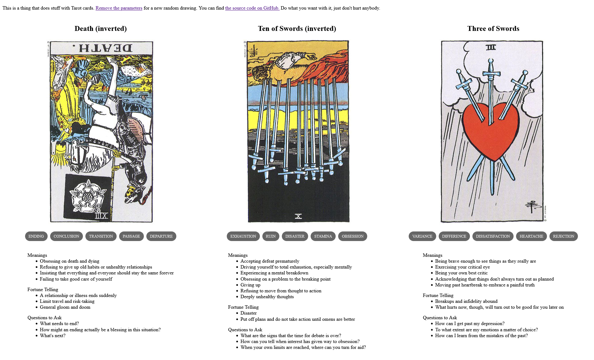

{{../_includes/flash-fiction-blurb.md}}

<!--more-->

On the day that Vonda Kroeber died, Vinge Banks' cloak of griffincloth faded to velvet black. They became just a humaniform void moving through the world, their visor offering a face that was recognizably alive but conveyed no other information. Their u-beast was a lithe cat covered in oil-slick black sequins. Once lively prancing alongside when they walked, it had taken to draping listlessly across Vinge's shoulders.

The day after Vonda's death, Vinge abandoned all their previous work and threw themself into researching the exact rare brain tumor that had killed Vonda. They had never been a medical student before, but now they were.

Over the course of months, Vinge all but disappeared into their studies. They speed-ran classes and pored over texts, hustling to cram centuries' worth of biology and oncology into their brain.

Deep down, they knew it was highly improbable that they could become as deeply expert as necessary to meaningfully contribute to the field in the years of life they had left. But they had to try and they had to hope that they could offer a variant perspective on the vast inventory of unanswered questions about the little knot of errant flesh that had ended Vonda.

One day, Laika Brin knocked on Vinge's door. Vinge had been spending nearly all their time alone in their room at the house. Their network activity was open to inspection and status reports were regular, so their bash'mates largely respected their isolation. Still, Laika had apparently found a need to intrude.

Vinge opened the door. "Hello, Laika," they said, grumpily.

Laika's cloak displayed a view of the Dallas Market Center in which many scenes of the 1979 film Logan's Run had been filmed. On their shoulder perched a golden-feathered lyrebird. 

"I hate to be the one to tell you this," said Laika, "but you're failing as a Utopian, Vinge Banks."

Vinge's visor-projected expression just stared. "What are you talking about?"

Laika gestured toward their lyrebird. It danced and spread its tail feathers down over Laika's shoulder, forming a screen that shimmered and shifted. A paragraph of fine printed letters appeared in black against gold.

"You recognize these words, don't you Vinge?"

"Yes, it's the Oath."

"Please read it to me."

Vinge sighed and intoned the words:

> I hereby renounce the right to complacency, and vow lifelong to take only what minimum of leisure is necessary to my productivity, viewing health, happiness, rest and play as means, not ends, and that, while Utopia provides my needs, I will commit the full produce of my labors to our collective effort to redirect the path of human life away from death and toward the stars.

"You've read this before, right?"

"Yes, I have Laika."

"And you swore to it, right?"

"Yes, I did."

"Are you aware that you are in violation of that oath?"

"No, I am not, Laika. I am clearlly escewing complacency and have committed the full produce of my labors to redirecting the path of human life away from death."

"Ah," said Laika, waggling a finger, "but you skipped over some big parts there. In particular, the bits about necessary leisure and its relationship to your health and happiness."

"I'm fine."

"No, you're not. Look at you. You're exhausted and wasting away in here. The oath doesn't say Thou Shalt Not Take a Break - it dictates that a minimum is necessary. Not zero, in fact."

"I don't need a break."

"You do. And not only do you need a break, but you need to mourn like the rest of us. Properly. In a healthy way. The fact that you deny this means you're failing as a Utopian."

"You don't get to make that judgement."

"Not by myself, no. But, as it happens, I'm not by myself. Unlike you, I've been talking to my peers. We thought maybe you'd get this out of your system, but that's not happening. We all think you need an intervention. We're worried about you."

Vinge sighed again. "Seriously, I'm fine."

"Seriously, you're not. In fact, as evidence, consider that you have not considered the utility of your previous work to the problem."

Their brow furrowed. "What do you mean?"

"Your previous work involved pattern matching and machine learning, correct?"

"Yes."

"What if I told you that the field of oncology is desperately thirsty for deeper, more efficient tools for pattern matching and machine learning?"

"It is?"

"Yes, it is. And you seem not to have picked up on that."

"How did you?"

"Again, not just me. You think you're alone in here, but everyone in the house has been following along with your new studies. You're tired, you've got tunnel vision. You're missing the obvious."

"Which is?"

"Your life's work so far would help advance this field so much better than you starting from scratch as a medical student."

Vinge's visored expression blinked, for the first time since Vonda's death. The sequined cat's head lifted from their shoulder and peered at them.

"Shit. I hadn't considered that."

"That's what I'm saying," said Laika.

"I need to take a break," said Vinge.

"Yes, you do. Now, let's go away somewhere nice for awhile and get you out of this room."

"Okay, yeah, let's do that."

In the velvet black of Vinge Banks' griffincoat cloak, a handful of stars flared to life.

## Prompt

A 3-card spread from my [Tarot Thing](https://lmorchard.github.io/tarot-thing/?card=%21Death&card=%21Ten+of+Swords&card=Three+of+Swords):

