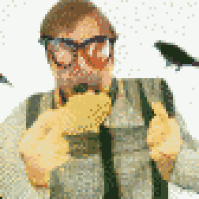

{{../_includes/flash-fiction-blurb.md}}

<!--more-->

Geoff was really rich. They called him a billionaire in the press. He hated that inaccuracy: It wasn't like he could literally write a check with nine zeroes and cash it. Still, he could buy anything with a price—and also, realistically, many things that didn't.

Of course, he could only buy from creatures who cared about money. That included most of humanity, though he'd encountered a few notable exceptions. Those exceptions fascinated him. And, what fascinated him more were all the species beyond his own, whose members were absolutely unimpressed by and had zero recognition of his wealth.

Take crows, for example: There were a dozen of them nesting in the trees around his house. He'd heard stories of folks trading with them. But, it wasn't like he could just flash an AmEx and have them swoop down to gather round. He'd heard they liked peanuts, though.

One day, he placed an order for two-hundred pounds of peanuts to be delivered to his house. As it turns out, that's a lot of peanuts. A cursing delivery driver who didn't know Geoff was watching took four trips up and down the stone steps of his terraced front yard to plonk eight big bags on his porch.

On the final trip, Geoff abruptly emerged to meet the man and offered him two $100 bills. The man was first startled by Geoff's sudden appearance, then startled again by what was thrust out toward him.

"Oh, I can't take that sir."

"Maybe you don't know this, but I own the company you work for. Or maybe my company contracts with the company you work for. Anyway, that was a lot of peanuts."

"Thank you," said the delivery man, who took the money and then hustled away down the steps to his van.

"Hmm," said Geoff to himself, looking at the bags, "I should have asked him to carry these to the garage." Shrugging, he hefted up one of the bags and marched to his back garden.

There, he tossed the bag down next to a little rock fountain by a bench. Then he sat on the bench and looked up.

"Hello crows," he said. "Come get some peanuts." He sat for awhile. Nothing happened. He got bored. With a shrug, he walked back into the house.

After an hour of processing email correspondence on a tablet from his breakfast nook, he realized he'd been hearing quite a lot of cawing from the back garden. So, he got up and walked outside.

Four crows had descended and were tearing into the bag of peanuts. He clapped and laughed. The crows all scattered back up into the trees, cawing noisily the whole way.

"Oh," he said. "Huh." After a few moments, he turned and walked inside.

Not long after he settled back into the breakfast nook, the cawing resumed. He went back outside. No crows in the back garden. He crept carefully around to the front of the house, where the noise was loudest. When he came within sight of the front porch, the cacophony stopped and six crows all turned to look at him. They were stationed on the other bags of peanuts he'd left there. Shells and mesh torn from the bags were strewn everywhere.

"Well, hello friends," he said. The crows all lept up and flapped away.

Geoff harumphed. Clearly, his crow-befriending technique required further research.

## Prompt

A 3-card spread from my [Tarot Thing](https://lmorchard.github.io/tarot-thing/?card=%21The+World&card=Three+of+Wands&card=Seven+of+Cups):

