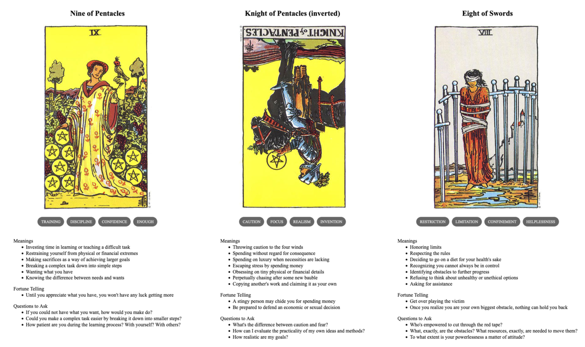

{{../_includes/flash-fiction-blurb.md}}

<!--more-->

Kyleigh cackled uncontrollably. With wild sweeps of her arms and spiraling flourishes of wrists and fingers, she channeled exuberant life into vines that sprang from the soil to ascend the surrounding oaks. Ferns unfurled from fiddleheads to broad fronds with dozens of miniature thunderclaps. Troops of mushrooms popped up in rapid fire cascades from fallen logs and leaf piles all around. 

"Not too much, now," said Helenka. She raised a wizened finger. 

"The vines can choke the oaks," she continued, tracing a tiny arc in the air with her fingertip. Vines slackened and some fell away from the trees. 

"If the ferns exert themselves too much now, they'll never survive the summer."  She curled her finger back and the ferns relaxed a little. 

"Too many mushrooms—poisonous as these—and the deer will eat themselves to death." She flattened her palm and pushed it toward the soil. Swaths of fungi darkened and sloughed away into slime. 

Kyleigh rolled her eyes and groaned. "I know, I know," she said. "How will I learn if I don't cut loose a little though?"

Helenka rolled her eyes in return. "You're not entirely wrong," she said. "But watch that you don't spend so much of yourself that you need to spend just as much to get back to where you intended. Or to undo a mistake. There's economy in caution."

Kyleigh pinched fingers to thumb, then spread them to draw sprays of tiny amethyst flowers from one of the vines. "There's plenty of me to spend!"

That made it Helenka's turn to cackle. "You say that now," she said. "I said that then, and look at me today!" She gave an awkward little shuffling pirouette that drew a giggle from Kyleigh. 

"You're not so bad," said Kyleigh.

"But not so good either," Helenka replied. "Listen, you can live twice as long and twice as strong, if you can learn from me what I learned the hard way."

Kyleigh nodded, the whimsy in her eyes turned grim. Though her apprenticeship under Helenka was often joyous, it hadn't started that way. 

She remembered the men and the dogs chasing her, stinking of blood and angry fear. She remembered Helenka rising from the loam in a clearing under silver moonlight, a fearsome shrieking hag that froze men and beasts alike. Somehow, though, Kyleigh felt only ecstatic awe as Helenka tore the life out of her pursuers and gave it to the forest. 

Kyleigh startled from her reverie: Helenka had leaned in and tapped her sharply on the forehead.

"Be here," said Helenka. "Here is the only place you have power."

## Prompt

A 3-card spread from my [Tarot Thing](https://lmorchard.github.io/tarot-thing/?card=Nine+of+Pentacles&card=%21Knight+of+Pentacles&card=Eight+of+Swords):

