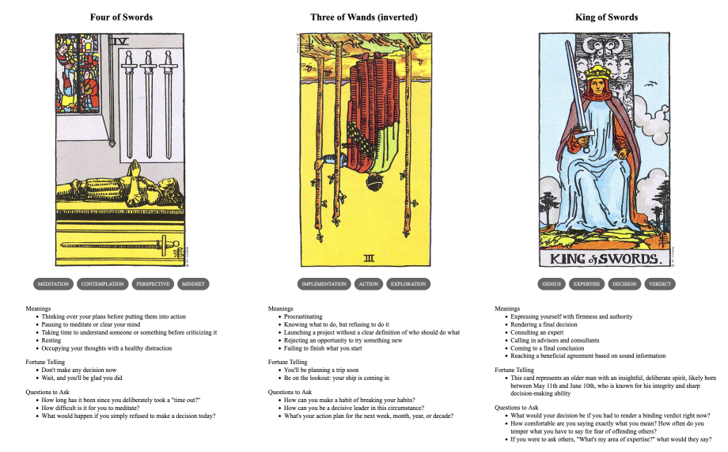

{{../_includes/flash-fiction-blurb.md}}

<!--more-->

Judge Rhisart sat at his desk, staring at two chrome cylinders resting on the blotter. Each held what was left of a life. One could become a life again, but it was up to him to choose.

He didn't actually like his job. But, he took it because he'd become convinced that few others could do it as well. A lot of other folks agreed, so he got the appointment. Twenty years of judging souls for a living. Somehow he hadn't quite lost his own yet. Still, he was so tired.

Sighing, he picked up the cylinder on the left and pressed the end against his temple. A transition of vertigo and displacement passed and he was Kenshin.

Kenshin was tired and cold. He was tired of being cold. The apartment was unoccupied. He knew this because he'd walked past it for months and had never seen anyone or anything in the space through the windows. He couldn't afford it in his wildest dreams. He couldn't afford anything. They wouldn't let him work. The snow fell, the cold became pain. The pain became numbness. He knew he was dying.

With the last of his strength, Kenshin drove a shoulder into the apartment door. It gave. He entered. It was warm. He closed the door behind him and passed out.

Self rotated kaleidoscopically and Kenshin was Rhisart. He sighed again, more heavily this time. He returned the cylinder in his hand to the desk and picked up the other. He pressed it to his temple. He was she was Katja.

Katja woke from a dead sleep to the break-in alert screaming from her phone at her bedside. She picked the phone and acknowledged it to silence it. It was one of the apartments. She got up, dressed, and grabbed her purse on the way out. It was so cold outside. She missed her late husband, he always used to take care of these things. She trudged through the snow and across the street. She couldn't get the apartment rented. She couldn't sell the building because the apartments weren't renting. She was so under water and her only tenants were squatters. She was so tired.

She walked through the hall to the apartment. The door was closed but the frame was splintered. She nudged the door with her foot and it swung open. Feeling around in her purse, her hand found the pistol. She drew it out and levelled it in front of her. She entered the dimlit apartment.

A bundle of rags in the middle of the living room floor. She stepped carefully toward it and nudged it with her toe. The bundle rolled over and sprouted a face. She panicked and fired three shots.

Then, panic became a pain in her chest. It blossomed and spread. She clutched at it and fell to her knees. Thudding in her head. Then she was he was Rhisart again. He set the second cylinder back down on his desk.

He was meant to choose one of these for resurrection. There was only one donor body available, but he had two souls in front of him. If he didn't choose, they would both degrade into noise by the end of the day.

He was so tired. He pressed the intercom button on his desk. 

His secretary answered. "Your decision, sir?"

"Both."

"Sir? But there's only—"

"I'm retiring, effective immediately. There's going to be a vacancy."

## Prompt

A 3-card spread from my [Tarot Thing](https://lmorchard.github.io/tarot-thing/?card=Four+of+Swords&card=%21Three+of+Wands&card=King+of+Swords):

