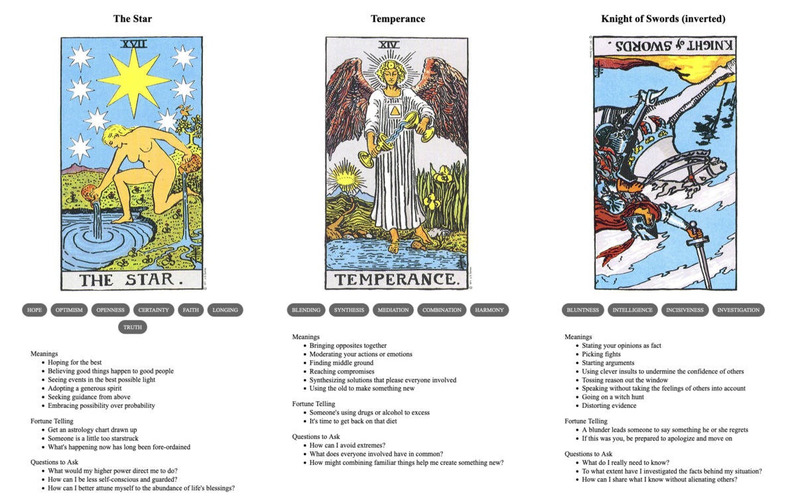

{{../_includes/flash-fiction-blurb.md}}

<!--more-->

When Radmilo was a boy, he talked to fireflies. He didn't know any better, it was just something he did. He had no brothers or sisters, only himself to play with in the fields and woods around the house. He'd stay out through all the days of summer, until dusk came and he had to run home. 

The fireflies didn't talk back, not exactly. But, when he talked, they seemed to like to be around him. They followed him in swarms and swirls—not crowding, not pestering, just there around him and reacting to his voice. Sometimes he thought they made shapes that almost made sense. Sometimes he thought they were telling him stories. 

One late afternoon, he stayed out too long. Dusk turned to twilight, but it was already so dim where he sat under the trees. He'd gone there to better see the patterns of glow. He lost all track of time, focused on dancing things that were almost meaning. Just a little longer and he'd figure it out. 

He didn't know that Dominik, his father, had come searching for him. He didn't know that, during the search, the man had grown ever angrier. That anger was the only emotion the man had available to him.

Radmilo didn't see when his father stumbled upon the clearing illuminated by galaxies of bioluminescent stars. 

Someone else might have felt awe at the sight—Radmilo did. But, again, Dominik felt only more anger. The man stormed through the curtains of swarming insects toward his son lying in the dirt. He swatted the bugs away as he moved. 

The disturbance registered in Radmilo, breaking the spell. He sat up just in time to feel a strong hand fall on the back of his neck like a truncheon. Fingers closed in a startling grip of pain that hauled him to his feet. Radmilo screamed.

Dominik slapped the boy across the face. "Enough of that," he said. "You were bold enough to disobey me, now face your punishment with as much courage."

## Prompt

A 3-card spread from my [Tarot Thing](https://lmorchard.github.io/tarot-thing/?card=The+Star&card=Temperance&card=%21Knight+of+Swords):

