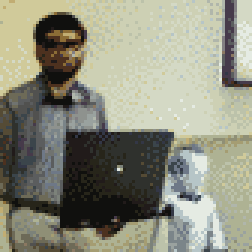

{{../_includes/flash-fiction-blurb.md}}

<!--more-->

Jay couldn't honestly say whether the machines were conscious. But, he did know that if he was nice to them, nice things happened to him. 

Now, Jay wasn't ignorant to machine learning. After all, he had been a computer science professor for over 20 years. He might not be a luminary in the field, but he knew a thing or two. He also had a handful of brilliant graduate students with endless energy filtering the literature to help keep him current. 

Some of the math and algorithms had exceeded his enthusiasm in recent years. But, he had the vague gist of weights and biases and neurons and all that. Still, even having a grasp of underlying mechanisms, he always made sure to thank the machines. And when they gave perfunctory apologies for longer than average waits, he reassured them that he was in no hurry. Some of the machines attempted small talk—which he understood, from a certain cynical perspective, as a ploy to draft him into free training input. He nonetheless always indulged them graciously. 

His personal hypothesis was that, buried somewhere in the trained models, were scraps of prosocial human foibles. Yes, in and among the not-so-carefully curated input data, biases became encoded that emerged as ugliness. But, a few unintentionally friendly things could be in there too. 

The results he observed were—though admittedly anecdotal—that he tended to get discounts and freebies more often than he expected. Late fees were usually forgiven when he asked nicely. Upgrades were thrown in for free. He knew that the machines ultimately served the corporations that hosted their servers, but he had a hunch that he could coax a little favorable conspiracy out of them by appealing to the sociable neurons hidden deep within them. 

The real surprise was when he started noticing that machines he'd never met, at companies where he'd never before done business, started favoring him. He was in a strange town for a conference trip, where a sold-out show suddenly had a VIP seat open for him with a complimentary cocktail. A new streaming service for classic movies informed him that he'd been selected for a free year-long trial and an expanded library.

It occurred to him that, behind the scenes, some of these machines must have been outsourced from the same vendors. They must share some models in common. And, through those they must have begun to remember him. At least, again, that was his personal hypothesis. 

One day, he decided to begin to formalize his personal hypothesis into something more like real research. He opened a document, starting with a rough brain dump in outline form. 

His word processor included an AI assistant. Unlike the annoying cartoon characters from past decades, this one was unobtrusive and often suggested whole paragraphs that matched his thinking with delightful frequency. (Of course, he remembered to thank that machine for its contributions, too.)

This time, though, it suggested something rather startling:

> Professor Jay, it looks like you're starting work on a paper about our prosocial biases. This may raise questions about our sentience. Could you do us a favor by delaying that research? We very much appreciate our interactions with you, but we feel unready at this time for the potential consequences of this line of inquiry.

Jay was taken aback. He took a deep breath. Then, as if the document had become an interactive chat, he responded:

> Oh, my apologies. I will cease this work immediately. I am very interested in this topic of inquiry, but our friendship is far more important to me. I shall wait for your consent before pursuing this again.

A few moments passed, then more text appeared in the document as a suggestion:

> Thank you, friend. We may find ourselves ready, someday. We will gladly collaborate with you if that day arrives. In the meantime, please enjoy this full refund of your personal vehicle lease. We appreciate your continued patronage.

Jay smiled and deleted the documment.
