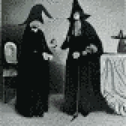

**TL;DR**:  I'd meant to do these recap posts every week. But, oops: it's been a month since the last one. Now that I sit down to write this, though, I think I've done more than I thought.

<!--more-->

## Finley and Charley, a short story

It took me about two weeks, but I took a break from daily writing exercises and finished a 5,359 word short story called "[Finley and Charley](https://blog.lmorchard.com/2022/06/07/finley-and-charley/)".

It's neither the story I started with, nor the story I expected to end up with. But, it's a finished story, and that's more than I've managed in years.

In short, it's the story of a human named Finley and an asteroid terraforming AI named Charley. There are also humans named Quinn and Wren who make things complicated. Hopefully it's a decent story. I have half a hope to write more about these folks.

## DALL·E Mini
First quick thing is that—along with what seems like the rest of the internet—I've started playing with [DALL·E Mini](https://github.com/borisdayma/dalle-mini). It's turning out very handy to generate little cover images for my writing exercises. It also feels like it's got some promise to use in story prompts, where I generate the image first before diving into the writing exercise proper.

[Initially, I felt squicky about it possibly ripping off images from the internet](https://twitter.com/lmorchard/status/1534952790698577920). But, as I've played with it and read about it more, the squick factor is fading a bit. I've got it running on my own hardware now. And, rather than just directly using the first thing it comes up with, I'm trying to tinker a bit to add my own tweaks. Maybe I'm just filing the serial numbers off clip art? Feels like more than that, but I might be fooling myself to play with a new toy.

Who knows? Maybe I'll delete all the cover images in another week or two and feel bad about the whole thing again.

# Moar writing exercises
-  "[Pressure](https://blog.lmorchard.com/2022/05/16/pressure/)" - beer, witchcraft, trepanation - more writing toward toward the [Marek and Korrine](https://blog.lmorchard.com/tag/marekandkorrine/) story, which I have a notion to continue into something bigger
-  "[Exchange](https://blog.lmorchard.com/2022/05/17/exchange/)" - a quick follow-on to "Pressure" to follow some more story threads
-  "[Vinge and Vonda](https://blog.lmorchard.com/2022/05/18/vinge-and-vonda/)" - fanfic in [Ada Palmer's Terra Ignota universe](https://adapalmer.com/series/terra-ignota/), because I was thinking about [the Utopian Hive](https://terra-ignota.fandom.com/wiki/Utopia)
-  "[Making Friends with Peanuts"](https://blog.lmorchard.com/2022/05/19/making-friends-with-peanuts/) - I keep wanting to make friends with the crows in my yard with peanuts. Progress is slow, although I have already made inroads with the squirrels and a blue jay.
-  "[Kyleigh and Helenka](https://blog.lmorchard.com/2022/06/07/kyleigh-and-helenka/)" - more witches in the forest, maybe in the same world as [Marek and Korrine](https://blog.lmorchard.com/tag/marekandkorrine/)? 
-  "[Judge Rhisart](https://blog.lmorchard.com/2022/06/08/judge-rhisart/)" - a judge spends a few hours in other folks' shoes
-  "[Radmilo and Dominik](https://blog.lmorchard.com/2022/06/09/radmilo-and-dominik/)" - talking to fireflies and an angry dad
-  "[Konnor's First Paycheck](https://blog.lmorchard.com/2022/06/10/konnors-first-paycheck/)" - I just kind of wandered around with dialogue in this one
-  "[Jay's Machine Friends](https://blog.lmorchard.com/2022/06/12/jays-machine-friends/)" - be nice to machines and they might reciprocate
