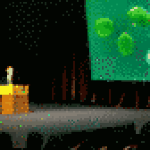

{{../_includes/flash-fiction-blurb.md}}

<!--more-->

"No, you don't understand," said Kelan. "They want me to give a talk."

"Well, yeah," said Thyra, "that's what a keynote speaker does. You give the opening talk."

"You mean, like, the very first talk?"

"Yup, that's a keynote: the first talk everybody goes to."

"Holy crap, that's so much worse! I thought maybe I could sneak off to some time slot on the last day when everyone's already running off the airport!"

"You could say no."

"It's kind of a big deal though."

"Yeah."

"And they might not ever invite me back."

"That's true."

Kelan looked miserable. "You're not helping."

Thyra laughed. "No, I guess I'm not. You're too easy to mess with, though!"

"Ugh," said Kelan. "This is serious. I'm going to have a panic attack behind the podium and pass out in front of everyone."

Thyra sighed. "Okay, listen, I've got one word for you: kombucha."

"What, that gross tea crap from the co-op?"

"No, yeah, that stuff is gross. I make my own." Thyra frowned for a second. "Okay, honestly, mine's gross too."

"You're not selling me on this."

Thyra rolled her eyes. "No, listen listen listen: it doesn't matter how it tastes. It's all about the SCOBY."

"From the cartoon?"

"Not Scooby, SCOBY: a symbiotic culture of bacteria and yeast."

"That sounds like my compost bin."

"Your gut is like a compost bin."

"That's a novel insult."

"Okay, so, your gut is full of bacteria—"

"Gross."

"Stay with me. The bacteria is your microbiome. It's about as important as all your other organs."

"What does this have to do with me literally dying on stage?"

"Your microbiome does all kinds of stuff for you. It plays with hormones in your blood. It can even talk to your brain over your vagus nerve."

"Is that like when you've got the nerve to say 'hit me' at the blackjack table?"

Thyra groaned. "Vagus, not Vegas. Anyway, the bacteria, they affect how you feel. They can even effect how you think."

"So creepy gross bugs in my compost guts can give me indigestion."

"Sure, they can do that. They can give you anxiety and panic attacks. They can also do the opposite."

Kelan's brow furrowed. "Wait, do you like get high on kombucha?"

"No, no—well, sort of maybe you could—but no. Look, you remember my last job was in biotech before this?"

"Yeah. Wait, is this like GMO kombucha?"

"Actually, yes! I absconded with some cultures when I quit. I've been tinkering with breeding some bacteria that a bunch of studies say can be used to treat performance anxiety and social sensitivity."

"So you're going to brew me up a nasty potion and I won't die on stage after I drink it."

"I wouldn't put it like—oh, hmm, I guess I could put it like that."

"Well, I don't believe you. But, I'm desperate. When can you have this all mixed up in your cauldron? I'd like to give it a trial run before I commit to my doom."

"I think I got some already bottled in my fridge at home. Want to swing by and pick some up after work?"

"Sure, what have I got to lose."

"Excellent. I promise not to turn you into a newt."

"You'll have to, if this doesn't work. That way, I'll have a good excuse to skip this keynote thing."
