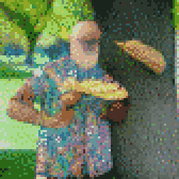
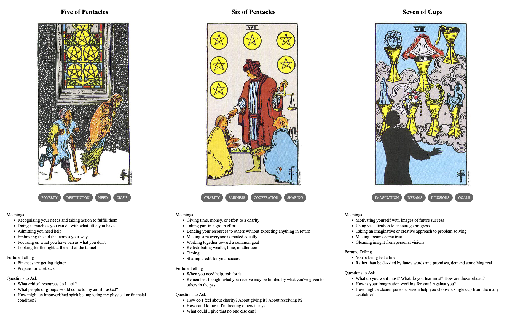

{{../_includes/flash-fiction-blurb.md}}

<!--more-->

"Hey, asshole," a man shouted, "eat this!"

I felt something soft but weighty whack against my face and gently roll off to the ground. I'd been dozing under a tree, so it took awhile for my eyes to open and focus. I pushed myself up to sit and picked the thing up. It was a turkey sandwich on sourdough, neatly packaged in plastic wrap.

Against my better judgement, I said, "What the hell, man?"

"You're looking all ragged and hungry," he barked, "and I'm sick of seeing it."

The guy had to be in his 70s. He was spry but had a deep-lined face, all framed by a grey beard and close-cropped silver hair. He towered over me, but didn't really seem all that imposing in his sandals and jorts and floral short-sleeved button-up. Still, I'd had my ass kicked by less likely contenders before.

"You heard me," he said, brandishing a stubby calloused finger at me. "I walk through this park every other day. I see you here all the time, just wasting away. Eat that damn sandwich."

I sniffed at the sandwich. "You put shit in this?"

"Fuck you, did I put shit in that," he said. "What kind of question is that?"

He stepped closer toward me and I couldn't help but shrink away. He plonked down next to me against the tree. This close, he smelled of caffeine and nicotene, both comforting and a threat to my broken brain. He pulled another sandwich out of a fanny pack around his waist. I just kind of stared as he unwrapped it halfway and took a big bite out of it.

"Here, trade you," he said, offering his sandwich to me.

"That's okay," I said.

"I don't have cooties," he said.

"I believe you," I said. I started unwrapping the sandwich he gave me.

"Alright, that's good," he said. "You eat that whole thing."

"You know, man," I said, taking a bite, "you're being pretty fuckin' aggressive."

"It's because I'm scared of you," he said. He sighed and leaned back against the tree. "But I'm also tired of being scared. And I really do feel sick just watching you turn all skin and bones."

I didn't know what to say to that. I stared off and ate some more sandwich. He ate some of his and stared off, too. Looking like he just remembered something, he pulled out a little bottle of water from his pack and handed it to me. I took it, opened it, drank, and stared some more.

"When you're done eating that," he said, after awhile, "I want to hear your story, if that's okay." 

"Yeah," I said, "okay."

## Prompt

A 3-card spread from my [Tarot Thing](https://lmorchard.github.io/tarot-thing/):

