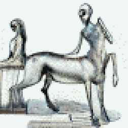

{{../_includes/flash-fiction-blurb.md}}

<!--more-->

Miriam watched how Goibniu moved into the room. Ey trundled in, turned around, carefully watched the room's door as ey closed it behind em. Ey painstakingly navigated the tables and chairs placed throughout the nearly-deserted break room.

"Hey Goibniu," she said. "Come hang out with me."

The upper two of four uncannily humanoid eyes tracked her in return, while the lower two fixated on the carpet. 

Eir body plan was centaur-adjacent: There were four jointed locomotive limbs in contact with the ground, sprouting from a pelvis elongated parallel to gravity. A torso rose from one end, itself hosting four segmented arms subdivided into a quartet of smaller fingers at the ends. A bulbous octopoid sensory cluster emerged from the top like a head, though Miriam knew eir neural infrastructure was more widely distributed than a human's singular brain.

Miriam reached over and scooted a couple of chairs out of the way. Goibniu sidled up to Miriam's table and settled down, folding eir legs neatly under to settle into a feline loaf. Ey sighed and brought eir arms down to rest on the table, interlacing all sixteen of eir fingers in a habitual braid.

Goibniu fluted a greeting from the vocal orifice atop eir sensory bulb. Miriam's implant translated this to a contralto voice: "How's it go?"

"It goes well," said Miriam. "And with you?"

"Also going well with me," ey said. 

"It's funny," she said, "the way you walked in here."

"You laugh at my walking," ey said, tilting eir head back quarrelously. "Two legs fall over so easily, you should talk."

Miriam laughed. "No, friend," she said, "you just reminded me of something. Did you have pets, growing up?"

"Pets?"

"Smaller animals, adopted as family."

"Oh, yes, I see. We had several such critters in our home. In fact, I had three 'pets' before I came here."

"Do you miss them?"

"Sometimes yes. But, you suffice."

Miriam laughed again. "Good one!"

Goibniu shook in silent amusement.

"Anyway," she said, "I remember watching doorways to make sure the cats wouldn't get out. And I remember watching my feet to make sure I didn't step on one of them."

Goibniu nodded, an affectation ey'd acquired from her. "I see," ey said, "yes, same. Always looking. Careful around the critters. Easy to trample and blunder and regret. Better to take care."

Miriam nodded. "Yes," she said, "all of that was the same for me."

"Different but same we are," said Goibniu. "You enjoy collecting these intersections."

"I guess I do," she said.

Goibniu unlaced a set of fingers to reach over and pat Miriam on the head.
