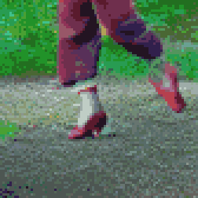

{{../_includes/flash-fiction-blurb.md}}

<!--more-->

The older woman danced in the clearing like a goddess. Silver hair spun and whipped. Her clothes had long since fallen to rags. They barely covered the assemblage of strained muscle, tendon, and bone to which she had been reduced. The one article of clothing that shone bright were a pair of red leather shoes strapped to her feet.

She pranced on toe-tips to pirouette and plié, as if an invisible strand suspended her from the tree canopy. She transitioned to visceral stomps and hips gyrating, feet kissing the ground in sympathy with tectonic shift and rivers of molten rock flowing far below. There were no words, no song. She was dancing a dream with the whole of her body.

Torunn watched, leaning against a nearby trunk. She'd watched the woman for hours the day before, from midday until sunset. Hunger and indecision had made her wander back to her camp. She came back the next morning to find the woman still at it, the dance going on and on, shifting and never ever repeating. The woman's eyes were open, but in a trance that ignored Torunn's presence.

Torunn took a breath. She approached the woman. The woman's eyes gained life and focused on her new companion.

"You should leave," said the woman. Her voice was breathy from exertion, but not overly so. The dance never stopped.

Torunn cocked her head. "Why would I do that? It took a lot of work to find you."

The woman's bobbing brow furrowed. "It took a lot of work not to be found. I didn't intend this as a puzzle."

"Nonetheless," said Torunn, "I solved it."

"I'm not here to entertain you," said the woman.

"I'm not here for entertainment," said Torunn. "I'm here for your shoes."

The woman spun and whirled around Torunn, weaving her stationary body into the dance. She brought her face within a finger's width of Torunn's, wide-eyed gaze boring into the girl's own.

"This is no illusion," said the woman. "I'm a sacrifice to the shoes."

"I'd love—," said Torunn.

"Shut up!" The woman slammed against Torunn, back-to-back. She slid down Torunn to a crouch before leaping away to tumble like a gymnast. "You're too close to invoking them!"

"I'd love to dance like you," said Torunn.

The woman stopped dancing and sat on the forest loam. She stretched her legs out in front of her.

"Just take off my red shoes," she said. The words flowed in a fluting melody, like a recording played through her. "Put them on and your dream'll come true."

Torunn stepped over and sat. She took off her own boots, placed them near the woman.

"We look to be about the same size," she said. "Plenty of padding inside, so I hope you can walk in them."

The woman didn't respond, frozen in place, her eyes locked on the red shoes.

Torunn shrugged. Tenderly, she untied the silk laces. The flesh beneath was calloused into permanent channels formed around the wide ribbons. She grasped both shoes and tugged them away. The woman's toes had all merged together. The soles and heels were stone. What had been feet had transformed into implements meant only for the shoes.

She pulled the red shoes onto her own feet. They snapped into place as if magnetized to bone. The silk laces moved on their own, drawing mercilessly tight and tying their own bows. Torunn winced, sighed, and then smiled in bliss.

Torunn lept to her feet and began dancing like a goddess.

## Prompt

<figure class="video-container"><iframe class="lazyload" width="560" height="315" data-src="https://www.youtube.com/embed/_vhhS9ZY4CQ" title="YouTube video player" frameborder="0" allow="accelerometer; autoplay; clipboard-write; encrypted-media; gyroscope; picture-in-picture" allowfullscreen></iframe></figure>
