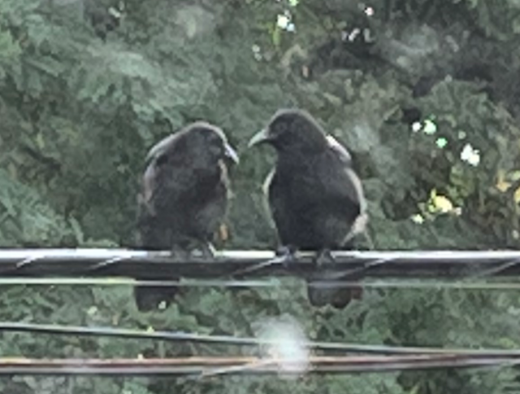

**TL;DR**: Yeah, yeah, I'm navel gazing about Twitter over here.

<!--more-->

I've been on Twitter since October 2006 - 16 years, as of this month. It replaced the social writing I used to do here, to my great shame as a proponent of the DIY web.

In the beginning, it was a watercooler for Silicon Valley folks. Being [a Silicon Valley transplant at the time](https://blog.lmorchard.com/2006/06/24/go-west-young-man/), this was handy for me. When [we replanted to the midwest](https://blog.lmorchard.com/2008/05/14/go-midwest-young-man/), it helped me stay in touch with distant acquaintances. Since then, it's become a place where I eavesdrop on interesting strangers and occasionally try to say something amusing. For a while, [it turned into a rage room](https://blog.lmorchard.com/2016/11/11/heartbroken/) to vent about the world's manifold fuckery. But, with the exception of occasional relapses, I've tried to lighten up.

I often consider ditching Twitter. [Of course](https://www.theverge.com/2022/10/28/23428132/elon-musk-twitter-acquisition-problems-speech-moderation), I'm considering it again. Like [Dread Pirate Roberts](https://www.youtube.com/watch?v=aHZGqBVBCRw), I say "Good night, Twitter. Good work. Sleep well. I'll most likely quit you in the morning."

For lack of a better description, Twitter is a comfy place for me to be a social coward. I can launch missives into the ether and retreat. Sometimes, when I come back, responses have arrived.

It's all very indirect and deferred, like a play-by-mail game. Or like the discussion forums of single-line dial-up BBSes from when I was a pre-teen. I don't have to address anyone in particular or engage with the exhausting phenomenon of having drawn immediate, in-the-moment attention. (It bears saying, of course, that this is a description of my experience from a position of privilege and luck. Mileage varies dramatically for others.)

I don't have any particularly strong bonds via Twitter. How could I, considering my nebula of [~4,500 followers](https://twitter.com/lmorchard/followers) and [~4,900 followed](https://twitter.com/lmorchard/following)? This is not an achievement, it's just impulsive accumulation from over a decade-and-a-half on the site.

What are all these accounts? How many are piloted by genuine people? How many care or know who I am? If pressed to perform an inventory, I could recall some details. In any case, it'd be absurd to say that I'm friends with 5000 people. There might be a few who'd show up for a party, even fewer who'd help me move a couch or pick me up at the airport. ([Not that I've thrown a party or been to an airport in years](https://blog.lmorchard.com/2021/09/14/in-volvation/), but I've heard that these are defining features of friendship.)

So, what am I doing on Twitter? Social cowardice as a service sounds like a disservice. Rather than daily social junk food, should I reconsider my habits of social outreach with greater mindful intent?

I mean, sure. But, that sounds like a lot of fraught work. I prefer to avoid it. I also don't know how to be social. Do I just:

- go doomscroll [on Mastodon](https://hackers.town/@lmorchard)?
- return here to blog into the silent void?
- jump around a bunch of Discords and say hello before immediately ghosting?
- review my contacts and embark on an old-school personal correspondence habit that I will also abandon with haste?

If I knew how to be an effective social human, I wouldn't need to lean on Twitter. My social life has been mediated by computers since I first used a modem in the 80s. I don't think that, for me, making friends in the offline world is an atrophied skill. Rather, I think it's that [I've never really had the knack](https://blog.lmorchard.com/2005/03/22/online-social-skills/).

Anyway, I have no conclusions. I just wanted to write into a different part of the ether for a change. Comment, if you like. I'll be here brooding over whether I feel like rewriting my blog build system from scratch yet again.
