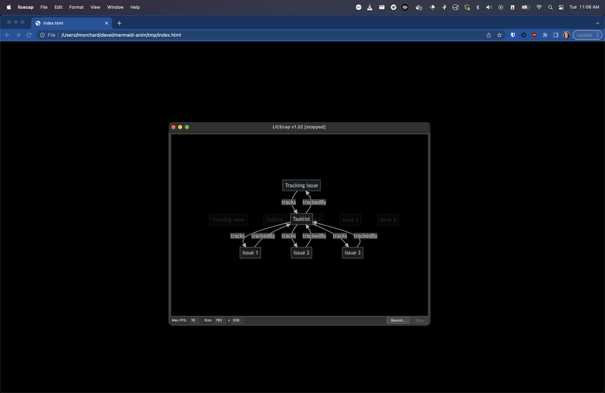

So, I wanted to produce a GIF animation of a graph diagram changing over time. What I came up with wasn't the slickest result, but it's close enough to what I'd initially imagined.


<!--more-->

One of [my earlier notions](https://hackers.town/@lmorchard/109507942547830293) was to tinker with hand-crafted SVG animations. That led me to a great feeling of exhaustion before I even began.

Then I remembered that [Mermaid diagrams](https://mermaid.js.org/) are a thing. I decided what I really wanted to do was tap out some quick symbolic descriptions and let the computer do the drawing and animating for me.

<pre class="language-markdown">
graph TD

A[Tracking Issue]
B[Tasklist]

A -- tracks --> B
B -- trackedBy --> A
</pre>

But, it wasn't that simple. Mermaid doesn't do animations. I scratched my head on this for awhile and felt [a growing urge to hop down a rabbit hole](https://hackers.town/@lmorchard/109508030036042755) of browser APIs to render Mermaid diagrams in a `<canvas>` and compose a GIF in a web page. And I could do it, too, you know - I can totally see those APIs all glued together and dancing in my head.

Luckily, I managed to pull myself back from the event horizon of that yak-shaving singularity. I found that there's [a `mermaid-cli`](https://github.com/mermaid-js/mermaid-cli) which can render a Mermaid diagram to an image. But, even better, I discovered that [`mmdc` can convert a markdown file bearing *many* Mermaid diagrams into a folder of images](https://github.com/mermaid-js/mermaid-cli#transform-a-markdown-file-with-mermaid-diagrams).

So, given that, I could compose a sequence of changing diagrams in one Markdown file:

<pre class="language-markdown">
## 1


## 2


## 3


</pre>

Running this though `mmdc` gave me the images I wanted:

```
mmdc -i index.md -o tmp/index.md -t dark -b transparent --outputFormat png
```

```zsh
➜  mermaid-anim git:(main) ✗ ls -al tmp 
total 296
drwxr-xr-x  13 lmorchard  staff    416 Dec 13 14:37 .
drwxr-xr-x  10 lmorchard  staff    320 Dec 13 13:33 ..
-rw-r--r--   1 lmorchard  staff   6021 Dec 13 15:21 index-1.png
-rw-r--r--   1 lmorchard  staff  27350 Dec 13 15:21 index-2.png
-rw-r--r--   1 lmorchard  staff   3499 Dec 13 15:20 index-3.png
-rw-r--r--   1 lmorchard  staff   3787 Dec 13 15:20 index-4.png
-rw-r--r--   1 lmorchard  staff   9954 Dec 13 15:20 index-5.png
-rw-r--r--   1 lmorchard  staff  12062 Dec 13 15:20 index-6.png
-rw-r--r--   1 lmorchard  staff  19654 Dec 13 15:20 index-7.png
-rw-r--r--   1 lmorchard  staff  21501 Dec 13 15:20 index-8.png
-rw-r--r--   1 lmorchard  staff  27350 Dec 13 15:20 index-9.png
-rw-r--r--   1 lmorchard  staff     98 Dec 13 15:21 index.md
```

Now the question was how to compile into a single GIF? Or, I guess, a video file would work - albeit in less meme-worthy fashion. (Wait, why does that matter? Nevermind, moving on...)

Another rabbit hole yawned open, drawing me toward `ffmpeg` documentation and [suchlike](https://hamelot.io/visualization/using-ffmpeg-to-convert-a-set-of-images-into-a-video/). But, I thought, I can just load up a bunch of images on a web page and cross-fade from one to another. Then, I can record a screen capture as it plays in a browser window.

Here's the quick & dirty page I came up with:

```html
<!DOCTYPE html>
<html>
  <head>
    <style>
      body {
        background-color: #000;
        overflow: hidden;
      }
      .container {
        position: relative;
        display: flex;
        align-items: center;
        justify-content: center;
        width: 100vw;
        height: 100vh;
      }
      .xfader {
        display: block;
        position: absolute;
        transition: opacity 0.5s;
        opacity: 0;
      }
      .xfader.fade-in {
        opacity: 1;
      }
    </style>
  </head>
  <body>
    <div class="container">
      <image class="xfader" src="./index-1.png" />
      <image class="xfader" src="./index-2.png" />
      <image class="xfader" src="./index-3.png" />
      <image class="xfader" src="./index-4.png" />
      <image class="xfader" src="./index-5.png" />
    </div>
    <script>
      const xfaders = Array.from(document.querySelectorAll(".xfader"));
      function xfade() {
        xfaders.forEach((el) => el.classList.remove("fade-in"));
        xfaders[0].classList.add("fade-in");
        xfaders.push(xfaders.shift());
      }
      xfade();
      setInterval(xfade, 1500);
    </script>
  </body>
</html>
```

Not award-winning code, but it does the job. And, for me at least, this JS hackery ended up being simpler than whatever shenanigans I'd considered with regards to `<canvas>` or CSS or SVG animations. (And yet, you may notice that I accomplished the most dangerous trick in all of web development - i.e. vertically centering content on a web page.)

And, while I guess I could have used the screen recording hotkey built into macOS, I was just really set on producing a GIF.

Thanks to [a blog post from Christian Heilmann way back in 2013](https://christianheilmann.com/2013/08/22/lightning-talk-five-tools-to-create-visuals-for-presentations/), the tool that immediately comes to mind for me is [LICEcap](https://www.cockos.com/licecap/). It works on Windows, it works on Mac, [it's GNU-licensed](https://github.com/justinfrankel/licecap), it's been around for years, it's great.

So, I opened the page, positioned the capture frame, and recorded my GIF:



I already spoiled the story by opening with the end result, but here it is again:


So, in conclusion, this is how I produced a GIF animation of a bunch of boxes and arrows and labels. It took me under an hour from start to finish - mainly because I managed to cobble together a bunch of things I already knew how to do.

Of course, the process at which I arrived was not the most efficient or elegant. It could quickly become annoying to repeat. If I end up finding a need to make many more of these diagram animations - or if I find that I end up going through many cycles of revision - I might revisit a few of those rabbit holes that I circumnavigated.

Anyway, maybe this could come in handy for someone else? Maybe future-me will appreciate that I wrote this down.
