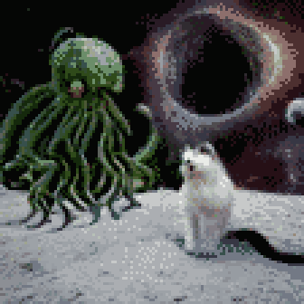

**TL;DR**: The creative writing habit never formed. But, this scene popped into my head, so I wrote it down and decided to post it here. Ever wonder what would happen if a [Kardashev Type II civilization](https://en.wikipedia.org/wiki/Kardashev_scale#Type_II) found us cute?

<!--more-->

"This is a dumb newbie question," said the Ensign at the sensor console, "but, why are we prepping to lob nukes into this asteroid field?"

The Captain chuckled around her coffee mug. "You read the mission brief, right?"

"Yeah," he said. "It said we're here to beg the aliens for treats?"

"The proper designation for them is 'Leviathan 12'. Take care not to diminish their threat with familiarity, even in your own mind."

"Understood," he said, sitting up straighter. "But, if they're so dangerous... 'treats'? That's verbatim from the brief."

The Captain took a thoughtful sip. She sighed. "They think it's cute," she said. 

"Leviathan 12 thinks nukes are cute?"

"Our nukes? Yeah." The Captain leaned forward and peered at the main viewscreen. Rocks tumbled serenely, wan light from a distant sun filered through. "Ensign, have you ever had a cat?"

His brow furrowed. "Me? No. I grew up on a miner. Barely enough to go around for the people, let alone a pet."

She shrugged. "Some ships keep cats. Haulers,  especially, if they carry food. Some cats have jobs, catching pests and managing morale. It's an ancient relationship."

"Okay," he said, nodding. "So we're cats?"

"We might be, someday," she said. "Right now, we're pre-domestication. Feral. Still, Leviathan 12 seems fond of us."

The Ensign opened his mouth to reply, but snapped his attention to the console. "Sir, contact at 23-mark-12, ten klicks out. Might be an echo."

"Weapons, fire on that position."

"Firing, aye." The crewman next to the Ensign tapped out a quick sequence and, on the viewscreen, a missile flared away from the ship and into the rocks.

"Contact vanished."

"Recall the missile. No sense in wasting it."

"Recalling, aye." The missile arced around back toward the ship.

The Captain sighed again. "You see," she said, "we think cats endeared themselves to humans through play - and by doing things like this: comms, execute the transmission protocol."

"Executing, aye."

A series of discordant scrapes and squeals issued from the bridge audio monitors, ending in a sort of sizzling warble.

"That's an audio representation of the EM burst that we just emitted," continued the Captain. "Some PhDs back home say this reminds Leviathan 12 of juvenile offspring. Cats learned this, too, meowing at us like babies."

"Huh," said the Ensign. "So that means we-- sir, contact at 110-mark-46, eight klicks out."

"Weapons, fire on that position."

"Firing, aye." The missile, which hadn't quite yet made it back to the ship, took another turn to zoom past the ship to a new target.

"We're being toyed with," said the Captain. "Is that what you were going to say?"

"More or less, yeah. Also: contact vanished."

"Recall the missile. Prep another, that one's got to be about out of fuel."

"Recalling Alpha, prepping Beta, aye," said the weapons console.

"Comms, execute the next protocol variant."

"Executing, aye."

Sizzling warbles cross-faded into a cluster of resonant pongs. The bass frequencies rattled in the crew's lungs.

"Contact at 212-mark-8, 3 kicks out."

"Ooh, a bit close for nukes," said the Captain. "Helm, vector away from that position. Weapons, fire on that position. Let's hope we can outrun our own adorable fission detonation."

"Maneuvering, aye."

"Firing, aye."

"Contact is holding."

"All hands, brace for debris strike. This thing's going to kick up some gravel."

Out in the asteroids, the missile flared, far brighter than the system's own pale star. The viewscreen dimmed to compensate for the sudden glare. 

A heartbeat later, collision alerts pealed. The bridge was sheltered away in the core of the ship, enveloped by most of its mass. But, even there, it sounded like a sudden hail storm whipping against the hull.

"Big rocks incoming," said the Ensign.

"Do we have an escape vector, helm?"

"No, sir."

"Comms, execute distress emote."

"Executing, aye."

Frantic rising sweeps of spiky fizzing whistles played, repeating with rising tempo and frequency.

At the center of the viewscreen, a brilliant white dot appeared. In a breath, it expanded into streamers that reached around and past the ship, enclosing it in a mesh of light. The mesh expanded away from the ship in all directions before fading. Where it encountered the rocks, matter evaporated. On the bridge, there were sighs and deep breaths all around. 

"Sir," said the Ensign, "I need to hit the med bay. I think I just saw God."
 
"We all did, newbie. That was Leviathan 12 poking our brain meats. It's like a cross between epilepsy and sex. Research says it's analogous to a scritch between the ears. Comms, execute purring emote."

"Executing, aye."

Falling sweeps of mid-range staticky sighs, repeating with lazy tempo. Resonant pongs joined the sequence, somehow more organic and rich than the earlier emission.

"That last bit is them," said the Captain. "They decided to respond. Let's hope for a treat. Comms, execute beg emote."

Questioning sweeps repeated, flat whispering tones with tiny upswings. The pongs quickened, grew rapid and disjointed like laughter.

The ship jolted. The Captain's eyebrows shot up.

"Engineering, report. In particular, tell me about the cargo bay?"

"Sir. Cargo bay is... abruptly full? Non-standard containers of some sort, unresponsive to manifest query. Want me to go take a look in person?"

"Yeah, but don a vacsuit. The treats are weird, sometimes. Leviathan 12 doesn't quite understand our vulnerability to radiation or viral contamination. We're probably not going to explode, but we should still be very careful."

"Understood." The officer rose from her console and hustled off the bridge.

"Sensors, any further contacts?"

"None, sir."

"Great. I think that means they've lost interest. Helm, plot a course home and take it easy on the throttle."

"Maneuvering to jump point, aye."

The Captain sank back into her seat. "So, that was the mission. How's the head, Ensign."

"Not bad, kind of feels like a hangover coming on."

"Yeah, that'll happen. I'd say you get used to it, but you don't."

"So they were just kind of dangling a string in front of us, huh?"

"Pretty much."

"Seems kind of undignified, if you ask me."

"Ensign," she said, "Leviathan 12 has encompassed over fifty stars in Dyson spheres. They've rearranged a few hundred planetary systems for what we can only interpret as aesthetic preference. I don't think we're well served by gravitas, here. Just be glad they didn't decide to take us home with them."

"Point taken, sir."

The ship jolted again: they'd translated to hyperspace and were on their way home. The Captain sighed and stood.

"Alright, folks. Stand down from alert. If anyone needs me, I'll be in the mess getting thoroughly drunk. I encourage everyone to join me."
