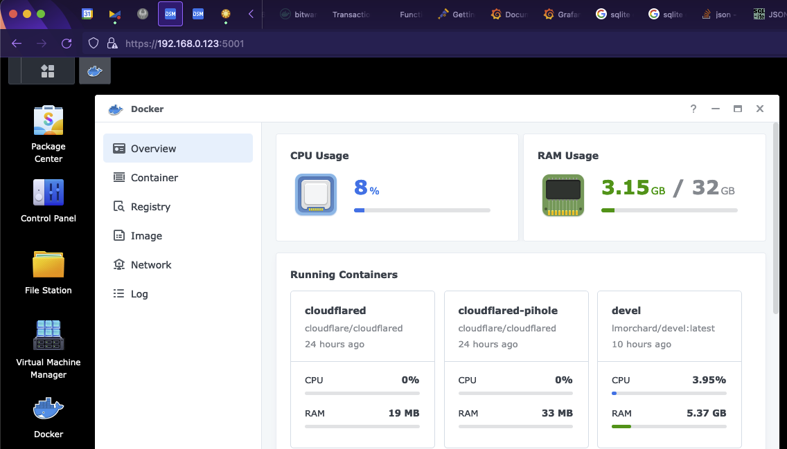

**TL;DR**: My new Synology NAS supports Docker and I can connect to it with VSCode for tinkering with all my horrible projects!

<!--more-->

Over the past couple of decades, I've had a Linux box kicking around on a basement shelf. It's a Ship of Theseus, composed of parts filtering out of my gaming PC after upgrades. This box tends to host my random experiments and learning projects - and it also tends to be broken in some way or another. That's fun for tinkering, but frustrating for things I want to stay working in between bouts of tinkering.


Enter my discovery of low-end Synology NAS devices: They're tidy little things, like two Nintendo Wii taped together.

My first was a [DS210j](https://global.download.synology.com/download/Document/Hardware/DataSheet/DiskStation/10-year/DS210j/enu/Synology_DS210j_Data_Sheet_enu.pdf) in 2010, followed by a [DS214play](https://global.download.synology.com/download/Document/Hardware/DataSheet/DiskStation/14-year/DS214play/enu/Synology_DS214play_Data_Sheet_enu.pdf) in 2015. They reliably take on the boring jobs that I've gotten tired of maintaining on my perpetually janky hobby server.


And then, just this week, I acquired a [DS723+](https://global.download.synology.com/download/Document/Hardware/DataSheet/DiskStation/23-year/DS723%2B/enu/Synology_DS723%2B_Data_Sheet_enu.pdf) . This one is quite an upgrade: My first NAS had 128MB of RAM and the second sported 2GB. This latest one has been upgraded with a whole 32GB. Along with that, I've slapped in a pair of  [10TB IronWolf hard drives](https://www.newegg.com/seagate-ironwolf-st10000vn000-10tb/p/N82E16822184973?Item=N82E16822184973) in a RAID1 configuration.

Beyond backups and media storage, why bother with all that for just a NAS? Well, this one supports Docker. And, as it turns out, a great many of my tinkering projects fit nicely into Docker containers.

So, in other words, it appears that this latest NAS can even take on the boring job of hosting *many* janky little hobby servers. This, while continuing to reliably do everything else a Synology NAS does. 



With Docker containers, I don't have to try crapping up the Synology host OS with attempts at installing assorted programming languages and tools (ahem, [optware](https://en.wikipedia.org/wiki/Optware)). And if I crap up a Docker container, I can toss it and rebuild without disturbing, say, [the DVR](https://www.silicondust.com/dvr-service/) for my TV antenna or [the self-hosted RSS reader](https://tt-rss.org/) we use at home.


The web UI even has a cute little in-browser terminal for access to the container:


Of course, I'll likely find limits to this. I can imagine there'll be some tinkery projects I don't want moshing around on the thing that lets us watch Seinfeld reruns after dinner. I'll still have my Ship of Theseus on hand for that stuff. But, that still leaves a great many things I can just toss onto the Synology for fun.

And speaking of my network, I just discovered how to [connect VSCode via SSH to a Docker container on a remote host](https://code.visualstudio.com/docs/containers/ssh) - i.e. my shiny new Synology DS723+ server. This makes for a kind of fiddly self-hosted alternative to [GitHub Codespaces](https://github.com/features/codespaces) in my basement.

Key to this are [Docker contexts](https://docs.docker.com/engine/context/working-with-contexts/) - they've been around for a few years, and I've likely been using tools that use them, but I hadn't really learned about them until this week. Long story short, I can switch `docker` on my Mac laptop over to managing Docker on my NAS like so:

```
docker context create castiel --docker "host=ssh://lmorchard@castiel"
docker context use castiel
docker ps
```

(Yes, I named my new server "[Castiel](https://supernatural.fandom.com/wiki/Castiel)" after [the angel from Supernatural](https://supernatural.fandom.com/wiki/Castiel). Watching over our files, he'd probably think we've hoarded too many episodes of Frasier and Star Trek.)


Anyway, once I have a new working Docker context defined, I can access it from VSCode for tinkering. First thing is to select the Docker context. On my Mac, that means hitting Command-Shift-P and typing "`dockeru`" until the `Docker Contexts: Use` command appears:


Selecting that gives me a selection of contexts, which includes `castiel`:


I pick that, and VSCode confirms the selection:


Now, when I click on Remote Explorer in the sidebar here, all the running containers on my Synology soon appear. From here, I can click on the "Attach to Container" button:


Once attached, I can add a folder from the container and start tinkering away on this very blog post!


Oh yeah, and since this is Docker, I can mount a path from the host NAS as storage for all my project code outside of the disposable container:


I know there can be some problems with this, I think largely around file watchers and suchlike. But, I'll burn those bridges when I get to them. For now, this seems like a fun new toy to play with and it's off-loaded a few more little jobs from my junker PC. 

Maybe next I can reformat the hobby server and try some more advanced things like [Proxmox](https://www.proxmox.com/en/) and friends, so it'll be like a big sibling to the little Synology.
