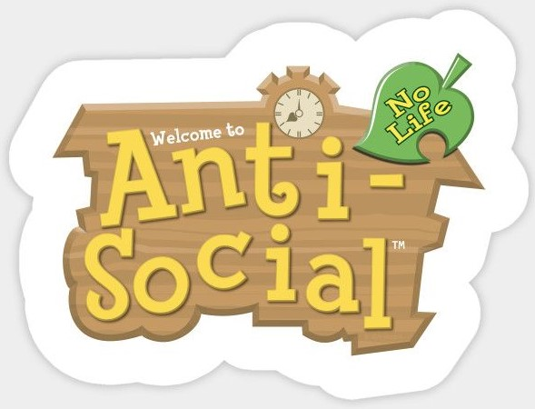
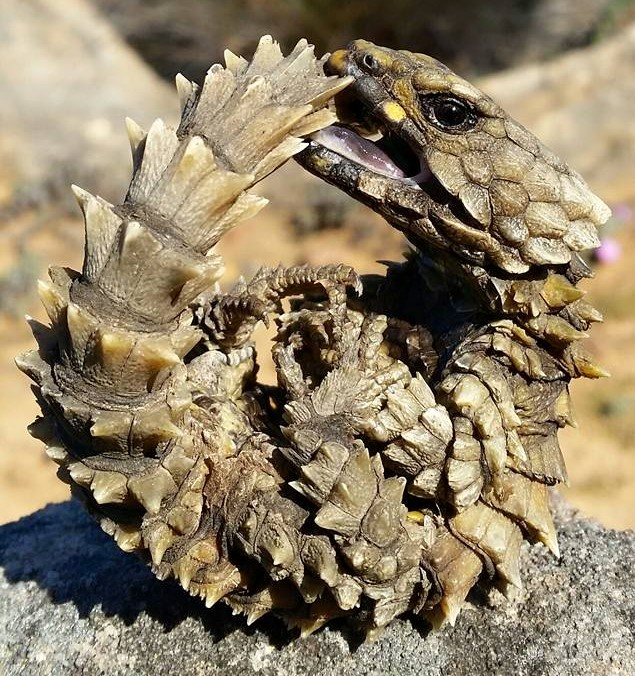

**TL;DR**: I spent most of the last 18 months in [volvation][]. It would be good to unroll someday.

<!--more-->

<figure>

<figcaption><a href="https://en.wikipedia.org/wiki/File:Lesser_Hedgehog-tenrecs_(Echinops_telfairi)_(10292363783).jpg">File:Lesser Hedgehog-tenrecs (Echinops telfairi) (10292363783).jpg</a> From Wikipedia, the free encyclopedia. Not entirely unlike my wife & I hanging out at home in 2020.</figcaption>
</figure>

[Volvation], from Wikipedia:

[volvation]: https://en.wikipedia.org/wiki/Volvation

> a defensive behavior in certain animals, in which the animal rolls its own body into a ball, presenting only the hardest parts of its integument (the animal's "armor"), or its spines to predators.

It started with [an all-hands week in Berlin for work][berlin], followed by a sinus infection picked up in transit. Thankfully, that wasn't COVID-19. Though, I was worried a runny nose would get me detained at an airport.

[berlin]: https://wiki.mozilla.org/All_Hands/Berlin2020

<blockquote class="twitter-tweet">
mainly I&#39;m just apprehensive about getting sick during / immediately after travel and really hope gearing up like this is copacetic with security <a href="https://t.co/49VpE631G0">pic.twitter.com/49VpE631G0</a>
&mdash; Les Orchard (@lmorchard) <a href="https://twitter.com/lmorchard/status/1219706169029083136?ref_src=twsrc%5Etfw">January 21, 2020</a></blockquote>

But, I did make it home. And, shortly after, [the first "stay at home" order][stayhome] came. COVID-19 was officially a pandemic. So, we settled in for lockdown, which seemed almost cozy at first. Surely it would only be a few weeks before things went back to normal.

[stayhome]: https://www.opb.org/news/article/oregon-stay-at-home-order-coronavirus-covid-19-kate-brown/

Then came a year featuring highlights such as:

- Resistance to basic public health measures.
- Violent police responses to George Floyd protests within earshot of my home.
- Layoffs, where job insecurity & survivor’s guilt pair nicely with a sense of mortal danger toward in-person interviews.
- Wildfires, swapping through furnace filters and wearing a respirator to take out the trash.
- An election, where an unhealthy news-watching habit still left me with no clue what would happen.
- Holidays spent hunkered down, pandemic numbers & graphs spiking after so many emerged to gather.
- January 6 and the spectacle of an insurrection of dangerous morons in the Capital.

But, by Spring 2021, there came some hope: My wife and I got vaccinated.

<figure>

<figcaption>Rode my bike to get my first jab at a CVS, back in March 2021</figcaption>
</figure>

<blockquote class="twitter-tweet">
I got a vaccine appointment, thanks to my wife. There is a rushing in my ears. Pulse fills my eyes with stars. There&#39;s an awareness of breath long held - it threatens to spawn tornadoes when finally exhaled. I&#39;d like to be chill about this but I have failed.
&mdash; Les Orchard (@lmorchard) <a href="https://twitter.com/lmorchard/status/1376962089399414786?ref_src=twsrc%5Etfw">March 30, 2021</a></blockquote>

We went to a restaurant, dined outdoors for cocktails and an anniversary dinner. I started tiptoeing into a grocery store again, where I tried relearning how to talk to strangers. [I ventured into a liquor store without a mask, once.][liquor store] These felt like massive, daring achievements.

[liquor store]: https://twitter.com/lmorchard/status/1420132695145730048

Then came:

- [A 113℉ Heat Dome in temperate Portland][heat dome], learning the term [wet-bulb temperature][].
- This year’s Smoke Season, which could get as bad as last year - who knows?
- The Delta Variant with more rising numbers & charts, anticipating another horrific holiday season.

[heat dome]: https://www.theguardian.com/us-news/2021/jun/28/portland-seattle-heatwave-heat-dome-temperatures
[wet-bulb temperature]: https://en.wikipedia.org/wiki/Wet-bulb_temperature

In journal entries, I’ve called it **manifold fuckery**: overlapping waves of bullshit that come and go, maintaining a [Fuck Shit Stack][] of five or more layers at all times. And it looks like the hope from spring was just slack before the tide rolls back in.

[fuck shit stack]: https://www.youtube.com/watch?v=DW_7P8X9MUU

<figure class="video-container"><iframe class="lazyload" width="560" height="315" src="" data-src="//www.youtube.com/embed/DW_7P8X9MUU" frameborder="0" allowfullscreen></iframe></figure>

To be fair, folks have lived under deeper stacks for longer than I’ve been alive. I’ve long been privileged with a shallow stack. All I can say is that this is my experience. There are many like it, but this one is mine.

That said, it’s fair to find my volvated state hard to distinguish from usual habits.

Reaching out is unnatural for me. My center of gravity lies inside. It’s not that I dislike people. In fact, I do sometimes find it deeply rewarding to connect with members of my own species. But, where many claim to be uplifted & nourished in a crowd, I am usually overwhelmed & enervated.

I don’t experience a hunger or thirst for social engagement. At most, I feel an occasional fleeting lonesomeness. I have to remember it’s a thing one does. I have to push with a mindful expenditure of willpower to muster up a convincing simulation of a social creature.

But, when burnt out by manifold fuckery, such expenditures pull from an overdrawn account.

<figure>

<figcaption><a href="https://www.google.com/search?q=anti-social+no+life+animal+crossing">Welcome to Anti-Social No Life</a> Wish I knew who made this. Played a lot of Animal Crossing in 2020</figcaption>
</figure>

So, the volvation difference is that I stopped trying. In fact, I leaned into isolation as a survival adaptation. I used social anxiety as a shield against disease & depletion alongside masks & handwashing. I deferred optional contact like social Zoom calls or anything beyond essentials to maintain my livelihood.

I rolled into a ball, presenting only the hardest parts of my integument.

<figure>

<figcaption><a href="https://en.wikipedia.org/wiki/File:Ouroborus_cataphractus02.jpg">File:Ouroborus cataphractus02.jpg</a> From Wikipedia, the free encyclopedia</figcaption>
</figure>

From 1988, when I was 12, I remember a moment: I stood at my junior high locker, looking at a stack of novels from the library. I could disappear into those pages.

I saw a life all laid out: Alone. Surrounded by books. Barely present in the world. Living in stories. Does that sound sad? To this day, it strikes me as a kind of paradise.

I also liked The Twilight Zone, including the episode “[Time Enough at Last][]”. It starred Burgess Meredith as Mr. Henry Bemis, sole survivor of a nuclear war during his lunch break within a bank vault.

[time enough at last]: https://www.youtube.com/watch?v=oLoNGRVeC7Y

<figure class="video-container"><iframe class="lazyload" width="560" height="315" src="" data-src="//www.youtube.com/embed/oLoNGRVeC7Y" frameborder="0" allowfullscreen></iframe></figure>

It was a rerun, already older than me. But, it seemed written just for me. Bemis was a bookish man, like me but grown up. After being tortured by everyone for his bumbling introversion, after wandering the nuclear wreckage, he finds an intact pile of library books. Time enough at last to do nothing but read. Then, his thick, heavy glasses fall off and shatter.

I thought the whole episode was cruel horror. But I did internalize something: I’d always need someone to fix my glasses. And someone to pay me for work, so I could buy books & glasses & food. Wild west mountain man legends notwithstanding, it seemed unlikely I could account for these things on my own. I couldn’t disappear so easily.

That realization itself didn’t make anything easier. It just convinced me of the need to reach out, despite the ease of curling up.

So, I think I need to de-volvate. It was meant to be temporary, anyway. Like what a hedgehog would do until it’s safe enough to resume snuffling through the world. It’s not entirely safe, but it never is. [So it goes.](https://www.theguardian.com/books/2007/apr/15/fiction.kurtvonnegut)

I’d like to write an optimistic conclusion here. Next steps in a decisive action plan. But, I don’t have a transformative one-weird-trick to resolve everything.

The best I can come up with is that I need to start trying again. Get back to pushing myself to attempt connections. Stay reasonably safe, yet reach out. Resist the urge to curl up, yet give myself a break when necessary. It’s an awkward, unsatisfying grind.

So, uh, yeah: [How're ya now?](https://www.youtube.com/watch?v=HZAz_MROU2I)

<figure class="video-container"><iframe class="lazyload" width="560" height="315" src="" data-src="//www.youtube.com/embed/HZAz_MROU2I" frameborder="0" allowfullscreen></iframe></figure>

 
