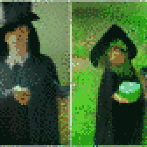
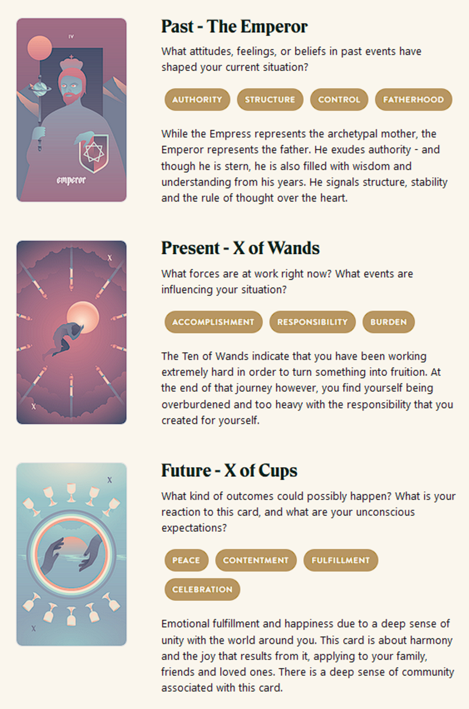

{{../../_includes/flash-fiction-blurb.md}}

<!--more-->

The night his Mitra died, Marek decided not to indulge in heartbreak.

He'd known men who fell prey to their own unexamined hearts. When their wives died on birthing beds, they blamed their children. They compounded the tragedy. They squandered the treasure that sacrifice had bought.

Mitra had been his everything. But, it was a capricious universe that bore responsibility for the exchange that delivered little wailing Korrine into his arms. He couldn't alter it. Korrine hadn't caused it. His best vengance would be to ensure his daughter grew brilliant and strong.

Years passed and Marek never took another wife. He and Mitra had lived far from crowds. Her passing hadn't left him inclined to change that. It was hard tending the land and animals by himself. But, as Korrine grew, he saw an uncanny spark grow in her eyes. She watched him and wanted to do what he did. He indulged her and taught her everything he knew.

In time, and to his delight, she surpassed him far earlier than he thought possible. Not even half his height and she had the goats and chickens and horses all heeding and adoring her. She had more than doubled the yield of their crops with her attention. He thought they might soon even find a surplus on their hands worth the trek to town for trade.

As Korrine approached the cusp of leaving childhood behind, he began to suspect that her talents weren't entirely his doing. She had insights into living things that couldn't quite be explained by the lessons and experience he shared. With a glance, she could charm crows and squirrels out of the trees to sit at her feet. She could reverse wilt and blight on crops in just a few days. Neither he nor she ever got sick with the seasons.

The day that convinced him that he was raising a witch was the day he broke his arm. He'd been on the roof of their little cabin patching leaks, when his footing slipped and he landed badly. He felt the forearm break against a rock. Saw the limb bent disastrously. Though shocked, he knew what had happened to him.

Just as he screamed, she rushed to his side and fussed over him. He felt the bones in his arm knit, the limb return to proper shape, the pain wash away. He knew what had happened to him then, too.

He'd known men who fell prey to their own unexamined hearts. When their daughters grew into power, they destroyed them. They squandered the treasure they'd spent their lives nurturing.

Marek, though, could do nothing but smile. He knew his daughter would grow restless soon. She would feel compelled to leave him and her childhood behind. But, in the meantime, he would do all he could to bolster her talents. She would be her own woman, but her mastery over the capricious universe would be his best vengance for Mitra.

## Prompt

[Take a look at my Labyrinthos Tarot Reading!](https://app.labyrinthos.co/reading/ppf/SSTRWS/47,69,14)

