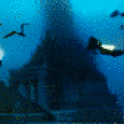
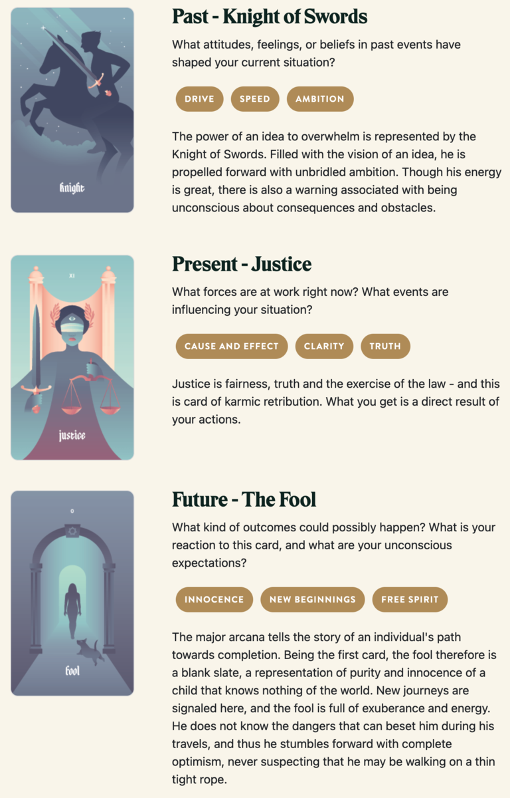

{{../_includes/flash-fiction-blurb.md}}

<!--more-->

Alexi had spent a decade and the bulk of his fortune chasing down scraps and clues. He had a network of machines and men crunching away at translations and correlations. Through diligent compartmentalization, he ensured that only he had access to the complete pattern.

And finally, it had paid off: He alone stood within the heart of Atlantis, the first visitor since it had been lost by ancient humanity. Beneath the waves of the Atlantic, deeper than the ocean floor, the Earth was hollow. In that space, Alexi found the greatest city-state the world had ever known. 

He'd long been certain that the Atlantean civilization had been real. Indeed, the bulk of his fortune was thanks to fragments of their technologies he'd recovered from caches around the world. He'd passed them off as his own inventions. 

Atlantis lay quiet, yet remarkably preserved. Streets and avenues were entirely deserted, yet lined by lights still somehow energized by a power source he'd yet to discover. 

But, he found the ultimate treasure cache at the city's center: a colossal cylindrical tower, itself composed of stacked rings of cylinders, a fractal pattern repeating through descending dimension. An archway at the base opened into a long hall leading to the structure's core.

There, Alexi found a cavernous chamber that he could only guess was a throne room, mission control, or some blend of the two. Concentric rings of marble benches surrounded a central dais. On the dais, there was a single seat. In a semi-circle fence around the seat, dozens of thin golden rods ascended from the floor to disappear into the ceiling unfathomably far above. 

Alexi grinned and strode to the seat on the dais. He touched one of the rods. It strummed, a deep bass note that filled the chamber. He turned and lowered himself onto the throne. All the rods strummed, then, an infrasonic drone that felt like it might dissolve all matter and consciousness in a warm annihilating wash of harmonics. 

When the sound faded, Alexi was gone. Atlantis lay quiet again. 

## Prompt

[Take a look at my Labyrinthos Tarot Reading!](https://app.labyrinthos.co/reading/ppf/SSTRWS/61,11,0)

