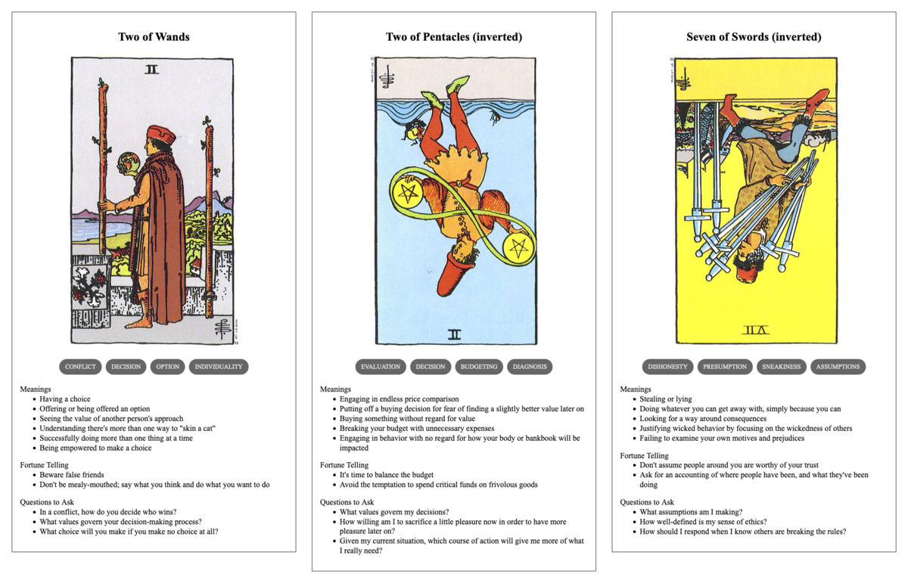

{{../../_includes/flash-fiction-blurb.md}}

<!--more-->

Garth wandered the exhibit hall, weaving through the convention crowd. It was overwhelming. He wanted everything. Spread out on the tables, he saw old memorabilia and signed copies, handcrafted tchotchkes and prints of original artwork. He even saw an original screen-ready uniform, but it wasn't his size. 

He had a running list in his head of things and prices. He also had an undeniable awareness of the lightness of his wallet versus the heaviness of his credit card balances. He'd really blown through his savings on this trip. But, he'd been cooped up at home for nearly three years, thanks to the pandemic. 

He really wanted to get the most out of this convention, even if the crowds did make him feel like he was on the giddy edge of either panic or joy. He couldn't decide which. He made a second circuit of the hall, then a third in empty-handed indecision.

The fourth time around, he saw it: a little diorama of the flagship against a backdrop of stars and planets. It was made with plastic perler beads and about the size of a classic lunch box. He could just about afford it. He snatched it up. 

The vendor guy behind the table was busy chatting with a cosplayer all done up as the season four baddie. Garth had to admire the work she'd put into the costume and her signature pistols. So did the vendor: when Garth tried to get his attention to pay, he just got put off with a raised finger.

Minutes passed and Garth got impatient. The crowd pressing past seemed to grow denser. They kept pushing him around. He tried to catch the vendor's eye again and got waved off. A roar went up and people started flowing toward something at the other end of the hall. 

Garth felt himself swept away from the vendor's table as people pressed and flowed around him. Finally, he gave up and went with the flow of jostling bodies. He overheard some folks near him mention that the show's lead actor had strolled into the hall for autographs. 

He was most of the way across the exhibit hall from the vendor when he realized he was still cradling the little diorama in his arms, hunched over to keep it from being crushed in the mob. He looked around to see if maybe he could find a path back to the table, but the herd was a solid wall pushing him further away.

"Screw it," he muttered to himself. "This thing couldn't have [cost that much](https://www.youtube.com/watch?v=NGR20B2cEBQ) to make anyway." He let the crowd carry him until he got clear and then just kept going out to the lobby elevators to head back to his hotel room. 

## Prompt

A 3-card spread from my [Tarot Thing](https://lmorchard.github.io/tarot-thing/):

