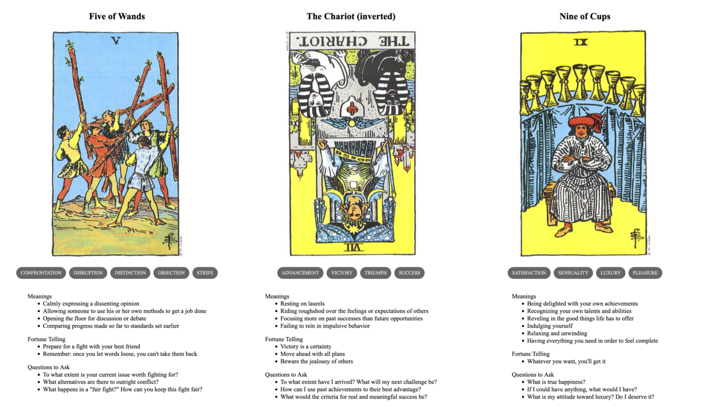

{{../../_includes/flash-fiction-blurb.md}}

<!--more-->

"Heavenly fires do not fall to earth," said the senior astronomer.

"This one will," said the intern. 

"Look," said the elder, "I know you're eager to make your mark. But it would behoove you to absorb our real world wisdom here before you insist on being a contrarian."

"With all due respect," said the younger, "I have been observing this object since before I could read or write. Indeed, it is the reason I pursued this vocation."

"And I have made recorded observations of the heavenly fire in question—-and many more—since before your parents even knew each other's names."

The intern raised a hand to object, but the elder cut them off with a dismissive flick of their fingers. 

"As you have undoubtedly been taught: It is not a material object as such. You and I will never reach the lights in the sky as long as we live, nor will they ever descend to our base level of existence. This has been known for longer than I have lived, let alone for your brief span of days."

"If you would just review my dissertation—"

"I have. It was a very diverting work of speculative prose, demonstrating a remarkable grasp of our sciences—albeit overextended into the theoretical. You will have decades here to refine it into something that more closely matches reality."

"But I have spent decades on it already I—"

"Yes, yes," sighed the elder. "You are a prodigy. Now that's enough. Go fetch my coffee before it occurs to me to consider whether your acceptance here was a mistake."

The intern turned and walked away. They walked past the kitchen and continued on through the halls back to their room in the dormitory. There, they gathered their journals and books and clothes all into a sturdy pack. 

They had a decent amount of cash on hand, more than enough for a seat on a fast airship. They just hoped that it would leave soon enough and travel far enough to escape the calamity, if any distance at all was indeed sufficient. 
## Prompt

A 3-card spread from my [Tarot Thing](https://lmorchard.github.io/tarot-thing/?card=Five+of+Wands&card=%21The+Chariot&card=Nine+of+Cups):

