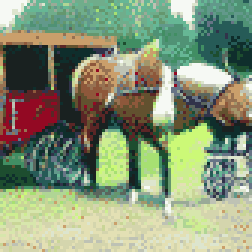

{{../../../_includes/flash-fiction-blurb.md}}

<!--more-->

The man broke eye contact with Korrine and snapped his gaze to Marek as that man's fingers brushed the handles of concealed knives.  

"I've been rude," he said. "In all the excitement, none of us have introduced ourselves. My name is Anton. I'm studying to be a physician. And you are?" He smiled and extended an open hand up to Marek from where he crouched.

"I am Marek," he said, relaxing just a degree. His hands came forward to grasp Anton's arm. He hoisted the younger man to his feet. "She is my *daughter* Korrine." She flushed slightly at the tone in his voice. 

"And I am Danijel," said the booming voice of an older man to Marek's left. He'd been grimly watching it all. "Anton is my son. The boy is little Sebastijan, son of my other son Petar." A man to Danijel's left nodded. "Jelena is my wife and Laura is Petar's wife. Laura is the boy's mother." He gestured to a pair of women, the older of the two comforting the younger weeping one.

Marek noticed Danijel's hands had eased from behind his back as he spoke, mirroring his own gesture. Both men smiled and nodded in understanding. A tension eased.

"We are pleased to meet you all," said Marek, "and to have been of aid."

"I hate to ask more of you," said Anton, "but the sooner we can get Sebastijan to a clean bed back at the house, the better I can ensure he heals well. You have an intact wagon—is there any way you could lend us a ride?"

Marek stroked his beard. "I'd gladly offer," he said, gesturing to their wagon, "but as you can see we're heavy with cargo bound for the market and we've no room for passengers."

Korrine gave her father a sharp glance, but Danijel just laughed.

"I see barrels," said Danijel. "What do you carry?"

"Wheat and rye beer, best you'll ever taste."

"I'll buy it all right now. And your wagon outright. Name a price."

Marek's brows shot up. "And the wagon? I couldn't part with it all it for less than—" He paused to gaze upward, muttering some calculation to himself. "—at least 25 aureus." Korrine's glance turned to a stormy glare. 

Danijel shook his head and sadly said, "Not good enough, my friend."

"But I built that wagon with my own hands—"

Danijel cut Marek off with a gesture. "You misunderstand me: you've asked for too little. I will pay no less than 100 aureus for all this."

Korrine gaped. Anton smiled. Marek blinked and held out a hand to Danijel. "I'd be a fool to argue. For that price, I'll build you a new wagon from scratch."

"I didn't take you for a fool," said Danijel, grasping Marek's hand. "Some help fixing our old wagon would be appreciated, though."

"One more thing," said Anton, sheepishly. "I'd very much appreciate it if Miss Korrine could accompany us to help keep Sebastijan stable on the trip."

Marek darkened. "Absolutely not."

"Father!" Korrine hissed.

"Daughter," said Marek.

"These are good people," she said, "and this boy still needs help."

Marek drew a breath to speak, but Danijel interrupted: "How about this—10 aureus in wages for Korrine's service to us today and 10 more to you, Marek, for your service while they're on their way. We will join them when we've finished here. I'll feed you both and make sure you get back home safely afterward."

Marek sighed. "That's more than fair and I don't think I could hold her back anyway." 

He reached under his jacket and unbuckled one of his knives. Korrine's face displayed a measure of horror as he handed it to her. Somehow she hadn't realized it was there.

"Take it," said Marek. "While we are apart, use this if you find yourself not among good people." Korrine took the sheath and buckled it across her back.

"Very good," said Danijel, with a clap. "Men, let's get to work unloading my beer so we can get my grandson home before sunset."

## Prompt

A 3-card spread from my [Tarot Thing](https://lmorchard.github.io/tarot-thing/?card=Eight+of+Swords&card=The+Magician&card=Seven+of+Cups):

